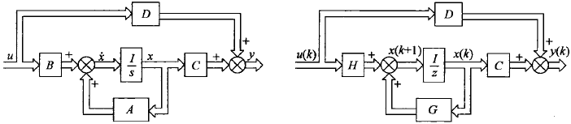

&ensp;
<!-- more -->

# 控制系统的状态空间描述
## 系统数学描述的两种基本形式
典型控制系统有被控对象、传感器、执行器和控制器组成。被控过程具有若干输入端和输出端。
系统的数学描述通常有两种基本形式：一种是基于输入、输出模型的外部描述，它将系统看出黑箱，只是反映输入输出见的关系，而不去表征系统内部结构和内部变量。另一种是基于状态空间模型的内部描述，状态空间模型反映系统内部结构与内部变量，由状态方程和输出方程组成。
状态方程反映系统内部变量和输出变量的动态关系，具有一阶微分方程组成。
输出方程则表征系统输出向量y与内部变量即输入变量间的关系，具有代数方程的形式。

外部描述不能反映系统内部结构和运行过程，内部结构不同的两个系统也可能具有相同的外部特性，因此外部描述通常是不完整的，而内部描述则全面、完整地反映出系统的动力学特征。

下图为一个简单二阶电路

图1 RLC串联电路

由上图可得
$$
LC{\text{d}^2v_c\over \text{d}t^2}+
RC{\text{d}v_c\over\text{d}t}+v_c=e
$$
若令
$$
x_1=i,x_2=V_c
$$
则有状态空间模型
$$
\begin{cases}
    \dot x_1=-\displaystyle{R\over L}x_1-{1\over L}x_2+{1\over L}e\\
    \dot x_2 =\displaystyle{1\over C}x_1\\
    y=x_2
\end{cases}
$$

将状态空间模型写出向量-矩阵形式
$$
\begin{cases}
    \begin{bmatrix}
        \dot x_1\\
        \dot x_2
    \end{bmatrix}=
    \begin{bmatrix}\displaystyle
        -{R\over L}&\displaystyle-{1\over L}\\
        \displaystyle-{1\over C}&0
    \end{bmatrix}
    \begin{bmatrix}
        x_1\\x_2
    \end{bmatrix}+
    \begin{bmatrix}
        \displaystyle{1\over L}\\0
    \end{bmatrix}
    e
    \\
    y=
    \begin{bmatrix}
        0&1
    \end{bmatrix}
    \begin{bmatrix}
        x_1\\x_2
    \end{bmatrix}
\end{cases}
$$

从这个例子可以看出与输入-输出模型相比，状态空间描述的优点在于
1. 状态变量选自电路核心元器件的关键参数，是电路系统的内部变量。
2. 一旦状态方程接触，系统中任何以变量均可以用代数方法求得。
3. 分析时，可以将某个需要的物理量设计出输出量，并列写相应的输出方程即可。
4. 系统输入量、输出量可以有多个，所以状态空间模型描述多输入-多输出系统十分方便。
5. 以状态方程和输出方程为核心的状态空间模型较好反映系统内部结构。

## 状态空间描述常用的基本概念

### 输入和输出
由外部施加到系统的激励称为输入，若输入是按需要人为施加的，又称为控制系统的被控量或从外部测量到的系统信息称为输出，若输出是由传感器测量得到的，称为观测。

### 状态、状态变量和状态向量

能完整描述和唯一确定系统时域行为或行为运行过程的一组独立变量称为系统状态，其中各个变量称为状态变量。当状态表示成以各状态为分量组成的向量时，称为状态向量。

对n阶微分方程描述的系统，当n个初始条件和输入给定时，可唯一确定方程的解。
状态变量以组的形式出现，它对于确定系统的时域行为既是必要的也是充分的。

当变量个数大于n时，则存在多余的变量，这些多余的变量就不是独立变量。判断变量是否独立的基本方法是看他们之间以及他们与输入量之间是否存在代数约束。

状态变量选取并不唯一，一个系统的状态变量通常有多种不同的选取方法，但应尽量选取能测量的物理量或独立的储能元件的储能变量作为状态变量。

### 状态空间

以状态向量的n个分量作为坐标轴所组成n维空间称为状态空间。

### 状态轨迹

系统在某时刻的状态，可以看作是状态空间的一个点，随着时间推移，系统状态不断变化，便在状态空间中描绘出一条轨迹，该轨迹称为状态轨迹。

### 状态方程

描述系统状态变量与输入变量之间关系的一阶向量微分方程或差分方程称为系统的状态方程，它不含输入的微积分项。

### 输出方程

描述系统输出变量与系统状态变量和输入变量之间函数关系的代数方程称为输出方程。

### 动态方程
状态方程与输出方程的组合称为动态方程，又称状态空间表达式。

### 线性系统

线性系统的状态方程是一阶向量线性微分方程或差分方程，输出方程是向量代数方程。
线性连续时间系统动态方程的一般形式为

$$
\begin{cases}
\dot x(t)=A(t)x(t)+B(t)u(t)\\
y(t)=C(t)x(t)+D(t)u(t)
\end{cases}
$$

设状态x、输入u、输出y的维度分别为$n，p，q，$称$n\times n$矩阵$A(t)$为系统矩阵或状态矩阵，称$n\times p$矩阵$B(t)$控制矩阵或输入矩阵，称$q\times n$矩阵$C(t)$为输出矩阵或观测矩阵，称$q\times p$矩阵$D(t)$为前馈矩阵或输入输出矩阵。

### 线性定常系统

线性定常系统即线性系统的$A,B,C,D$中各元素全部是常数。

### 线性系统的结构图
线性系统的动态方程常用结构图表示下图为其结构图，左边为连续系统结构图，右边为离散系统结构图。

图2 线性系统结构图

由于状态变量选取不是唯一的，因此状态方程、输出方程、动态方程都不是唯一的。但是用独立变量所描述的系统状态向量的维数应该是唯一的。

动态方程对于系统的描述是充分和完整的，即系统中的任何一个变量均可用状态方程和输出方程来描述。
状态方程着眼于系统动态演变过程的描述，反映状态变量间的微积分约束，而输出方程则反映系统中变量之间的静态关系，着眼于建立系统中输出变量于状态变量间的代数约束。

动态方程描述主要优点是，便于采用向量、矩阵记号简化数学描述，便于在计算机上求解，便于考虑初始条件，便于了解系统内部状态的变化特征，便于应用现代设计方法实现最优控制和最优估计，适用时变、非线性、连续、离散、随机、多变量等各类控制系统。

## 系统的传递函数矩阵
设初始条件为零，对线性定常系统的动态方程进行拉普拉斯变换，可以得到
$$
X(s)=(sI-A)^{-1}BU(s)\\
Y(s)=[C(sI-A)^{-1}B+D]U(s)
$$

系统的传递函数矩阵定义为
$$
G(s)=C(sI-A)^{-1}B+D
$$

## 线性定常系统动态方程的建立
### 根据系统物理模型建立动态方程
若以R-L-C电路方程为例，设状态变量为电感器电流和电容器电压，即$x_1=i,x_2={1\over C}\int i \text{d}t$

$$
\begin{cases}
    \begin{bmatrix}
        \dot x_1\\
        \dot x_2
    \end{bmatrix}=
    \begin{bmatrix}\displaystyle
        -{R\over L}&\displaystyle-{1\over L}\\
        \displaystyle-{1\over C}&0
    \end{bmatrix}
    \begin{bmatrix}
        x_1\\x_2
    \end{bmatrix}+
    \begin{bmatrix}
        \displaystyle{1\over L}\\0
    \end{bmatrix}
    e
    \\
    y=
    \begin{bmatrix}
        0&1
    \end{bmatrix}
    \begin{bmatrix}
        x_1\\x_2
    \end{bmatrix}
\end{cases}
$$

若设专题变量为电容器电路和电荷，即$x_1=i,x_2=\int i\text{d}t$

$$
\begin{cases}
    \begin{bmatrix}
        \dot x_1\\
        \dot x_2
    \end{bmatrix}=
    \begin{bmatrix}\displaystyle
        -{R\over L}&\displaystyle-{1\over LC}\\
        1&0
    \end{bmatrix}
    \begin{bmatrix}
        x_1\\x_2
    \end{bmatrix}+
    \begin{bmatrix}
        \displaystyle{1\over L}\\0
    \end{bmatrix}
    e
    \\
    y=
    \begin{bmatrix}
        0&\displaystyle{1\over C}
    \end{bmatrix}
    \begin{bmatrix}
        x_1\\x_2
    \end{bmatrix}
\end{cases}
$$

### 由高阶微分方程建立动态方程
#### 微分方程不含输入量的导数项
$$
y^{(n)}+a_{n-1}y^{(n-1)}+\cdots+a_1\dot y+a_0y=\beta_0u
$$

选取n个状态变量$x_1=y,x_2=\dot y,\cdots,x_n=y^{(n-1)}$，则有

$$
\begin{cases}
\dot x_1&=x_2\\
\dot x_2&=x_3\\
&\vdots\\
\dot x_{n-1}&=x_n\\
\dot x_n&=-a_0x_1-a_1x_2-\cdots-a_{n-1}x_n+\beta_0u
\end{cases}
$$

按照上式绘制的结构图称为状态变量图，其主要特点是每个积分的输出都是对于的状态变量

图3 系统的状态变量图

为了避免在状态方程中出现输入导数项，可按如下规则选择一组状态变量
$$
\begin{cases}
x_1=y-h_0u\\
x_i=\dot x_{i-1}-h_{i-1}u
\end{cases}
$$

其展开式为

$$
\begin{cases}
x_1=y-h_0u\\
x_2=\dot x_1-h_1u\\
\vdots\\
x_n=\dot x_{n-1}-h_{n-1}u
\end{cases}
$$

式中$h_0,h_1,\cdots,h_{n-1}$是n个待定系数，输出方程为

$$
y=x_1+h_0u
$$

### 由系统传递函数建立动态方程
高阶微分方程式对应单输入-单输出系统传递函数，若有系统的传递函数为

$$
G(s)={Y(s)\over U(s)}={b_ns^n+b_{n-1}s^{n-1}+\cdots+b_1s+b_0\over s^n+a_{n-1}s^{n-1}+\cdots+a_1s+a_0}
$$

则有
$$
G(s)=b_n+{\beta_{n-1}s^{n-1}+\cdots+\beta_1s+\beta_0\over s^n+a_{n-1}s^{n-1}+\cdots+a_1s+a_0}=
b_n+{N(s)\over D(s)}
$$

式中，$b_n$是联系输入、输出的前馈系数，$\displaystyle{N(s)\over D(s)}$是有理真分数。

#### 串联分解

将$\displaystyle{N(s)\over D(s)}$串联分解为两部分，如图

图3 串联分解

则有
$$
z^{(n)}+a_{n-1}z^{(n-1)}+\cdots+a_1\dot z+a_0z=u\\
y=\beta_{n-1}z^{(n-1)}+\cdots+\beta_1\dot z+\beta_0z
$$

选取状态变量
$$
x_1=z,x_2=\dot z,\cdots,x_n=z^{(n-1)}
$$

则状态方程为

$$
\begin{cases}
\dot x_1=x_2\\
\dot x_2=x_3\\
\vdots
\dot x_n=-a_0x_1-a_1x_2-\cdots-a_{n-1}x_n+u
\end{cases}
$$

输出方程为$y=\beta_0x_1+\beta_1x_2+\cdots+\beta_{n-1}x_n$

#### $N(s)\over D(s)$只含单实极点

$D(s)$可被分解为
$$
D(s)=(s-\lambda_1)(s-\lambda_2)\cdots(s-\lambda_n)
$$

则传递函数可展开成部分分式之和

$$
{Y(s)\over U(s)}={N(s)\over D(s)}=\sum_{i=1}^n{c_i\over s-\lambda_i}
$$

若令状态变量
$$
X_i(s)={1\over s-\lambda_i}U(s)
$$

那么有
$$
\begin{cases}
    \dot x_1=\lambda_1x_1+u\\
    \dot x_2=\lambda_2x_2+u\\
    \vdots\\
    \dot x_n=\lambda_nx_n+u\\
    y=c_1x_1+c_2x_2+\cdots+c_nx_n
\end{cases}
$$

若令状态变量
$$
X_i(s)={c_i\over s-\lambda_i}U(s)
$$

那么有
$$
\begin{cases}
    \dot x_1=\lambda_1x_1+c_1u\\
    \dot x_2=\lambda_2x_2+c_2u\\
    \vdots\\
    \dot x_n=\lambda_nx_n+c_nu\\
    y=x_1+x_2+\cdots+x_n
\end{cases}
$$

#### ${N(s)\over D(s)}$含重实极点

设$D(s)$可分解为
$$
D(s)=(s-\lambda_1)^2(s-\lambda_3)\cdots(s-\lambda_n)
$$

则传递函数可展开为
$$
{Y(s)\over U(s)}={N(s)\over D(s)}={c_{11}\over (s-\lambda_1)^2}+{c_{12}\over s-\lambda_1}+\sum_{i=3}^n{c_i\over s-\lambda_i}
$$

若令状态变量
$$
X_i(s)={1\over s-\lambda_i}U(s)\quad(i\neq1,2)
$$
其中
$$
X_2(s)={1\over (s-\lambda_1)}U(s),X_1(s)={1\over s-\lambda_1}X_1(s)
$$

那么有
$$
\begin{cases}
    \dot x_1=\lambda_1x_1+x_2+c_1u\\
    \dot x_2=\lambda_1x_2+c_2u\\
    \vdots\\
    \dot x_n=\lambda_nx_n+c_nu\\
    y=x_1+x_2+\cdots+x_n
\end{cases}
$$

### 由差分方程和脉冲传递函数建立动态方程
单输入-单输出线性定常离散系统差分方程的一般形式为

$$
y(k+n)+a_{n-1}y(k+n-1)+\cdots+a_0y(k)=b_nu(k+n)+b_{n-1}u(k+n-1)+\cdots+b_0u(k)
$$

可得脉冲传递函数为
$$
G(z)={Y(z)\over U(z)}={b_nz^n+b_{n-z}z^{n-1}+\cdots+b_1z+b_0\over z^n+a_{n-1}z^{n-1}+\cdots+a_1z+a_0}\\
=b_n+{\beta_{n-1}z^{n-1}+\cdots+\beta_1 z+\beta_0\over z^n+a_{n-1}z^{n-1}+\cdots+a_1z+a_0}
$$

脉冲传递函数的形式与离散传递函数的形式相同，因而连续系统动态方程的建立方法可用与离散系统，可以得到动态方程为

$$
\begin{bmatrix}
x_1(k+1)\\x_2(k+1)\\
\vdots\\x_{n-1}(k+1)\\x_n(k+1)
\end{bmatrix}
=
\begin{bmatrix}
0&1&0&\cdots&0\\
0&0&1&\cdots&0\\
\vdots&\vdots&\vdots&\ddots&\vdots\\
0&0&0&\cdots&1\\
-a_0&-a_1&-a_2&\cdots&-a_{n-1}
\end{bmatrix}
\begin{bmatrix}
x_1(k)\\x_2(k)\\
\vdots\\x_{n-1}(k)\\x
\end{bmatrix}
+
\begin{bmatrix}
0\\0\\
\vdots\\
0\\1
\end{bmatrix}
u(k)\\
y(k)=[\beta_0\quad\beta_1\quad\cdots\quad\beta_{n-1}]x(k)+b_nu(k)
$$

### 由传递函数矩阵建立动态方程

给定传递函数矩阵$\hat{G}(s)$，若有系统$S(A,B,C,D)$能使
$$
C(sI-A)^{-1}B+D=G(s)
$$
则称系统$S(A,B,C,D)$是$G(s)$的一个实现。

传递函数的实现问题矩阵的实现问题是由传递函数矩阵寻求对应动态方程问题，由于实现问题复杂，因此仅限于讨论单输入-多输出和多输入-单输出系统

#### 单输入-多输出系统
设单输入q维输出系统传递函数矩阵如图所示

图4 单输入-多输出系统结构图

系统可以看作q个子系统组成，其传递函数矩阵
$$
G(s)=
\begin{bmatrix}
G_1(s)\\G_2(s)\\
\vdots\\
G_q(s)
\end{bmatrix}
=
\begin{bmatrix}
d_1+\hat{G}_1(s)\\
d_2+\hat{G}_2(s)\\
\vdots\\
d_q+\hat{G}_q(s)\\
\end{bmatrix}=
\bold{d}+\hat{G}(s)
$$

其中，$\bold{d}$为常数向量，$\hat{G}_i(s)$为有理真分式。
通常$\hat{G}_1(s),\cdots,\hat{G}_q(s)$的特性并不相同，具有不同的分母，设最小公分母为
$$
D(s)=s^n+a_{n-1}s^{n-1}+\cdots+a_1s+a_0
$$

则$\hat{G}(s)$一般形式为
$$
\hat{G}(s)=
{1\over D(s)}
\begin{bmatrix}
\beta_{1,n-1}s^{n-1}+\cdots+\beta_{11}s+\beta_{10}\\
\beta_{2,n-1}s^{n-1}+\cdots+\beta_{21}s+\beta_{20}\\
\vdots\\
\beta_{q,n-1}s^{n-1}+\cdots+\beta_{q1}s+\beta_{q0}\\
\end{bmatrix}
$$

作串联分解可得
$$
\dot x=
\begin{bmatrix}
0&1&0&\cdots&0\\
0&0&1&\cdots&0\\
\vdots&\vdots&\vdots&\ddots&\vdots\\
0&0&0&\cdots&1\\
-a_0&-a_1&-a_2&\cdots&-a_{n-1}
\end{bmatrix}
\begin{bmatrix}
x_1\\ x_2\\
\vdots\\
x_{n-1}\\x_n
\end{bmatrix}
+
\begin{bmatrix}
0\\0\\
\vdots\\
0\\1
\end{bmatrix}
u
$$

输出方程为
$$
\begin{bmatrix}
y_1\\y_2\\
\vdots\\
y_q
\end{bmatrix}
=
\begin{bmatrix}
\beta_{10}&\beta_{11}&\cdots&\beta_{1,n-1}\\
\beta_{20}&\beta_{21}&\cdots&\beta_{2,n-1}\\
\vdots&\vdots&\ddots&\vdots\\
\beta_{q0}&\beta_{q1}&\cdots&\beta_{q,n-1}\\
\end{bmatrix}
\begin{bmatrix}
x_1\\x_2\\
\vdots\\
x_q
\end{bmatrix}
+
\begin{bmatrix}
d_1\\d_2\\
\vdots\\
d_q
\end{bmatrix}
u
$$

由于单输入-多输出系统的输出矩阵为q维列向量，输出矩阵为$q\times n$矩阵，不存在对偶形式，即不存在可观测标准型。

#### 多输入-单输出系统传递函数矩阵

设单输入p维输入系统传递函数矩阵如图所示

图4 多输入-单输出系统结构图

系统可以看作个子系统组成，系统输出由子系统输出合成为
$$
Y(s)=G(s)U(s)=\sum_{i=1}^pG_1(s)U_1(s)
$$

其中
$$
\begin{aligned}
G(s)&=[G_1(s)\quad G_2(s)\quad\cdots\quad G_p(s)]\\
&=[d_1+\hat{G_1}(s)\quad d_2+\hat{G_2}(s)\quad\cdots\quad d_p+\hat{G_p}(s)]\\
&=d+\hat{G}(s)
\end{aligned}
$$
通常$\hat{G}_1(s),\cdots,\hat{G}_q(s)$的特性并不相同，具有不同的分母，设最小公分母为$D(s)$
$$
D(s)=s^n+a_{n-1}s^{n-1}+\cdots+a_1s+a_0
$$

则$\hat{G}(s)$一般形式为
$$
G(s)=[d_1\cdots d_p]+
{1\over D(s)}
\begin{bmatrix}
\beta_{1,n-1}s^{n-1}+\cdots+\beta_{11}s+\beta_{10}\cdots\beta_{p,n-1}s^{n-1}+\cdots+\beta_{p1}s+\beta_{p0}
\end{bmatrix}
$$

状态空间方程得
$$
\dot x=
\begin{bmatrix}
0&0&\cdots&0&-a_0\\
1&0&\cdots&0&-a_1\\
0&1&\cdots&0&-a_2\\
\vdots&\vdots&\ddots&\vdots&\vdots\\
0&0&\cdots&1&-a_{n-1}
\end{bmatrix}
\begin{bmatrix}
x_1\\ x_2\\ x_3\\
\vdots\\
x_n
\end{bmatrix}
+
\begin{bmatrix}
\beta_{10}&\beta_{20}&\cdots&\beta_{p0}\\
\beta_{11}&\beta_{21}&\cdots&\beta_{p1}\\
\beta_{12}&\beta_{22}&\cdots&\beta_{p2}\\
\vdots&\vdots&\ddots&\vdots\\
\beta_{1,n-1}&\beta_{2,n-1}&\cdots&\beta_{p,n-1}
\end{bmatrix}
\begin{bmatrix}
u_1\\ u_2\\ u_3\\
\vdots\\ u_p
\end{bmatrix}
$$

输出方程为
$$
y
=
[0\quad\cdots\quad0\quad 1]x+
[d_1\quad d_2\cdots\quad d_p]u
$$

由于多输入-单输出系统的输入矩阵为$n\times p$矩阵，不存在对偶形式，即不存在可控标准型。

# 线性系统运动分析
## 线性定常连续系统的自由运动

在没有控制作用时，线性定常系统由初始条件引起的运动称为线性定常系统的自由云，可由齐次状态方程描述，即
$$
\dot x(t)=Ax(t)
$$

齐次状态方程通常采用幂级数法、凯莱-哈密顿定理和拉普拉斯变换法求解。

### 幂级数法

设齐次方程的解是时间t的向量幂级数
$$
x(t)=b_0+b_1t+b_2t^2+\cdots+b_kt^k+\cdots
$$

其中$x,b_0,b_1,b_k$都是n维向量，并求导并考虑状态方程

$$
\dot x(t)=b_1+2b_2t+\cdots+kb_kt^{k-1}=A(b_0+b_1t+b_2t^2+\cdots+b_kt^k+\cdots)
$$

由等号两边对应系数相等有
$$
b_1=Ab_0\\
b_2={1\over 2}Ab_1={1\over 2}A^2b_0\\
b_3={1\over 3}Ab_2={1\over 6}A^3b_0\\
\vdots\\
b_k={1\over k}Ab_{k-1}={1\over k!}A^kb_0\\
\vdots
$$

故

$$
x(t)=(I+At+{1\over 2}A^2t^2+\cdots+{1\over k!}A^kt^k+\cdots)x(0)
$$
定义

$$
e^{At}=I+At+{1\over2}A^2t^2+\cdots+{1\over k!}A^kt^k+\cdots=\sum_{K=0}^\infty{1\over k!}A^kt^k
$$

则
$$
x(t)=e^{At}x(0)
$$

变量微分方程$\dot x=ax$的解与指数函数$e^{at}$的关系为$x(t)=e^{at}x(0)$，由此可以看出，向量微分方程式的解与其形式上是相似的，故把e^{At}称为矩阵指数函数。
由于$x(t)$是由$x(0)$转移而来，$e^{At}$又称为状态转移矩阵，记为$\varPhi(t)$，即

$$
\varPhi(t)=e^{At}
$$

则齐次状态方程的求解问题，核心就是状态转移矩阵$\varPhi(t)$的计算问题，因而有必要进一步研究状态转移矩阵的算法和性质

### 拉普拉斯变换法
将$\dot x(t)=Ax(t)$进行拉普拉斯变换
$$
X(s)=(sI-A)^{-1}x(0)
$$
进行反变换有
$$
x(t)=\mathcal L^{-1}[(sI-A)^{-1}]x(0)
$$

因而可以得到
$$
e^{At}=\mathcal L^{-1}[(sI-A)^{-1}]
$$

上式是$e^{At}$的封闭形式

### 凯莱-哈密顿定理法

**凯莱-哈密顿定理**
矩阵A满足它子集的特征方程，即若n阶矩阵A特征多项式为
$$
f(\lambda)=[\lambda I-A]=\lambda^n+a_{n-1}\lambda^{n-1}+\cdots+a_1\lambda+a_0
$$

则有
$$
f(A)=A^n+a_{n-1}A^{n-1}+\cdots+a_1A+a_0I=0
$$

由此可以得到两个推论

推论1 
矩阵A的k次幂可表示为A的$(n-1)$阶多项式，即
$$
A^k=\sum_{m=0}^{n-1}\alpha_m A^m\quad (k\geqslant n)
$$

推论2
矩阵指数$e^{At}$可表达为A的$(n-1)$阶多项式，即

$$
e^{At}=\sum_{m=0}^{n-1}\alpha_m(t)A^m
$$

由凯莱-哈密顿定理可知，矩阵A满足他自己的特征方程，即
$$
e^{\lambda_i t}=\sum_{j=0}^{k-1}\alpha_j(t)\lambda_i^j
$$

若$\lambda_i$互不相等，则可写出n元一次方程组为
$$
\begin{cases}
e^{\lambda_1t}=&\alpha_0+\alpha_1\lambda_1+\cdots+\alpha_{n-1}\lambda_1^{n-1}\\
e^{\lambda_2t}=&\alpha_0+\alpha_1\lambda_2+\cdots+\alpha_{n-1}\lambda_2^{n-1}\\
&\vdots\\
e^{\lambda_nt}=&\alpha_0+\alpha_1\lambda_n+\cdots+\alpha_{n-1}\lambda_n^{n-1}\\
\end{cases}
$$

由此即可解出$e^{At}$。

## 状态转移矩阵
状态转移矩阵$\varPhi(0)$具有如下性质

$$
1. \varPhi(0)=I\\
2. \dot\varPhi(t)=A\varPhi(t)=\varPhi(t)A\\
3. \varPhi(t_1\pm t_2)=\varPhi(t_1)\varPhi(\pm t_2)=\varPhi(\pm t_2)\varPhi(t_1)\\
4. \varPhi^{-1}(t)=\varPhi(-t)\\
5. x(t_2)=\varPhi(t_2-t_1)x(t_1)\\
6. \varPhi(t_2-t_0)=\varPhi(t_2-t_1)\varPhi(t_1-t_0)\\
[\varPhi(t)]^k=\varPhi(kt)
$$

## 线性定常连续系统受控运动

线性定常系统在控制作用下的运动称为线性定常系统的受控运动，其数学描述为非齐次状态方程，即

$$
\dot x(t)=Ax(t)+Bu(t)
$$

该方程主要有两种解法

### 积分法
由上式有
$$
e^{-At}[\dot x(t)-Ax(t)]=e^{-At}Bu(t)
$$

由于
$$
{\text{d}\over\text{d}t}[e^{-At}x(t)]=e^{-At}[\dot x(t)-Ax(t)]
$$

因此积分后有

$$
e^{-At}x(t)-x(0)=\int_0^te^{-A\tau}Bu(t)\text{d}\tau
$$

即

$$
\begin{aligned}
x(t)=&e^{At}x(0)+\int_0^t e^{A(t-\tau)}Bu(\tau)\text{d}\tau\\
=&\varPhi(t)x(0)+\int_0^t\varPhi(t-\tau)Bu(\tau)\text{d}\tau
\end{aligned}
$$

上式等号右边第一项为状态转移项，是系统对初始状态的响应，即零输入响应，第二项是系统对输入作用的响应，即零状态响应。
若取t_0作为初始时刻，则有

$$
\begin{aligned}
x(t)=&e^{A(t-t_0)}x(t_0)+\int_{t_0}^te^{A(t-\tau)}Bu(\tau)\text{d}\tau\\
=&\varPhi(t-t_0)x(t_0)+\int_{t_0}^t\varPhi(t-\tau)Bu(\tau)\text{d}\tau
\end{aligned}
$$

### 拉普拉斯变换法

将两端取拉普拉斯变换有
$$
sX(s)-X(0)=AX(s)+BU(s)\\
X(s)=(sI-A)^{-1}X(0)+(sI-A)^{-1}BU(s)
$$

进行拉普拉斯反变换有
$$
x(t)=\mathcal L^{-1}(sI-A)^{-1}x(0)+\mathcal L^{-1}[(sI-A)^{-1}BU(s)]
$$

## 线性定常离散系统的运动分析

