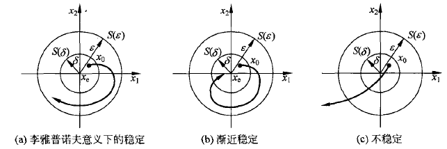
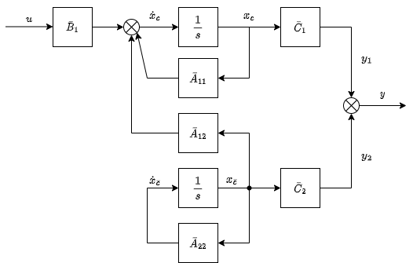
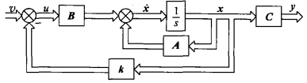
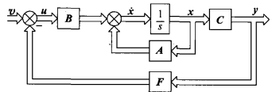

&ensp;
<!-- more -->

# 控制系统的状态空间描述
## 系统数学描述的两种基本形式
典型控制系统有被控对象、传感器、执行器和控制器组成。被控过程具有若干输入端和输出端。
系统的数学描述通常有两种基本形式：一种是基于输入、输出模型的外部描述，它将系统看出黑箱，只是反映输入输出见的关系，而不去表征系统内部结构和内部变量。另一种是基于状态空间模型的内部描述，状态空间模型反映系统内部结构与内部变量，由状态方程和输出方程组成。
状态方程反映系统内部变量和输出变量的动态关系，具有一阶微分方程组成。
输出方程则表征系统输出向量y与内部变量即输入变量间的关系，具有代数方程的形式。

外部描述不能反映系统内部结构和运行过程，内部结构不同的两个系统也可能具有相同的外部特性，因此外部描述通常是不完整的，而内部描述则全面、完整地反映出系统的动力学特征。

下图为一个简单二阶电路

图1 RLC串联电路

由上图可得
$$
LC{\text{d}^2v_c\over \text{d}t^2}+
RC{\text{d}v_c\over\text{d}t}+v_c=e
$$
若令
$$
x_1=i,x_2=V_c
$$
则有状态空间模型
$$
\begin{cases}
    \dot x_1=-\displaystyle{R\over L}x_1-{1\over L}x_2+{1\over L}e\\
    \dot x_2 =\displaystyle{1\over C}x_1\\
    y=x_2
\end{cases}
$$

将状态空间模型写出向量-矩阵形式
$$
\begin{cases}
    \begin{bmatrix}
        \dot x_1\\
        \dot x_2
    \end{bmatrix}=
    \begin{bmatrix}\displaystyle
        -{R\over L}&\displaystyle-{1\over L}\\
        \displaystyle-{1\over C}&0
    \end{bmatrix}
    \begin{bmatrix}
        x_1\\x_2
    \end{bmatrix}+
    \begin{bmatrix}
        \displaystyle{1\over L}\\0
    \end{bmatrix}
    e
    \\
    y=
    \begin{bmatrix}
        0&1
    \end{bmatrix}
    \begin{bmatrix}
        x_1\\x_2
    \end{bmatrix}
\end{cases}
$$

从这个例子可以看出与输入-输出模型相比，状态空间描述的优点在于
1. 状态变量选自电路核心元器件的关键参数，是电路系统的内部变量。
2. 一旦状态方程接触，系统中任何以变量均可以用代数方法求得。
3. 分析时，可以将某个需要的物理量设计出输出量，并列写相应的输出方程即可。
4. 系统输入量、输出量可以有多个，所以状态空间模型描述多输入-多输出系统十分方便。
5. 以状态方程和输出方程为核心的状态空间模型较好反映系统内部结构。

## 状态空间描述常用的基本概念

### 输入和输出
由外部施加到系统的激励称为输入，若输入是按需要人为施加的，又称为控制系统的被控量或从外部测量到的系统信息称为输出，若输出是由传感器测量得到的，称为观测。

### 状态、状态变量和状态向量

能完整描述和唯一确定系统时域行为或行为运行过程的一组独立变量称为系统状态，其中各个变量称为状态变量。当状态表示成以各状态为分量组成的向量时，称为状态向量。

对n阶微分方程描述的系统，当n个初始条件和输入给定时，可唯一确定方程的解。
状态变量以组的形式出现，它对于确定系统的时域行为既是必要的也是充分的。

当变量个数大于n时，则存在多余的变量，这些多余的变量就不是独立变量。判断变量是否独立的基本方法是看他们之间以及他们与输入量之间是否存在代数约束。

状态变量选取并不唯一，一个系统的状态变量通常有多种不同的选取方法，但应尽量选取能测量的物理量或独立的储能元件的储能变量作为状态变量。

### 状态空间

以状态向量的n个分量作为坐标轴所组成n维空间称为状态空间。

### 状态轨迹

系统在某时刻的状态，可以看作是状态空间的一个点，随着时间推移，系统状态不断变化，便在状态空间中描绘出一条轨迹，该轨迹称为状态轨迹。

### 状态方程

描述系统状态变量与输入变量之间关系的一阶向量微分方程或差分方程称为系统的状态方程，它不含输入的微积分项。

### 输出方程

描述系统输出变量与系统状态变量和输入变量之间函数关系的代数方程称为输出方程。

### 动态方程
状态方程与输出方程的组合称为动态方程，又称状态空间表达式。

### 线性系统

线性系统的状态方程是一阶向量线性微分方程或差分方程，输出方程是向量代数方程。
线性连续时间系统动态方程的一般形式为

$$
\begin{cases}
\dot x(t)=A(t)x(t)+B(t)u(t)\\
y(t)=C(t)x(t)+D(t)u(t)
\end{cases}
$$

设状态x、输入u、输出y的维度分别为$n，p，q，$称$n\times n$矩阵$A(t)$为系统矩阵或状态矩阵，称$n\times p$矩阵$B(t)$控制矩阵或输入矩阵，称$q\times n$矩阵$C(t)$为输出矩阵或观测矩阵，称$q\times p$矩阵$D(t)$为前馈矩阵或输入输出矩阵。

### 线性定常系统

线性定常系统即线性系统的$A,B,C,D$中各元素全部是常数。

### 线性系统的结构图
线性系统的动态方程常用结构图表示下图为其结构图，左边为连续系统结构图，右边为离散系统结构图。

图2 线性系统结构图

由于状态变量选取不是唯一的，因此状态方程、输出方程、动态方程都不是唯一的。但是用独立变量所描述的系统状态向量的维数应该是唯一的。

动态方程对于系统的描述是充分和完整的，即系统中的任何一个变量均可用状态方程和输出方程来描述。
状态方程着眼于系统动态演变过程的描述，反映状态变量间的微积分约束，而输出方程则反映系统中变量之间的静态关系，着眼于建立系统中输出变量于状态变量间的代数约束。

动态方程描述主要优点是，便于采用向量、矩阵记号简化数学描述，便于在计算机上求解，便于考虑初始条件，便于了解系统内部状态的变化特征，便于应用现代设计方法实现最优控制和最优估计，适用时变、非线性、连续、离散、随机、多变量等各类控制系统。

## 系统的传递函数矩阵
设初始条件为零，对线性定常系统的动态方程进行拉普拉斯变换，可以得到
$$
X(s)=(sI-A)^{-1}BU(s)\\
Y(s)=[C(sI-A)^{-1}B+D]U(s)
$$

系统的传递函数矩阵定义为
$$
G(s)=C(sI-A)^{-1}B+D
$$

## 线性定常系统动态方程的建立
### 根据系统物理模型建立动态方程
若以R-L-C电路方程为例，设状态变量为电感器电流和电容器电压，即$x_1=i,x_2={1\over C}\int i \text{d}t$

$$
\begin{cases}
    \begin{bmatrix}
        \dot x_1\\
        \dot x_2
    \end{bmatrix}=
    \begin{bmatrix}\displaystyle
        -{R\over L}&\displaystyle-{1\over L}\\
        \displaystyle-{1\over C}&0
    \end{bmatrix}
    \begin{bmatrix}
        x_1\\x_2
    \end{bmatrix}+
    \begin{bmatrix}
        \displaystyle{1\over L}\\0
    \end{bmatrix}
    e
    \\
    y=
    \begin{bmatrix}
        0&1
    \end{bmatrix}
    \begin{bmatrix}
        x_1\\x_2
    \end{bmatrix}
\end{cases}
$$

若设专题变量为电容器电路和电荷，即$x_1=i,x_2=\int i\text{d}t$

$$
\begin{cases}
    \begin{bmatrix}
        \dot x_1\\
        \dot x_2
    \end{bmatrix}=
    \begin{bmatrix}\displaystyle
        -{R\over L}&\displaystyle-{1\over LC}\\
        1&0
    \end{bmatrix}
    \begin{bmatrix}
        x_1\\x_2
    \end{bmatrix}+
    \begin{bmatrix}
        \displaystyle{1\over L}\\0
    \end{bmatrix}
    e
    \\
    y=
    \begin{bmatrix}
        0&\displaystyle{1\over C}
    \end{bmatrix}
    \begin{bmatrix}
        x_1\\x_2
    \end{bmatrix}
\end{cases}
$$

### 由高阶微分方程建立动态方程
#### 微分方程不含输入量的导数项
$$
y^{(n)}+a_{n-1}y^{(n-1)}+\cdots+a_1\dot y+a_0y=\beta_0u
$$

选取n个状态变量$x_1=y,x_2=\dot y,\cdots,x_n=y^{(n-1)}$，则有

$$
\begin{cases}
\dot x_1&=x_2\\
\dot x_2&=x_3\\
&\vdots\\
\dot x_{n-1}&=x_n\\
\dot x_n&=-a_0x_1-a_1x_2-\cdots-a_{n-1}x_n+\beta_0u
\end{cases}
$$

按照上式绘制的结构图称为状态变量图，其主要特点是每个积分的输出都是对于的状态变量

图3 系统的状态变量图

为了避免在状态方程中出现输入导数项，可按如下规则选择一组状态变量
$$
\begin{cases}
x_1=y-h_0u\\
x_i=\dot x_{i-1}-h_{i-1}u
\end{cases}
$$

其展开式为

$$
\begin{cases}
x_1=y-h_0u\\
x_2=\dot x_1-h_1u\\
\vdots\\
x_n=\dot x_{n-1}-h_{n-1}u
\end{cases}
$$

式中$h_0,h_1,\cdots,h_{n-1}$是n个待定系数，输出方程为

$$
y=x_1+h_0u
$$

### 由系统传递函数建立动态方程
高阶微分方程式对应单输入-单输出系统传递函数，若有系统的传递函数为

$$
G(s)={Y(s)\over U(s)}={b_ns^n+b_{n-1}s^{n-1}+\cdots+b_1s+b_0\over s^n+a_{n-1}s^{n-1}+\cdots+a_1s+a_0}
$$

则有
$$
G(s)=b_n+{\beta_{n-1}s^{n-1}+\cdots+\beta_1s+\beta_0\over s^n+a_{n-1}s^{n-1}+\cdots+a_1s+a_0}=
b_n+{N(s)\over D(s)}
$$

式中，$b_n$是联系输入、输出的前馈系数，$\displaystyle{N(s)\over D(s)}$是有理真分数。

#### 串联分解

将$\displaystyle{N(s)\over D(s)}$串联分解为两部分，如图

图3 串联分解

则有
$$
z^{(n)}+a_{n-1}z^{(n-1)}+\cdots+a_1\dot z+a_0z=u\\
y=\beta_{n-1}z^{(n-1)}+\cdots+\beta_1\dot z+\beta_0z
$$

选取状态变量
$$
x_1=z,x_2=\dot z,\cdots,x_n=z^{(n-1)}
$$

则状态方程为

$$
\begin{cases}
\dot x_1=x_2\\
\dot x_2=x_3\\
\vdots
\dot x_n=-a_0x_1-a_1x_2-\cdots-a_{n-1}x_n+u
\end{cases}
$$

输出方程为$y=\beta_0x_1+\beta_1x_2+\cdots+\beta_{n-1}x_n$

#### $N(s)\over D(s)$只含单实极点

$D(s)$可被分解为
$$
D(s)=(s-\lambda_1)(s-\lambda_2)\cdots(s-\lambda_n)
$$

则传递函数可展开成部分分式之和

$$
{Y(s)\over U(s)}={N(s)\over D(s)}=\sum_{i=1}^n{c_i\over s-\lambda_i}
$$

若令状态变量
$$
X_i(s)={1\over s-\lambda_i}U(s)
$$

那么有
$$
\begin{cases}
    \dot x_1=\lambda_1x_1+u\\
    \dot x_2=\lambda_2x_2+u\\
    \vdots\\
    \dot x_n=\lambda_nx_n+u\\
    y=c_1x_1+c_2x_2+\cdots+c_nx_n
\end{cases}
$$

若令状态变量
$$
X_i(s)={c_i\over s-\lambda_i}U(s)
$$

那么有
$$
\begin{cases}
    \dot x_1=\lambda_1x_1+c_1u\\
    \dot x_2=\lambda_2x_2+c_2u\\
    \vdots\\
    \dot x_n=\lambda_nx_n+c_nu\\
    y=x_1+x_2+\cdots+x_n
\end{cases}
$$

#### ${N(s)\over D(s)}$含重实极点

设$D(s)$可分解为
$$
D(s)=(s-\lambda_1)^2(s-\lambda_3)\cdots(s-\lambda_n)
$$

则传递函数可展开为
$$
{Y(s)\over U(s)}={N(s)\over D(s)}={c_{11}\over (s-\lambda_1)^2}+{c_{12}\over s-\lambda_1}+\sum_{i=3}^n{c_i\over s-\lambda_i}
$$

若令状态变量
$$
X_i(s)={1\over s-\lambda_i}U(s)\quad(i\neq1,2)
$$
其中
$$
X_2(s)={1\over (s-\lambda_1)}U(s),X_1(s)={1\over s-\lambda_1}X_1(s)
$$

那么有
$$
\begin{cases}
    \dot x_1=\lambda_1x_1+x_2+c_1u\\
    \dot x_2=\lambda_1x_2+c_2u\\
    \vdots\\
    \dot x_n=\lambda_nx_n+c_nu\\
    y=x_1+x_2+\cdots+x_n
\end{cases}
$$

### 由差分方程和脉冲传递函数建立动态方程
单输入-单输出线性定常离散系统差分方程的一般形式为

$$
y(k+n)+a_{n-1}y(k+n-1)+\cdots+a_0y(k)=b_nu(k+n)+b_{n-1}u(k+n-1)+\cdots+b_0u(k)
$$

可得脉冲传递函数为
$$
G(z)={Y(z)\over U(z)}={b_nz^n+b_{n-z}z^{n-1}+\cdots+b_1z+b_0\over z^n+a_{n-1}z^{n-1}+\cdots+a_1z+a_0}\\
=b_n+{\beta_{n-1}z^{n-1}+\cdots+\beta_1 z+\beta_0\over z^n+a_{n-1}z^{n-1}+\cdots+a_1z+a_0}
$$

脉冲传递函数的形式与离散传递函数的形式相同，因而连续系统动态方程的建立方法可用与离散系统，可以得到动态方程为

$$
\begin{bmatrix}
x_1(k+1)\\x_2(k+1)\\
\vdots\\x_{n-1}(k+1)\\x_n(k+1)
\end{bmatrix}
=
\begin{bmatrix}
0&1&0&\cdots&0\\
0&0&1&\cdots&0\\
\vdots&\vdots&\vdots&\ddots&\vdots\\
0&0&0&\cdots&1\\
-a_0&-a_1&-a_2&\cdots&-a_{n-1}
\end{bmatrix}
\begin{bmatrix}
x_1(k)\\x_2(k)\\
\vdots\\x_{n-1}(k)\\x
\end{bmatrix}
+
\begin{bmatrix}
0\\0\\
\vdots\\
0\\1
\end{bmatrix}
u(k)\\
y(k)=[\beta_0\quad\beta_1\quad\cdots\quad\beta_{n-1}]x(k)+b_nu(k)
$$

### 由传递函数矩阵建立动态方程

给定传递函数矩阵$\hat{G}(s)$，若有系统$S(A,B,C,D)$能使
$$
C(sI-A)^{-1}B+D=G(s)
$$
则称系统$S(A,B,C,D)$是$G(s)$的一个实现。

传递函数的实现问题矩阵的实现问题是由传递函数矩阵寻求对应动态方程问题，由于实现问题复杂，因此仅限于讨论单输入-多输出和多输入-单输出系统

#### 单输入-多输出系统
设单输入q维输出系统传递函数矩阵如图所示

图4 单输入-多输出系统结构图

系统可以看作q个子系统组成，其传递函数矩阵
$$
G(s)=
\begin{bmatrix}
G_1(s)\\G_2(s)\\
\vdots\\
G_q(s)
\end{bmatrix}
=
\begin{bmatrix}
d_1+\hat{G}_1(s)\\
d_2+\hat{G}_2(s)\\
\vdots\\
d_q+\hat{G}_q(s)\\
\end{bmatrix}=
\bold{d}+\hat{G}(s)
$$

其中，$\bold{d}$为常数向量，$\hat{G}_i(s)$为有理真分式。
通常$\hat{G}_1(s),\cdots,\hat{G}_q(s)$的特性并不相同，具有不同的分母，设最小公分母为
$$
D(s)=s^n+a_{n-1}s^{n-1}+\cdots+a_1s+a_0
$$

则$\hat{G}(s)$一般形式为
$$
\hat{G}(s)=
{1\over D(s)}
\begin{bmatrix}
\beta_{1,n-1}s^{n-1}+\cdots+\beta_{11}s+\beta_{10}\\
\beta_{2,n-1}s^{n-1}+\cdots+\beta_{21}s+\beta_{20}\\
\vdots\\
\beta_{q,n-1}s^{n-1}+\cdots+\beta_{q1}s+\beta_{q0}\\
\end{bmatrix}
$$

作串联分解可得
$$
\dot x=
\begin{bmatrix}
0&1&0&\cdots&0\\
0&0&1&\cdots&0\\
\vdots&\vdots&\vdots&\ddots&\vdots\\
0&0&0&\cdots&1\\
-a_0&-a_1&-a_2&\cdots&-a_{n-1}
\end{bmatrix}
\begin{bmatrix}
x_1\\ x_2\\
\vdots\\
x_{n-1}\\x_n
\end{bmatrix}
+
\begin{bmatrix}
0\\0\\
\vdots\\
0\\1
\end{bmatrix}
u
$$

输出方程为
$$
\begin{bmatrix}
y_1\\y_2\\
\vdots\\
y_q
\end{bmatrix}
=
\begin{bmatrix}
\beta_{10}&\beta_{11}&\cdots&\beta_{1,n-1}\\
\beta_{20}&\beta_{21}&\cdots&\beta_{2,n-1}\\
\vdots&\vdots&\ddots&\vdots\\
\beta_{q0}&\beta_{q1}&\cdots&\beta_{q,n-1}\\
\end{bmatrix}
\begin{bmatrix}
x_1\\x_2\\
\vdots\\
x_q
\end{bmatrix}
+
\begin{bmatrix}
d_1\\d_2\\
\vdots\\
d_q
\end{bmatrix}
u
$$

由于单输入-多输出系统的输出矩阵为q维列向量，输出矩阵为$q\times n$矩阵，不存在对偶形式，即不存在可观测标准型。

#### 多输入-单输出系统传递函数矩阵

设单输入p维输入系统传递函数矩阵如图所示

图4 多输入-单输出系统结构图

系统可以看作个子系统组成，系统输出由子系统输出合成为
$$
Y(s)=G(s)U(s)=\sum_{i=1}^pG_1(s)U_1(s)
$$

其中
$$
\begin{aligned}
G(s)&=[G_1(s)\quad G_2(s)\quad\cdots\quad G_p(s)]\\
&=[d_1+\hat{G_1}(s)\quad d_2+\hat{G_2}(s)\quad\cdots\quad d_p+\hat{G_p}(s)]\\
&=d+\hat{G}(s)
\end{aligned}
$$
通常$\hat{G}_1(s),\cdots,\hat{G}_q(s)$的特性并不相同，具有不同的分母，设最小公分母为$D(s)$
$$
D(s)=s^n+a_{n-1}s^{n-1}+\cdots+a_1s+a_0
$$

则$\hat{G}(s)$一般形式为
$$
G(s)=[d_1\cdots d_p]+
{1\over D(s)}
\begin{bmatrix}
\beta_{1,n-1}s^{n-1}+\cdots+\beta_{11}s+\beta_{10}\cdots\beta_{p,n-1}s^{n-1}+\cdots+\beta_{p1}s+\beta_{p0}
\end{bmatrix}
$$

状态空间方程得
$$
\dot x=
\begin{bmatrix}
0&0&\cdots&0&-a_0\\
1&0&\cdots&0&-a_1\\
0&1&\cdots&0&-a_2\\
\vdots&\vdots&\ddots&\vdots&\vdots\\
0&0&\cdots&1&-a_{n-1}
\end{bmatrix}
\begin{bmatrix}
x_1\\ x_2\\ x_3\\
\vdots\\
x_n
\end{bmatrix}
+
\begin{bmatrix}
\beta_{10}&\beta_{20}&\cdots&\beta_{p0}\\
\beta_{11}&\beta_{21}&\cdots&\beta_{p1}\\
\beta_{12}&\beta_{22}&\cdots&\beta_{p2}\\
\vdots&\vdots&\ddots&\vdots\\
\beta_{1,n-1}&\beta_{2,n-1}&\cdots&\beta_{p,n-1}
\end{bmatrix}
\begin{bmatrix}
u_1\\ u_2\\ u_3\\
\vdots\\ u_p
\end{bmatrix}
$$

输出方程为
$$
y
=
[0\quad\cdots\quad0\quad 1]x+
[d_1\quad d_2\cdots\quad d_p]u
$$

由于多输入-单输出系统的输入矩阵为$n\times p$矩阵，不存在对偶形式，即不存在可控标准型。

# 线性系统运动分析
## 线性定常连续系统的自由运动

在没有控制作用时，线性定常系统由初始条件引起的运动称为线性定常系统的自由云，可由齐次状态方程描述，即
$$
\dot x(t)=Ax(t)
$$

齐次状态方程通常采用幂级数法、凯莱-哈密顿定理和拉普拉斯变换法求解。

### 幂级数法

设齐次方程的解是时间t的向量幂级数
$$
x(t)=b_0+b_1t+b_2t^2+\cdots+b_kt^k+\cdots
$$

其中$x,b_0,b_1,b_k$都是n维向量，并求导并考虑状态方程

$$
\dot x(t)=b_1+2b_2t+\cdots+kb_kt^{k-1}=A(b_0+b_1t+b_2t^2+\cdots+b_kt^k+\cdots)
$$

由等号两边对应系数相等有
$$
b_1=Ab_0\\
b_2={1\over 2}Ab_1={1\over 2}A^2b_0\\
b_3={1\over 3}Ab_2={1\over 6}A^3b_0\\
\vdots\\
b_k={1\over k}Ab_{k-1}={1\over k!}A^kb_0\\
\vdots
$$

故

$$
x(t)=(I+At+{1\over 2}A^2t^2+\cdots+{1\over k!}A^kt^k+\cdots)x(0)
$$
定义

$$
e^{At}=I+At+{1\over2}A^2t^2+\cdots+{1\over k!}A^kt^k+\cdots=\sum_{K=0}^\infty{1\over k!}A^kt^k
$$

则
$$
x(t)=e^{At}x(0)
$$

变量微分方程$\dot x=ax$的解与指数函数$e^{at}$的关系为$x(t)=e^{at}x(0)$，由此可以看出，向量微分方程式的解与其形式上是相似的，故把e^{At}称为矩阵指数函数。
由于$x(t)$是由$x(0)$转移而来，$e^{At}$又称为状态转移矩阵，记为$\varPhi(t)$，即

$$
\varPhi(t)=e^{At}
$$

则齐次状态方程的求解问题，核心就是状态转移矩阵$\varPhi(t)$的计算问题，因而有必要进一步研究状态转移矩阵的算法和性质

### 拉普拉斯变换法
将$\dot x(t)=Ax(t)$进行拉普拉斯变换
$$
X(s)=(sI-A)^{-1}x(0)
$$
进行反变换有
$$
x(t)=\mathcal L^{-1}[(sI-A)^{-1}]x(0)
$$

因而可以得到
$$
e^{At}=\mathcal L^{-1}[(sI-A)^{-1}]
$$

上式是$e^{At}$的封闭形式

### 凯莱-哈密顿定理法

**凯莱-哈密顿定理**
矩阵A满足它子集的特征方程，即若n阶矩阵A特征多项式为
$$
f(\lambda)=[\lambda I-A]=\lambda^n+a_{n-1}\lambda^{n-1}+\cdots+a_1\lambda+a_0
$$

则有
$$
f(A)=A^n+a_{n-1}A^{n-1}+\cdots+a_1A+a_0I=0
$$

由此可以得到两个推论

推论1 
矩阵A的k次幂可表示为A的$(n-1)$阶多项式，即
$$
A^k=\sum_{m=0}^{n-1}\alpha_m A^m\quad (k\geqslant n)
$$

推论2
矩阵指数$e^{At}$可表达为A的$(n-1)$阶多项式，即

$$
e^{At}=\sum_{m=0}^{n-1}\alpha_m(t)A^m
$$

由凯莱-哈密顿定理可知，矩阵A满足他自己的特征方程，即
$$
e^{\lambda_i t}=\sum_{j=0}^{k-1}\alpha_j(t)\lambda_i^j
$$

若$\lambda_i$互不相等，则可写出n元一次方程组为
$$
\begin{cases}
e^{\lambda_1t}=&\alpha_0+\alpha_1\lambda_1+\cdots+\alpha_{n-1}\lambda_1^{n-1}\\
e^{\lambda_2t}=&\alpha_0+\alpha_1\lambda_2+\cdots+\alpha_{n-1}\lambda_2^{n-1}\\
&\vdots\\
e^{\lambda_nt}=&\alpha_0+\alpha_1\lambda_n+\cdots+\alpha_{n-1}\lambda_n^{n-1}\\
\end{cases}
$$

由此即可解出$e^{At}$。

## 状态转移矩阵
状态转移矩阵$\varPhi(0)$具有如下性质

$$
1. \varPhi(0)=I\\
2. \dot\varPhi(t)=A\varPhi(t)=\varPhi(t)A\\
3. \varPhi(t_1\pm t_2)=\varPhi(t_1)\varPhi(\pm t_2)=\varPhi(\pm t_2)\varPhi(t_1)\\
4. \varPhi^{-1}(t)=\varPhi(-t)\\
5. x(t_2)=\varPhi(t_2-t_1)x(t_1)\\
6. \varPhi(t_2-t_0)=\varPhi(t_2-t_1)\varPhi(t_1-t_0)\\
[\varPhi(t)]^k=\varPhi(kt)
$$

## 线性定常连续系统受控运动

线性定常系统在控制作用下的运动称为线性定常系统的受控运动，其数学描述为非齐次状态方程，即

$$
\dot x(t)=Ax(t)+Bu(t)
$$

该方程主要有两种解法

### 积分法
由上式有
$$
e^{-At}[\dot x(t)-Ax(t)]=e^{-At}Bu(t)
$$

由于
$$
{\text{d}\over\text{d}t}[e^{-At}x(t)]=e^{-At}[\dot x(t)-Ax(t)]
$$

因此积分后有

$$
e^{-At}x(t)-x(0)=\int_0^te^{-A\tau}Bu(t)\text{d}\tau
$$

即

$$
\begin{aligned}
x(t)=&e^{At}x(0)+\int_0^t e^{A(t-\tau)}Bu(\tau)\text{d}\tau\\
=&\varPhi(t)x(0)+\int_0^t\varPhi(t-\tau)Bu(\tau)\text{d}\tau
\end{aligned}
$$

上式等号右边第一项为状态转移项，是系统对初始状态的响应，即零输入响应，第二项是系统对输入作用的响应，即零状态响应。
若取t_0作为初始时刻，则有

$$
\begin{aligned}
x(t)=&e^{A(t-t_0)}x(t_0)+\int_{t_0}^te^{A(t-\tau)}Bu(\tau)\text{d}\tau\\
=&\varPhi(t-t_0)x(t_0)+\int_{t_0}^t\varPhi(t-\tau)Bu(\tau)\text{d}\tau
\end{aligned}
$$

### 拉普拉斯变换法

将两端取拉普拉斯变换有
$$
sX(s)-X(0)=AX(s)+BU(s)\\
X(s)=(sI-A)^{-1}X(0)+(sI-A)^{-1}BU(s)
$$

进行拉普拉斯反变换有
$$
x(t)=\mathcal L^{-1}(sI-A)^{-1}x(0)+\mathcal L^{-1}[(sI-A)^{-1}BU(s)]
$$

## 线性定常离散系统的运动分析

求解离散系统运动的方法主要有z变换和递推法，前者只适用线性定常系统，后者对非线性系统、时变系统都适用。
下面用递推法求解系统响应，重写系统的动态方程如下
$$
\begin{cases}
    x(k+1)=\varPhi x(k)+Gu(k)\\
    y(k)= Cx(k)+Du(k)
\end{cases}
$$

令状态方程中的$k=0,1,\cdots,k-1$，可得到$T,2T,\cdots,kT$时刻的状态，即
$$
k=0\qquad x(1)=\varPhi x(0)+Gu(0)\\
k=1\qquad x(2)=\varPhi x(1)+Gu(1)\\
\vdots\\
k=k-1\quad x(k)=\varPhi x(k-1)+Gu(k-1)\\
y(k)=Cx(k)+Du(k)=C\varPhi^kx(0)+C\sum_{i=0}^{k-1}\varPhi^{k-1-i}Gu(i)+Du(k)
$$

于是系统解为
$$
\begin{cases}
    x(k)=\varPhi^k x(0)+\sum_{i=0}^{k-1}\varPhi^{k-1-i}Gu(i)\\
    y(k)=C\varPhi^kx(0)+C\sum_{i=0}^{k-1}\varPhi^{k-1-i}Gu(i)+Du(k)
\end{cases}
$$

## 连续系统的离散化
### 线性定常连续系统的离散化

已知线性定常连续系统状态方程$\dot x=Ax+Bu$在$x(t_0)$及$u(t)$作用下的解为
$$
x(t)=\varPhi(t-t_0)x(t_0)+\int_{t_0}^t\varPhi(t-\tau)Bu(\tau)\text{d}\tau
$$

假定采样过程时间间隔相等，令$t_0=kT$，则$x(t_0)=x(k)$，令$t=(k+1)T$，则
$$
x(k+1)=\varPhi[(k+1)T-kT]x(k)+\int_{kT}^{(k+1)T}
\varPhi[(k+1)T-\tau]B\text{d}\tau u(k)
$$

故离散化的状态方程为
$$
x(k+1)=\varPhi(T)x(k)+G(T)u(k)
$$

### 非线性时变系统的离散化及分析方法

对于$\dot x=f[x(t), u(t),t]$表示的非线性时变系统，状态方程很难求得解析解，常采用近似的离散化处理方法。
当采用周期T足够小时，按导数定义有

$$
\dot x(k)\approx{1\over T}[x(k+1)-x(k)]
$$

则有离散化后的状态方程
$$
x(k+1)=x(k)+Tf[x(k), u(k),k]
$$

对于非线性时变系统，一般先离散化，然后递推计算求解数值方法进行系统的运动分析。

# 控制系统的李雅普诺夫稳定性分析

稳定性描述系统受到外界干扰，平衡工作状态被破坏后，系统偏差调节过程的收敛性。它是系统的重要特征，是系统正常工作的必要条件。
李雅普诺夫建立了基于状态空间描述的稳定性理论，提出依赖于线性系统微分方程的解来判断稳定性的第一方法称为间接法，和利用经验和技巧来构造李雅普诺夫函数借以判断稳定性的第二方法称为直接法。

李雅普诺夫提出的这一理论是确定系统稳定性更一般的理论，不仅适用于单变量、线性、定常系统，还适用于多变量、非线性、时变系统。

## 李雅普诺夫稳定性概念

忽略输入后，非线性时变系统的状态方程为
$$
\dot x=f(x,t)
$$

其中，x为n维状态向量，t为时间变量。

假定方程的解$x(t;x_0,t_0)$，$x_0,t_0$分别为初始状态向量和初始时刻。

### 平衡状态

若对于所有t，满足
$$
\dot x_e=f(x_e,t)=0
$$

$x_e$称为平衡状态，平衡状态的各分类不再随时间变换。
若已知状态方程，令$\dot x=0$所求解x，便是平衡状态。

对于线性定常系统$\dot x=Ax$，其平衡状态的满足$Ax_e=0$，如果矩阵A非奇异，系统只有唯一的零解。
至于非线性系统，f(x_e,t)=0的解可能有多个，由系统状态方程决定。

控制系统李雅普诺夫稳定性理论所指的稳定性是关于平衡状态的稳定性，反映了系统在平衡状态附近的动态行为。鉴于实际线性系统往往只有一个平衡状态，平衡状态的稳定性能够表征整个系统的稳定性。
对于具有多个多个平衡状态的非线性系统来说，需要逐个加以考虑，还需结合具体初始条件下的系统运动轨迹来考虑。

接下来主要研究平衡状态位于状态空间原点(即零状态)的稳定性问题。

### 李雅普诺夫稳定性定义

#### 李雅普诺夫稳定性
如果对于任意小的$\varepsilon>0$，均有$\delta(\varepsilon,t_0
)>0$，当初始状态满足$\|x_0-x_e\|\leq\delta$时，系统运动轨迹满足
$\lim\limits_{t\to\infty}\|x(t;x_0,t_0)-x_e \|\leqslant\varepsilon$，则该平衡状态$x_e$是李雅普诺夫意义下稳定，$\|x_0-x_e \|$表示状态空间中$x_0$点至$x_e$之间距离，其数学表达式
$$
\|x_0-x_e \|=\sqrt{(x_{10}-x_{1e})^2+\cdots+(x_{n0}-x_{ne})^2}
$$

设系统初始状态$x_0$位于平衡状态以$x_e$为球心、半径$\delta$的闭球域$S(\delta)$内，如果系统稳定，则状态方程的解$x(t;x_0,t_0)$在$t\to\infty$的过程中，都位于以$x_e$为球心，半径为$\varepsilon$的闭球域$S(\varepsilon)$内。

#### 一致稳定性

通常$\delta$与$\varepsilon,t_0$都有关。如果$\delta$与$t_0$无关，则称平衡状态是一致稳定的。

#### 渐进稳定性

系统的平衡状态不仅具有李雅普诺夫意义下的稳定性，且有

$$
\lim\limits_{t\to\infty}
\|x(t;x_0,t_0)-x_e  \|\to 0
$$

称此平衡状态时渐进稳定的，这时，从$S(\delta)$出发的轨迹不仅不会超出$S(\varepsilon)$，且当$t\to\infty$时收敛于$x_e$附近。

#### 大范围稳定

当初始条件扩展至整个状态空间，且具有稳定性时，称此平衡状态时大范围稳定的，或全局稳定。
此时，$\delta\to\infty$，$S(\delta)\to\infty$，$x\to\infty$。
对于线性系统，如果它是渐进稳定的，必具有大范围稳定，因为线性系统稳定性与初始条件无关。非线性系统的稳定性一般与初始条件的大小密切相关，通常只能在小范围内稳定。

#### 不稳定性

不管$\delta$取多小，只要在$S(\delta)$内有一条从$x_0$出发的轨迹跨出$S(\varepsilon)$，则称此平衡状态时不稳定的。

图5 稳定性的平面几何表示

按李雅普诺夫稳定性定义，当系统作不衰减的振荡运动时，将在平面内绘出一条封闭的曲线，只要不超过$S(\varepsilon)$，则认为时稳定的，这同经典控制理论中的稳定性定义时有差异的。

## 李雅普诺夫稳定性间接判别法
适用于线性定常、线性时变及可线性化的非线性系统。

线性定常系统的特征值判据为系统$\dot x=Ax$渐进稳定的充要条件时：系统矩阵A的全部特征值位于复平面的左半部。

证明
假定A有相异特征值$\lambda_1,\cdots,\lambda_n$，根据线性代数理论，存在非奇异线性变换$x=P\bar{x}$，$P$由特征值$\lambda_i$对应的特征向量构成，为常数矩阵。可使$\bar{A}$对角化。有

$$
\bar{A}=P^{-1}AP
$$

变换后状态方程的解为

$$
\bar{x}(t)=e^{At}\bar{x}(0)=\text{diag}(e^{\lambda_1t}\cdots e^{\lambda_nt})\bar{x}(0)
$$

故原状态方程的解为
$$
x(t)=Pe^{\bar{A}t}P^{-1}=
P\text{diag}(e^{\lambda_1t}\cdots e^{\lambda_nt})P^{-1}
$$

将上式展开，$e^{At}$的每一行元素都是$e^{\lambda_1t},\cdots,e^{\lambda_nt}$的线性组合，因而可写成矩阵多项式

$$
e^{At}=\sum_{i=1}^nR_ie^{\lambda_it}
$$

故$x(t)$可以表达出与$\lambda_i$的关系，即
$$
x(t)=e^{At}x(0)
$$

对于任意$x(0)$，均有$x(t)|_{t\to\infty}\to 0$，系统渐进稳定。

李雅普诺夫稳定性直接判别法

李雅普诺夫第二法利用李雅普诺夫函数直接对平衡状态稳定性进行判断，无需求出系统状态方程的解。

根据物理学原理，若系统存储的能量随时间推移而衰减，系统迟早会达到平衡状态。
实际系统的能量表达式相当难找，因此李雅普诺夫引入了广义能量函数，称之为李雅普诺夫函数。
它与$x_1,\cdots,x_n$及t有关，是一个标量函数，记以$V(x,t)$，若不显含t，则记为$V(x)$。
考虑到能力总大于0，故为正定函数，能力衰减特性用$\dot V(x,t)$表示。

但至今为形成构造李雅普诺夫函数的通用方法，需凭经验与技巧。
实践表明，对于大多数系统，可先尝试用二次型函数$x^TPx$作为李雅普诺夫函数。

### 标量函数定号性
1. 正定性，标量函数在域$S$中对所有非零状态有$V(x)>0$，且$V(0)=0$，称$V(x)$在域$S$内正定。
2. 负定性，标量函数在域$S$中对所有非零状态有$V(x)<0$，且$V(0)=0$，称$V(x)$在域$S$内负定。
3. 负（正）半定性，$V(0)=0$，$V(x)$在域$S$内某些状态处有$V(x)=0$，而其他状态均有$V(x)<0(V(x)>0)$，则称$V(x)$在域$S$内负（正）半定。
4. 不定性，$V(x)$在域$S$内可正可负，则称$V(x)$不定。

二次型函数是一类重要的标量函数，即

$$
V(x)=x^TPx=
\begin{bmatrix}
x_1&\cdots&x_n
\end{bmatrix}
\begin{bmatrix}
p_{11}&\cdots&p_{1n}\\
\vdots&\ddots&\vdots\\
p_{n1}&\cdots&p_{nn}
\end{bmatrix}
\begin{bmatrix}
x_1\\
\vdots\\
x_n
\end{bmatrix}
$$

其中$P$为对称矩阵，有$p_{ij}=p_{ji}$，其定号性由塞尔维斯特准则判定。
当$P$的各顺序主子行列式均大于零时，$P$为正定矩阵，则$V(x)$正定。当$P$的各顺序主子行列式负正相间时，$P$为负定矩阵，则$V(x)$负定。若主子行列式含有等于零的情况，则$V(x)$为半正定或半负定。

### 李雅普诺夫第二法诸稳定性定理

设系统状态方程为$\dot x=f(x,t)$，其平衡状态满足$f(0,t)=0$，不失一般性，把状态空间原点作为平衡状态，并设系统在原点邻域存在$V(x,t)$对$x$的连续一阶偏导数。

1. 定理1，若$V(x,t)$正定，$\dot V(x,t)$负定，则原点是渐进稳定的。
2. 定理2，若$V(x,t)$正定，$\dot V(x,t)$半负定，且在非零状态不恒为零。则原点是渐进稳定的。
3. 定理3，若$V(x,t)$正定，$\dot V(x,t)$半负定，且在非零状态恒为零。则原点是李雅普诺夫意义下稳定。
4. 定理4，若$V(x,t)$正定，$\dot V(x,t)$正定，则原点是不稳定的。

应当说，李雅普诺夫函数的选取不是唯一的。但只要找到一个满足定理所述条件，便可以对原点的稳定性做出判断，并不因为选取李雅普诺夫函数不同而变化。

不过至今无构造李雅普诺夫函数的通用方法，这时应用李雅普诺夫稳定性理论的主要障碍，如果选取不当，会出现$\dot V(x,t)$不定的结果。

以上方法并未考虑实际稳定系统可能存在衰减振荡的情况，因此条件是偏于保守的。

## 线性定常系统的李雅普诺夫稳定性分析

### 连续系统渐进稳定的判别

设系统状态方程为$\dot x=Ax$，$A$为非奇异矩阵，故原点是唯一平衡点，可以取正定二次型函数作为李雅普诺夫函数，即
$$
V(x)=x^TPx
$$
求导并考虑状态方程
$$
\dot V(x)=\dot x^TPx+x^TP\dot x=x^T(A^TP+PA)x
$$

令
$$
A^TP+PA=-Q
$$
从而得到
$$
\dot V(x)=-x^TQx
$$

因此只要$Q$矩阵正定，则系统是大范围一致渐进稳定的，于是线性定常连续系统渐进为你的难过的判定条件可表示为：给定一个正定矩阵$P$，存在满足上式的正定矩阵$Q$。

### 离散系统渐进稳定判别
设系统状态方程为$x(k+1)=\varPhi x(k)$，原点是平衡状态，取正定二次型函数。
$$
V[x(k)]=x^T(k)Px(k)
$$

取
$$
\Delta V[x(k)]=V[x(k+1)]-V[x(k)]
$$

则有
$$
\Delta V[x(k)]=x^T(k+1)Px(k+1)-x^T(k)Px(k)=x^T(k)[\varPhi^TP\varPhi-P]x(k)
$$

令

$$
\varPhi^TP\varPhi-P=-Q
$$

于是有
$$
\Delta V[x(k)]=-x^T(k)Qx(k)
$$

因此系统$x(k+1)=\varPhi x(k)$渐进稳定的充分条件是，给定任一正定实对称矩阵$Q$，存在正定对称矩阵$P$，使得上式成立。

### 李雅普诺夫稳定性、BIBS稳定性、BIBO稳定性直接关系
线性定常系统的BIBO稳定判据主要依据传递函数矩阵进行，如果极点全部唯一左半复平面，则系统BIBO稳定。

线性定常系统的BIBS稳定判据主要依据系统矩阵A进行，如果极点全部唯一左半复平面，则系统BIBS稳定。

对于线性定常系统，如果系统是渐进稳定的，则系统必然是BIBS稳定和BIBO稳定的。
如果系统是BIBS稳定的则系统必然是BIBO稳定的，即渐进稳定要求的条件严于BIBS稳定。
如果系统是李雅普诺夫稳定，则系统不一定是BIBS稳定和BIBO稳定的。

# 线性系统的可控性和可观测性
## 可控性和可观测性的概念

在用传递函数描述的控制系统中，输出量一般是可控的和可以被测量的，因而不需要特别提及可控性和可观测性。

现代控制理论用状态方程和输出方程描述系统，输出和输入构成系统的外部变量，状态为内部变量。

就好比系统是一块集成电路芯片，内部结构可能未知，而外部只有少数举个引脚，这就存在着系统内所有状态是否都受输入控制和所有状态是否都可以从输出反映处理的问题，这就是可观性和可控性问题。

可控性和可观性是用状态空间描述系统引申出来的新概念和稳定性是控制系统的三个属性。

## 线性定常系统的可控性

### 离散系统的可控性

#### 单输入离散系统的状态可控性
n阶单输入线性定常离散系统状态可控性定义为：在有限衰减间隔$t\in [0, nT]$内，存在无约束的阶梯控制序列$u(0),\cdots,u(n-1)$，能使系统从任意初态$x(0)$转移至任意终态$x(n)$，则称该系统状态完全可控，简称可控。

设单输入系统状态方程为
$$
x(k+1)=\varPhi x(k)+gu(k)
$$

其解为
$$
x(k)=\varPhi^k x(0)+\sum_{i=0}^{k-1}\varPhi^{k-1-i}gu(i)
$$

定义
$$
\Delta x=x(n)-\varPhi^nx(0)
$$

由于$x(0)$和$x(n)$的取值可以是任意的，因此$\Delta x$的取值可以是任意的，有

$$
\Delta x=\varPhi^{n-1}gu(0)+\varPhi^{n-2}gu(1)+\cdots+gu(n-1)
$$

记
$$
S_1=[g\quad \varPhi g\quad \cdots\quad\varPhi^{n-1}g]
$$

称$n\times n$方阵$S_1$为单输入离散系统的可控性矩阵，n个方程有n个未知数$u(0),\cdots,u(n-1)$，由线性方程组解的存在定理可知，当矩阵$S_1$的秩相等时，方程组有解。

注意到在$\Delta x$为任意的情况下，要使得方程组有解的充要条件是矩阵$S_1$满秩，即

$$
\text{Rank}S_1=n
$$

当$\text{Rank}S_1$时，系统不可控，表示不存在能使任意$x(0)$转移到任意$x(n)$的控制。

#### 多输入离散系统的状态可控性

单输入离散系统可控性的判断方法可推广到多输入系统，设系统状态方程为

$$
x(k+1)=\varPhi x(k)+gu(k)
$$

可控性矩阵为
$$
S_2=[G\quad \varPhi G\quad \cdots\quad\varPhi^{n-1}G]\\
\Delta x=\varPhi^{n-1}Gu(0)+\varPhi^{n-2}Gu(1)+\cdots+Gu(n-1)
$$

该矩阵为$n\times np$矩阵，由于列向量$u(n-1),\cdots,u(0)$构成的控制列向量是$np$维的。
上式含有n个方程和np个待求的控制量。
由于$\Delta x$是任意的，矩阵$S_2$的秩为$n$时，方程才有解，即

$$
\text{Rank}S_2=n
$$

多输入线性定常离散系统的状态转移过程一般可少于n个采样周期。

### 连续系统的可控性
#### 单输入连续系统的状态可控性

定义为：在有限时间间隔$t\in[t_0, t_f]$内，如果存在无约束的分段连续控制函数$u(t)$，能使系统从任意初态$x(t_0)$转移至任意终态$x(t_f)$，则称该系统是状态完全可控的。

设状态方程为
$$
\dot x=Ax+bu
$$

终态解为

$$
x(t_f)=e^{A(t_f-t_0)}+\int_{t_0}^{t_f} e^{A(t_f-\tau)}bu(\tau)\text{d}\tau
$$

定义
$$
\Delta x=x(t_f)-e^{A(t_f-t_0)}x(t_0)
$$

显然，$\Delta x$是任意的，于是有
$$
\Delta x=\int_{t_0}^{t_f}e^{A(t_f-\tau)}bu(\tau)\text{d}\tau
$$

利用凯莱-哈密顿定理的推论

$$
e^{-A\tau}=\sum_{m=0}^{n-1}\alpha_m(\tau)A^M
$$
有

$$
\Delta x=e^{At_f}\sum_{m=0}^{n-1}A^mb \int_{t_0}^{t_f}\alpha_m (\tau)u(\tau) \text{d}\tau
$$

若令
$$
u_m=\int_{t_0}^{t_f}\alpha_m(\tau)u(\tau) \text{d}\tau
$$
考虑到$u_m$是标量，有
$$
e^{-At_f}\Delta x=\sum_{m=0}^{n-1}A^mbu_m=
[b\quad Ab\quad\cdots\quad A^{n-1}b]
$$

记
$$
S_3=[b\quad Ab\quad\cdots\quad A^{n-1}b]
$$

同离散系统一样，状态可控的充要条件是
$$
\text{Rank}S_3=n
$$

#### 多输入线性定常连续系统的可控性

设状态方程为
$$
\dot x=Ax+bu
$$

记
$$
S_4=[B\quad AB\quad\cdots\quad A^{n-1}B]
$$

同离散系统一样，状态可控的充要条件是
$$
\text{Rank}S_4=n
$$

## 线性定常系统的可观测性
### 离散系统状态可观测性

定义为：已知输入向量序列$u(0),\cdots,u(n-1)$及在有限采样周期内测量到的输出向量序列$y(0),\cdots,y(n-1)$，能唯一确定任意初始状态向量$x(0)$，则称系统是完全可观测的。

设系统状态空间描述为

$$
\begin{cases}
x(k+1)=\varPhi x(k)+Gu(k)\\
y(k)=Cx(k)+Du(k)
\end{cases}
$$

可假设输入为0，其动态方程解$y(k)$写成展开式为
$$
x(k)=\varPhi^kx(0)\\
y(k)=C\varPhi^kx(0)
$$

$$
\begin{cases}
y(0)=Cx(0)\\
y(1)=C\varPhi x(0)\\
\vdots\\
y(n-1)=C\varPhi^{n-1}x(0)
\end{cases}
$$

令

$$
V_1^T=
\begin{bmatrix}
C\\
C\varPhi\\
\vdots\\
C\varPhi^{n-1}
\end{bmatrix}
$$

称$nq\times n$矩阵$V_1^T$为线性定常离散系统的可观测性矩阵，上式展开后有$nq$个方程，若其中有n个独立方程，便可以唯一确定一组$x_1(0),\cdots,x_n(0)$，故可观测的充要条件为
$$
\text{Rank}V_1^T=n
$$

#### 连续系统的状态可观测性

定义为：已知输入$u(t)$在有限时间间隔$t\in[t_0, t_f]$内测量到输出$y(t)$，能唯一确定初始状态$x(t_0)$，则称系统是完全可观测的，简称系统可观测。

对多输入-多输出连续系统，系统可观测的充要条件是
$$
\text{Rank}V_2^T=\text{Rank}
\begin{bmatrix}
C\\
CA\\
\vdots\\
CA^{n-1}
\end{bmatrix}=n
$$

## 可控性、可观性与传递函数矩阵的关系

### 单输入-单输出系统
设系统的动态方程为
$$
\begin{cases}
\dot x=Ax+bu\\
y=cx
\end{cases}
$$

当A矩阵具有相异特征值$\lambda_1,\cdots,\lambda_n$时，通过线性变换，定可使矩阵A对角化为

$$
\dot z=
\begin{bmatrix}
\lambda_1&&0\\
&\ddots&\\
0&&\lambda_n
\end{bmatrix}
z+
\begin{bmatrix}
r_1\\
\vdots\\
r_n
\end{bmatrix}
u\\
y=
\begin{bmatrix}
f_1&\cdots&f_n
\end{bmatrix}
z=
\sum_{i=1}^nf_iz_i
$$
根据A矩阵对角化的可控、可观性判据可知：当$r_i$时，$x_i$不可控，当$f_i=0$时，$x_i$不可观。由于

$$
G(s)={Y(s)\over U(s)}=c(sI-A)^{-1}b
$$

$(sI-A)^{-1}b$是输入至状态向量之间的传递矩阵，这可由状态方程两端取拉普拉斯变换来导出，即
$$
X(s)=(sI-A)^{-1}bU(s)
$$

若$r_1=0$，即$x_1$不可控，则$(sI-A)^{-1}b$矩阵一定会出现零极点对消现象。
若$f_1=0$，即$x_1$不可观，则$(sI-A)^{-1}b$矩阵一定会出现零极点对消现象。

以上判据适用于单输入-单输出系统，对多输入-多输出系统一般不适用。

由不可约传递函数列写的动态方程一定是可控可观的，不能反映系统中可能存在的不可控不可观的属性。
由动态方程导出传递函数时，表明系统或是可控、不可观测的，或是可观测、不可控的，或是不可观测、不可控的。

传递函数可约时，若对消的时系统的一个不稳定值，便可能掩盖了系统固有的不稳定性而认为系统稳定。
通常说传递函数描述系统数学不完全，就是值它可能掩盖系统的不可控性、不可观测性及不稳定性。

只有系统时可控又可观测时，传递函数描述才与状态空间描述是等价的。

### 多输入-多输出系统

多输入-多输出系统传递函数矩阵存在零极点对消，系统并非一定不可控或不可观的。

多输入系统可控的充要条件是：传递函数矩阵$(sI-A)^{-1}B$的n行线性无关。
多输入系统可观的充要条件是：传递函数矩阵$C(sI-A)^{-1}$的n列线性无关。

## 连续系统离散后的可控性与可观测性
一个可控的连续系统在其离散化后并不一定保持其可控性，可观测性同理。

设连续系统动态方程为
$$
\begin{bmatrix}
\dot x_1\\
\dot x_2
\end{bmatrix}
=
\begin{bmatrix}
0&1\\
-w^2&0
\end{bmatrix}
\begin{bmatrix}
x_1\\ x_2
\end{bmatrix}
+
\begin{bmatrix}
0\\1
\end{bmatrix}
u\\
y=\begin{bmatrix}
1&0
\end{bmatrix}
\begin{bmatrix}
x_1\\x_2
\end{bmatrix}
$$

其状态转移矩阵
$$
\varPhi(t)=
\begin{bmatrix}
\cos wt& {\sin wt\over w}\\
-w\sin wt &\cos wt
\end{bmatrix}
\\
G(t)=
\begin{bmatrix}
{1-\cos wT\over w^2}\\
{\sin w T\over w}
\end{bmatrix}
$$

离散化状态方程为

$$
\begin{aligned}
x(k+1)=&\varPhi(T)x(k)+G(T)u(k)\\
=&
\begin{bmatrix}
\cos wt& {\sin wt\over w}\\
-w\sin wt &\cos wt
\end{bmatrix}
\begin{bmatrix}
x_1(k)\\
x_2(k)
\end{bmatrix}
+
\begin{bmatrix}
{1-\cos wT\over w^2}\\
{\sin w T\over w}
\end{bmatrix}
u(k)
\end{aligned}
$$

离散后系统的可控矩阵为

$$
S=[G\quad \varPhi G]
$$

当采样周期$T={kT\over w}$时，系统不可控，故离散化系统的采样周期选择不当，便不能保持原连续系统的可控性。

# 线性系统非奇异线性变换及系统的规范分解

## 线性系统的非奇异线性变换及其性质
### 非奇异线性变换

设系统动态方程

$$
\begin{cases}
\dot x(t)=Ax(t)+Bu(t)\\
y(t)=Cx(t)+Du(t)
\end{cases}
$$

令$x=P\bar{x}$，则变换后的动态方程为
$$
\dot{\bar{x}}(t)=\bar{A}\bar x(t)+\bar Bu(t)\\
y(t)=\bar C \bar x(t)+\bar Du(t)
$$

则有
$$
\bar x=P^{-1}x,\bar A=P^{-1}AP,\bar B=P^{-1}B,\bar C=CP,\bar D=D
$$

线性变换的目的在于使A矩阵或系统规范化，以便揭示系统属性，简化分析、计算与设计。

## 对偶原理

设有系统$S_1(A,B,C)$，则称系统$S_2(A^T,C^T,B^T)$为系统$S_1$的对偶系统。其动态方程为
系统$S_1$:
$$
\dot x=Ax+Bu,y=Cx
$$

系统$S_2$:
$$
\dot z=A^T+C^Tv,w=B^Tz
$$

注意：如果系统$S_1$可控，则$S_2$必然可观测，如果系统$S_1$可观测，则$S_2$必然可控，反之亦然，这就是对偶原理。

不难验证，系统$S_1$的可控性矩阵与系统$S_2$的可观测性矩阵完全相同，反之亦然。

在动态建模、系统可控性和可观测性判别、系统线性变换等问题上，应用对偶原理，往往可以使问题简化。

可以把可观测的单输入-单输出系统化为可观测标准型问题，转化为其对偶系统化为可控标准型的问题
其步骤如下
1. 列出对偶系统的可控性矩阵$V_2$
2. 求出矩阵$V_2$的逆矩阵$V_2^{-1}$
3. 取$V_2^{-1}$的第n行$V_n^T$，并按下列规则构造变换矩阵
$$
P=
\begin{bmatrix}
v^T_n\\
v^T_nA^T\\
\vdots\\
v_n^T(A^T)^{n-1}
\end{bmatrix}
$$
4. 求矩阵$P$的逆矩阵$P^{-1}$且令$z=P^{-1}\bar z$，变换后的动态方程为
$$
\dot{\bar{z}}=PA^TP^{-1}\bar z+Pc^Tv,w=b^TP^{-1}\bar z
$$
5. 再用一次对偶原理，可得原系统的可观测标准型

## 线性系统的规范分解

不可控系统含有可控、不可控两种状态变量，状态变量可以分解成可控$x_c$、不可控$x_{\bar c}$两类，与之对应，系统和状态空间可分成可控子系统和不可控子系统。

同样，不可观测系统状态变量可以分解成可观测$x_o$、不可观测$x_{\bar o}$两类，状态空间也能分成可观测子空间和不可观测子空间，这个分解过程称为系统的规范分解

分解过程还可以进一步深入，状态变量可以分解成可控可观测，不可观测不可控、可观测不可控和不可观测可控四类。

规范分解过程可以先从可控分解开始再进行可观测分解。

### 可控性分解

设不可控系统动态方程为
$$
\dot x=Ax+Bu,y=Cx
$$

假定可控性矩阵的秩为r，从可控性局长选出r个线性无关的列向量，再附加上任意尽可能简单的$n-r$个列向量，构成非奇异的$T^{-1}$变换矩阵，令
$$
x=T^{-1}
\begin{bmatrix}
    x_c\\x_{\bar c}
\end{bmatrix}
$$

就可以变换成如下的标准构造

$$
\begin{bmatrix}
    \dot x_c\\ \dot x_{\bar c}
\end{bmatrix}
=
TAT^{-1}
\begin{bmatrix}
    x_c\\ x_{\bar c}
\end{bmatrix}
+
TBu\\
y=CT^{-1}
\begin{bmatrix}
    x_c\\ x_{\bar c}
\end{bmatrix}
$$

式中

$$
TAT^{-1}=
\begin{bmatrix}
    \bar A_{11}&\bar A_{12}\\
    0& \bar A_{22}
\end{bmatrix}\qquad
TB=
\begin{bmatrix}
    \bar B_1\\0
\end{bmatrix}\\
CT^{-1}=[\bar C_1\quad\bar C_2]
$$

由此可得

$$
\dot x_c=\bar A_{11}x_c+\bar A_{12}x_{\bar c}+\bar B_1u\\
\dot x_{\bar c}=\bar A_{22}x_{\bar c}\\
y=\bar C_1x_c+\bar C_2x_{\bar c}
$$

则可控子系统状态方程为
$$
\dot x_c=\bar A_{11}x_c+\bar A_{12}x_{\bar c}+\bar B_1u\\
y_1=\bar C_1x_c
$$

不可控子系统状态方程
$$
\dot x_{\bar c}=\bar A_{22}x_{\bar c}\\
y_2=\bar C_2x_{\bar c}
$$

可控性分解后的系统结构图如图所示

图6 系统的可控性规范分解结构图

由于u仅通过可控子系统传递到输出，故u到y之间的传递函数矩阵不能反映不可控部分的属性。
但是可控子系统的状态想要$x_c(t)$及系统输出相应$y(t)$均与$x_{\bar c}$有关，不可控子系统对整个系统的影响依然存在，如果要求整个系统稳定，则$\bar A_{22}$应仅含稳定特征值。

### 可观测性分解

设不可观测系统动态方程为
$$
\dot x=Ax+Bu,y=Cx
$$

假定可控性矩阵的秩为l，从可控性局长选出l个线性无关的列向量，再附加上任意尽可能简单的$n-l$个列向量，构成非奇异的$T^{-1}$变换矩阵，令
$$
x=T^{-1}
\begin{bmatrix}
    x_o\\x_{\bar o}
\end{bmatrix}
$$

就可以变换成如下的标准构造

$$
\begin{bmatrix}
    \dot x_o\\ \dot x_{\bar o}
\end{bmatrix}
=
TAT^{-1}
\begin{bmatrix}
    x_o\\ x_{\bar o}
\end{bmatrix}
+
TBu\\
y=CT^{-1}
\begin{bmatrix}
    x_o\\ x_{\bar o}
\end{bmatrix}
$$

式中

$$
TAT^{-1}=
\begin{bmatrix}
    \bar A_{11}&0  \\
    \bar A_{21} & \bar A_{22}
\end{bmatrix}\qquad
TB=
\begin{bmatrix}
    \bar B_1\\ \bar B_2
\end{bmatrix}\\
CT^{-1}=[\bar C_1\quad0]
$$

由此可得

$$
\dot x_o=\bar A_{11}x_o+\bar B_1u\\
\dot x_{\bar o}=\bar A_{21}x_o \bar A_{22}x_{\bar o}+\bar B_2u \\
y=\bar C_1x_o
$$

则可观测子系统状态方程为
$$
\dot x_c=\bar A_{11}x_o+\bar B_1u\\
y_1=\bar C_1x_c
$$

不可观测子系统状态方程
$$
\dot x_{\bar o}=\bar A_{11}x_{\bar o}+\bar A_{22}x_{\bar o}+\bar B_2u    \\
y_2=0
$$

可控性分解后的系统结构图如图所示

图6 系统的可观测性规范分解结构图

# 线性定常控制系统的综合设计

## 状态反馈与极点配置
系统状态变量可测量是用状态反馈进行极点配置的前提。
状态反馈有两种基本形式：
一种为状态反馈至微分处。
一种为状态反馈至控制输出处。
前者可以任意配置系统矩阵从而任意配置状态反馈系统的几点，使系统性能达到最佳且设计上只需要将状态反馈矩阵与原有的系统矩阵合并即可。但是需要为反馈控制量增加新的注入点，否则无法实施反馈控制，显然这在工程上往往是难以实现的。
后者则是状态反馈控制信号与原有的控制输入信号叠加后在原控制输入注入，正好解决输入问题，工程上容易实现。

图7 状态反馈至控制输入

设单输入系统的动态方程为
$$
\dot x=Ax+bu\\
y=Cx
$$

状态向量x通过待设计的状态反馈矩阵，负反馈至控制输入处，有

$$
u=v-kx
$$

状态反馈系统的动态方程为

$$
\dot x=Ax+b(v-kx)=(A-bk)x+bv\\
y=Cx
$$

显然引入状态反馈后，只改变了系统矩阵及其特征值，b，c矩阵均无改变。

**用状态反馈任意配置系统闭环极点的充要条件是系统可控，且状态反馈不改变系统的可控性。**

## 输出反馈与极点配置

输出反馈有两种基本形式：
一种为将输出量反馈至状态微分处。
一种为将输出量反馈至控制输入处。
由于输出量一般是可测量的，因此输出反馈工程容易实现。且对于单输入-单输出系统输出反馈不能任意配置高阶系统的闭环极点，因此，多输入-单输出系统来讨论。

图8 输出反馈至控制输入

图9 输出反馈至状态微分

设输出反馈至状态微分处动态方程为
$$
\dot x=Ax+bu-hy\\
y=Cx
$$

即

$$
\dot x=(A-hC)x+bu\\
y=Cx
$$

**用输入至状态微分的反馈任意配置系统闭环极点的充要条件是系统可观测，且状态反馈不改变系统的可观测性。**

## 状态重构与状态观测器设计

极点配置上，状态反馈优于输出反馈，但是工程上未必实现。
输入量一般可测，然而输出反馈至状态微分处，在工程上同样难以实现，但是如果反馈至输入处，往往又不能任意配置系统的闭环极点。

于是就提出了利用系统的输入，通过状态观测器重构系统状态，然后将状态估计至反馈至控制输入处来配置系统极点的方案。
当忠狗状态想的维数与系统状态的维数相同时，观测器成为全维状态观测器，否则称为降维观测器。

### 全维状态观测器机器状态反馈系统组成结构

设系统动态方程为

$$
\dot x=Ax+Bu,y=Cx
$$

可构造一个结构与之相同的系统
$$
\dot{\hat{x}}=A\hat{x}+Bu,\hat{y}=C\hat{x}
$$

式中，$\hat{x},\hat{y}$分别为模拟系统的状态向量及输出向量，当模拟系统与受控对象的初始状态相同时有$\hat{x}=x$，但是受控对象的初始状态一般不可能知道，模拟系统的状态初值只能预估值，因而两个系统总有差异，用$\hat{x}$代替$x$难以真正实现状态反馈。
但是$\hat{x}-x$存在会导致$\hat{y}-y$的存在，可以利用$\hat{y}-y$，负反馈至$\dot{\hat{x}}$处，并设置H为观测器输出反馈矩阵，目的是配置观测器极点，提高其动态性能，使得$\hat{x}-x$尽快逼近0

图9 全维状态观测器实现状态反馈

### 全维状态观测器分期设计

由图9可得全维状态观测器动态方程为

$$
\dot{\hat{x}}=A\hat{x}+Bu-H(\hat{y}-y)\\
\hat{y}=C\hat{x}
$$
故

$$
\dot{\hat{x}}=A\hat{x}+Bu-HC(\hat{x}-x)=
(A-HC)\hat{x}+Bu+Hy
$$

$A-HC$称为观测器系统矩阵，为了保证状态反馈系统正常工作，重构的状态在任何$\hat{x}(t_0)$与$x(t_0)$的初始条件下，都必须满足

$$
x-\dot{\hat{x}}=
(A-HC)(x-\hat{x})
$$

其解为
$$
x-\hat{x}=e^{(A-HC)(t-t_0)}[x(t_0)-\hat{x}(t_0)]
$$

当$\hat{x}(t_0)=x(t_0)$，恒有$\hat{x}(t)=x(t)$，输出反馈不起作用，当$\hat{x}(t_0)\neq x(t_0)$时，有$\hat{x}(t)\neq x(t)$，输出反馈便起作用。
只要观测器具有负实部，状态误差向量总会按指数规律衰减，衰减速率取决于观测器的极点配置，由输出反馈有

$$
\dot{\hat{x}}=
(A-HC)\hat{x}+Bu+Hy
$$

实际选择H矩阵参数时，既要防止状态反馈失真，又要防止数值过大导致饱和效应和噪声加剧等，通常希望观测器的响应速度比状态反馈系统的响应速度快$3\sim 10$倍。

#### 分离特性

用全维状态观测器提供的状态估计值$\hat{x}$代替真实状态$x$来实现状态反馈，其状态反馈矩阵是否需要重新设计；
观测器被引入系统后状态反馈系统部分是否会改变已经设计好的观测器极点配置；
其观测器输出反馈矩阵$H$是否需要重新设计。
这些问题均需要作进一步分析。

如图9，其中
$$
u-v-K\hat{x}
$$

状态反馈子系统的动态方程为

$$
\begin{cases}
    \dot x=Ax+Bu=Ax-BK\hat{x}+Bv\\
    y=Cx
\end{cases}
$$

全维状态观测器子系统的状态方程为

$$
\dot{\hat{x}}=A\hat{x}+Bu-H(\hat{y}-y)=
(A-BK-HC)\hat{x}+HCx+Bv
$$

故复合系统动态方程为

$$
\begin{bmatrix}
    \dot{x}\\
    \dot{\bar{x}}
\end{bmatrix}
=
\begin{bmatrix}
    A&-BK \\
    HC & A-BK-HC
\end{bmatrix}
\begin{bmatrix}
    x\\ 
    \bar{x}
\end{bmatrix}
+
\begin{bmatrix}
    B\\B
\end{bmatrix}
v\\
y=[C\quad 0]
\begin{bmatrix}
    x\\
    \hat{x}
\end{bmatrix}
$$

由于

$$
x-\dot{\hat{x}}=
(A-HC)(x-\hat{x})
$$

可以得到复合系统的另一种形式

$$
\begin{cases}
\begin{bmatrix}
    \dot{x}\\
    \dot x-\dot{\hat{x}}
\end{bmatrix}
=
\begin{bmatrix}
    A&-BK \\
    0 & A-HC
\end{bmatrix}
\begin{bmatrix}
    x\\ 
    x-\hat{x}
\end{bmatrix}
+
\begin{bmatrix}
    B\\0
\end{bmatrix}
v\\
y=[C\quad 0]
\begin{bmatrix}
    x\\
    x-\hat{x}
\end{bmatrix}
\end{cases}
$$

可以导出复合系统传递函数矩阵

$$
G(s)=
\begin{bmatrix}
    C&0
\end{bmatrix}
\begin{bmatrix}
    sI-(A-BK)&-BK\\
    0&sI-(A-HC)
\end{bmatrix}^{-1}
\begin{bmatrix}
    B\\0
\end{bmatrix}
$$

利用分块矩阵求逆公式

$$
\begin{bmatrix}
    R&S\\
    0&T
\end{bmatrix}^{-1}
=
\begin{bmatrix}
    R^{-1}&-R^{-1}ST^{-1}\\
    0&T^{-1}
\end{bmatrix}
$$

得到

$$
G(s)=C[sI-(A-BK)]^{-1}B
$$

上式正是引入真实状态x作为反馈的状态反馈系统，即

$$
\dot{x}=(A-BK)x+Bv\\
y=Cx
$$

的传递函数矩阵。
这表明复合系统与状态反馈系统具有相同的传递特性，与观测器的部分无关。

从2n维复合系统导出了$n\times n$传递函数矩阵，这是由于$x-\hat{x}$不可控造成的。

复合系统的特征多项式为

$$
\begin{vmatrix}
    sI-(A-BK)&-BK\\
    0&sI-(A-HC)
\end{vmatrix}
=
|sI-(A-BK)||sI-(A-HC)|
$$

这表明复合系统特征值有状态反馈子系统和全维状态观测器特征值组合，两部分相互独立，因此状态反馈矩阵K和输出反馈矩阵H，可根据各自要求来独立进行设计。

#### 分离定理

若受控系统$S(A,B,C)$可控、可观测，用状态观测器估值形成状态反馈时，其系统的极点配置和观测器设计可分别独立进行。

