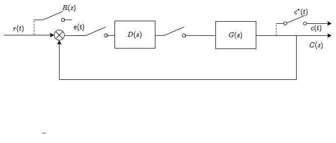

&ensp;
<!-- more -->

# 离散系统
离散控制系统是指在控制系统的一处或输出信号为脉冲序列或数码的系统。

如果在系统中使用了采样开关，将连续信号变为脉冲序列去控制系统，则称此系统为采样控制系统。

如果在系统中采用了数字计算机或数字控制器，其信号是以数码形式传递的，则称此系统为数字控制系统。

通常把采样控制系统和数字控制系统统称为离散控制系统。

数字控制系统是一种以数字计算机为控制器去控制具有连续工作状态的被控对象的闭环控制系统。
因此，数字控制系统包括工作于离散状态下的数字计算机和工作于连续状态下的被控对象两大部分。
下图给出数字控制系统的原理框图

图1 数字控制系统原理框图

图中计算机作为校正装置被引进系统，它只能接受时间上离散、数值上被量化的数码信号，而系统的被控量、给定量一般为连续的模拟信号。
因此，需要将偏差量$e(t)$进行离散化，再由A/D将每个离散点进行量化，转换成数码信号。然后进入计算机进行数字运算，输出的仍然是时间上离散、数值上量化的数码信号。数码信号不能直接作用于被控对象，因为在两个离散点之间是没有信号的，需要保持器补上输出信号值。
最简单的保持器为零阶保持器，它将前一个采样点的值一直保持到后一个采样点出现前。作用到被控对象上，数模转换和信号保持都由D/A完成。

当数字计算机字长足够长，转换精度够高，可忽略量化误差影响，近似认为转换有唯一对应关系。
此时，A/D相当于一个采样开关，D/A相当于一个保持器，又将计算机规律近似用传递函数加一个采样开关等效描述，这样可以得到下图的结构图

图2 计算机控制结构图

# 信号保持和采样

## 信号采样

在采样过程中，把连续信号转换成脉冲或数码序列的过程称作采样过程

实现采样的装置，叫做采样开关或采样器，如果采样开关以周期T时间闭环，并且闭合的时间为$\tau$，这样就一个连续函数$e(t)$就变成了一个断续的脉冲序列$e^*(t)$。
在实际过程中，采样开关闭合持续时间很短，可近似认为$\tau\approx0$，同时假设计算机字长足够长，忽略量化误差的影响，输入采样信号就是一串理想脉冲。可以得到其数学描述
$$
e^*(t)=e(0)\delta(t)+e(T)\delta(t-T)+\cdots+e(nT)\delta(t-nT)+\cdots
$$
或
$$
e^*(t)=e(t)\sum_{n=-\infty}^{\infty}\delta(t-nT)
$$

## 采样定理
如何将离散信号不失真恢复到原来的形状，这设计到采样频率如何选择的问题。
由于理想单位脉冲序列$\delta_T(t)$是周期函数，可以展开为复数形式傅里叶级数
$$
\delta_T(t)=\sum_{n=-\infty}^\infty c_ne^{jnw_st}
$$

其中$w_s=2\pi/T$，为采样角频率，T为采样周期，$c_n$是傅里叶级数系数，由下式确定
$$
c_n={1\over T}\int_{-T/2}^{T/2}\delta_T(t)e^{-jnw_st}dt
$$

由于$\delta_T(t)$在$t=0$时有值,所以有
$$
c_n={1\over T}\int_{0_-}^{0_+}\delta(t)dt={1\over T}
$$

将其带回去可得
$$
\delta_T(t)={1\over T}\sum_{n=-\infty}^{+\infty}e^{jnw_st}
$$
则有
$$
e^*(t)=e(t){1\over T}\sum_{n=-\infty}^{+\infty}e^{jnw_st}
={1\over T}\sum_{n=-\infty}^{+\infty}e(nT)e^{jnw_st}
$$

上式两边取拉普拉斯变换，由移位定理得
$$
E^*(s)={1\over T}\sum_{n=-\infty}^{+\infty}E(s+jnw_s)
$$

令s=jw，得

$$
E^*(jw)={1\over T}\sum_{n=-\infty}^{+\infty}E[j(w+nw_s)]
$$

其中，$E(jw)$为相应连续信号$e(t)$的傅里叶变换，$|E(jw)|$为$e(t)$频谱。一般来说，连续信号的带宽是有限的。，上式表明采样信号具有以采样频率为周期的无线频谱。
除了主频谱外，还包含无线多个附加的高频频谱分量，只不过复制上变化了$1/T$倍。
为了准确复现被采样信号，可用一个理想的低通滤波器滤掉全部附加的高频频谱分量，保留主频谱。
如果频谱中最高频率为$w_h$，则$e^*(t)$频谱不混叠的条件为
$$
w_s\geqslant2w_h\qquad 或\qquad T\leqslant{\pi\over w_h}
$$

即为香农采样定理，定理说明，当采样频率大于或等于信号所含最高频率两倍，才有可能通过理想滤波器，把信号完整恢复出来。

## 采样周期的选择

采样周期T是离散控制系统设计中的一个重要因素，采样定理只给出不产生频率混叠的T的最大值。
显然，T越小，获得控制控制过程的信息越多，控制效果也会越好。但是T过短也会增加不必要的计算负担，难以实现复杂的控制率。
反之，会给系统控制过程带来较大的误差，影响系统的动态性能，甚至导致系统不稳定。

从频率性能指标来看，控制系统的闭环频率响应通常具有低通滤波性，当随动系统输入信号的频率高于其闭环幅相特性的带宽时，信号通过系统会显著衰减。可以认为通过系统的控制信号最高频率分量为$w_b$。
一般随动系统的开环截止频率与闭环带宽频率比较接近，可以认为$w_c=w_b$，因此，可以认为超过$w_c$的频率分量通过系统将被大幅度衰减，根据工程经验有
$$
w_s=10w_c
$$

因此有
$$
T={\pi\over 5w_c}
$$

从时域性能指标来看，采样周期可根据阶跃响应的调节时间$t_s$，按下列经验公式有
$$
T={t_s\over 40}
$$

## 零阶保持器

为了控制被控对象，需要将数字计算器输出的离散信号回复成连续信号。但是理想滤波器实际上是不可实现的，因此，需要寻找在特性上接近理想滤波器，而物理上又可以实现的滤波器。

零阶保持器实现简单，是工程上常用的保持器。作用是把某时刻的采样值一直保持到下一个采样时刻，从而使采样信号$e^*(t)$变成阶梯信号$e_h(t)$，因为$e_h(t)$在每个采样周期内的导数为0，故称零阶保持器。
给零阶保持器输入一个理想脉冲$\delta(t)$则其单位脉冲响应函数$g_h(t)$是幅值为1，持续时间为T的矩形脉冲，它可分解为两个单位阶跃函数的和
$$
g_h(t)=1(t)-1(t-T)
$$

对脉冲响应函数$g_h(t)$取拉普拉斯变换，可得零阶保持器的传递函数
$$
G_h(s)={1\over s}-{e^{-Ts}\over s}
$$
令s=jw，得到零阶保持器的频率特性
$$
G_h(jw)={1-e^{-jwT}\over jw}={2e^{-jwT/2}(e^{jwT/2}-e^{-jwT/2})\over2jw}=T{\sin(wT/2)\over wT/2}e^{-jwT/2}
$$

若用$w_s=2\pi/T$来表示，则有
$$
G_h(jw)={2\pi\over w_s}{\sin\pi(w/w_s)\over\pi(w/w_s)}e^{-j\pi(w/w_s)}
$$

根据上式绘制零阶保持器的频率特性曲线

图3 零阶保持器频率特性

由图可得，零阶保持器幅频特性的幅值随频率的增大而衰减，具有明显的低通滤波性，但与理想滤波器幅频特性相比，在$w=w_s/2$，其幅值只有初值的$63.7\%$，另外，零阶保持器除了允许主频分量通过外，还允许一部分高频分量通过。
从相频特性可以看出，零阶保持器会产生相角滞后，所以经过恢复以后所得到的连续信号$e_h(t)$和原有信号$e(t)$是有区别的。
如果把零阶保持器的输出阶梯信号的中点光滑连接起来，可以得到与连续信号形状一致但时间上滞后T/2的曲线。
所以粗略将，引入零阶保持器，相当于给系统增加了一个延迟环节，会使系统总的滞后角增大，对系统的稳定性不利，这与零阶保持器滞后特性是一致的。

# z变换
## z变换的定义
对采样信号的数学描述进行拉普拉斯变换有
$$
E^*(s)={\mathcal L[e^*(t)]}=\sum_{n=0}^{\infty}e(nT)
{\mathcal L}[\delta(t-nT)]=\sum_{n=0}^\infty e(nT)e^{-nTs}
$$

上式的$e^{-Ts}$是s的超越函数，直接运算不方便，为此引入变量
$$
z=e^{Ts}
$$

将其代回去，可得
$$
E(z)=E^*(s)|_{s={\ln z\over T}}=\sum_{n=0}^\infty e(nT)z^{-n}
$$

z变换定义式有明确的物理意义，即变量$z^{-n}$的系数代表连续时间函数$e(t)$在采样时刻$nT$上的采样值。

## z变换的方法

### 级数求和法

根据z变换的定义，将连续信号$e(t)$按周期T进行采样，将采样点的值代入，可得E(z)的级数展开式
$$
E(z)=e(0)+e(T)z^{-1}+e(2T)z^{-2}+\cdots+e(nT)z^{-n}+\cdots
$$
若有连续时间函数如下
$$
e(t)=
\begin{cases}
a^t,&t\geqslant0\\
0,&t<0
\end{cases}
$$

按周期T=1进行采样可得
$$
e(n)=
\begin{cases}
a^n,&n\geqslant0\\
0,&n<0
\end{cases}
$$

则有
$$
E(z)=\sum_{n=0}^\infty e(nT)z^{-n}=\sum_{n=0}^\infty(az^{-1})^n
$$

若$|z|>|a|$，则无穷级数是收敛的，利用等比求和公式有
$$
E(z)={1\over 1-az^{-1}}={z\over z-a}
$$

### 部分分式法
若连续信号的拉普拉斯变换可展开成部分分式之和，且每一部分都是z变换表中所对应的标准函数，即
$$
E(s)=E_1(s)+E_2(s)+\cdots+E_n(s)
$$

若有
$$
E(s)={s+2\over s^2(s+1)}
$$
则有
$$
E(s)={2\over s^2}-{1\over s}+{1\over s+1}
$$

查表可得

$$
E(z)={2Tz\over (z-1)^2}-{z\over z-1}+{z\over z-e^{-T}}
$$

### 留数法
若已知$E(s)$和它的全部极点$s_i$，可用下列留数计算公式计算采样序列的z变换

$$
E(z)=\sum_{I=1}^l[Res E(s){z\over z-e^{Ts}}]_{s\to s_i}
$$

若$s_i$为单极点
$$
Res[E(s){z\over z-e^{Ts}}]_{s\to s_i}
=\lim\limits_{s\to s_i}[(s-s_i)E(s){z\over z-e^{Ts}}]
$$

若$s_i$为m重极点
$$
Res[E(s){z\over z-e^{Ts}}]_{s\to s_i}=
{1\over (m-1)!}\lim\limits_{s\to s_i}{d^{m-1}\over ds^{m-1}}[(s-s_i)^mE(s){z\over z-e^{Ts}}]
$$

若有$E(s)=\displaystyle{s(2s+3)\over (s+1)^2(s+2)}$
，则$E(s)$的极点为-2，-1，其中-1为二重极点。则有
$$
E(z)=\lim\limits_{s\to-1}{d\over ds}[(s+1)^2{s(2s+3)\over(s+1)^2(s+2)}{z\over z-e^{Ts}}]+
\lim\limits_{s\to-2}[(s+2){s(2s+3)\over(s+1)^2(s+2)}{z\over z-e^{Ts}}]\\
={-Tze^{-T}\over z(z-e^{-T})^2}+{2\over z-e^{-2T}}
$$

## z变换基本定理
### 线性定理
若$E_1(z)=\mathcal Z[ e_1(t)],E_2(z)=\mathcal Z[ e_2(t)],a,b$为常数，则有
$$
\mathcal Z[ ae_1(t)\pm be_2(t)]=aE_1(z)\pm bE_2(z)
$$

### 实位移定理
如果函数$e(t)$是可以z变换的，则有滞后定理
$$
z[e(t-kT)]=z^{-k}E(z)
$$

以及超前定理
$$
z[e(t+kT)]=z^k[E(z)-\sum_{n=0}^{k-1}e(nT)z^{-n}]
$$

### 复位移定理

如果函数$e(t)$是z变换的，则有
$$
\mathcal Z[a^{\mp bt}e(t)]=E(za^{\pm bt})
$$

### 初值定理
设$e(t)$的z变换为$E(z)$，并存在极限$\lim\limits_{z\to\infty}E(z)$，则
$$
\lim\limits_{t\to0}e^*(t)=\lim\limits_{z\to\infty}E(z)
$$

### 终值定理
如果信号$e(t)$的z变换为$E(z)$，信号序列$e(nT)$为有限值。
$$
\lim\limits_{n\to\infty}e(nT)=\lim\limits_{z\to1}(z-1)E(z)
$$

## z反变换

### 幂级数法
设
$$
E(z)={10z\over (z-1)(z-2)}
$$
则有

变量$z^{-n}$的系数代表连续时间函数在$nT$时刻上的采样值。根据$z^{-n}$的系数便可以得出时间序列$e(nT)$的值。

### 部分分式法

根据已知的$E(z)$，通过查z变换表找出相应的$e^*(t)$，或者$e(nT)$。
考虑到z变换函数$E(z)$在其分子上都有因子z，所以通常线将$E(z)/z$展开成部分分式之和。

设
$$
E(z)={10z\over (z-1)(z-2)}
$$

那么
$$
{E(z)\over z}={-10\over z-1}+{10\over z-2}
$$
所以
$$
E(z)={-10z\over z-1}+{10z\over z-2}
$$

最后可得
$$
e^*(t)=\sum_{n=0}^\infty 10(2^n-1)\delta(t-nT)
$$

### 留数法
$E(z)$的幂级数展开形式为
$$
E(z)=\sum_{n=0}^\infty e(nT)z^{-n}
$$

设函数$E(z)z^{n-1}$除有限个极点$z_1,z_2,\cdots,z_k$外，在z域上是解析的，则有

$$
e(nT)=\sum_{i=1}^k Res[E(z)z^{n-1}]_{z\to z_i}
$$

其中，若$z_i$为单极点则有
$$
Res[E(z)z^{z-1}]_{z\to z_i}
=\lim\limits_{z\to z_i}[(z-z_i)E(z)z^{n-1}]
$$

若$z_i$为m重极点
$$
Res[E(z)z^{z-1}]_{z\to z_i}=\lim\limits_{z\to z_i}
{1\over (m-1)!}{\huge\{ }  {d^{m-1} \over dz^{m-1} }[(z-z_i)^m E(z)z^{n-1}] \huge\}
$$

若$E(z)=\displaystyle{z^3\over (z-1)(z-5)^2}$，则有

$$
Res[E(z)z^{n-1}]_{z\to 1}=
\lim\limits_{z\to 1}(z-1){z^{n+2}\over(z-1)(z-5)^2}=
{1\over 16}\\
Res[E(z)z^{n-1}]_{z\to 5}=
{d\over dz}[(z-5)^2{z^{n+2}\over (z-1)(z-5)^2}]=
{(4n+3)5^{n+1}\over 15}
$$

## z变换的局限性

z变换是研究线性定长离散系统的一种有效工具，但z变换也有其本身的局限性，使用时应注意其使用范围

1. 输出z变换函数$C(z)$只确定了时间函数$c(t)$在采样瞬时的值，而不能反映$c(t)$在采样点间的信息。
2. 用z变换法分析离散系统时，若在采样开关和系统连续部分传递函数$G(s)$之间有零阶保持器，则$G(s)$极点数**应**至少比其零点数多一个，反之，则**应**多两个，即 $G(s)$的脉冲响应在t=0时，必须没有跳跃，或者满足
$$
\lim\limits_{s\to\infty}sG(s)=0
$$
否则，用z变换法得到的系统采样输出$c^*(t)$与实际连续输出$c(t)$之间会有较大差别。

# 离散系统的数学模型

## 差分方程及其解法

### 差分的概念
设连续函数为$e(t)$，其采样函数为$e(kT)$简记为$e(k)$，则一阶前向差分定义为

$$
\Delta e(k)=e(k+1)-e(k)
$$

二阶前向差分定义为
$$
\Delta^2e(k)=\Delta[e(k+1)-e(k)]\\
=\Delta e(k+1)-\Delta e(k)\\=
e(k+2)-2e(k+1)+e(k)
$$

同理可得n阶前向差分定义为
$$
\Delta^n e(k)=\Delta^{n-1}e(k+1)-\Delta^{n-1}e(k)
$$

同理一阶后向差分定义为

$$
\nabla e(k)=e(k1)-e(k-1)
$$

二阶后向差分定义为

$$
\nabla^2e(k)=\nabla[e(k)-e(k-1)]\\
=\nabla e(k)-\nabla e(k-1)\\=
e(k)-2e(k-1)+e(k-2)
$$

同理可得n阶后向差分定义为
$$
\nabla^n e(k)=\nabla^{n-1}e(k)-\nabla^{n-1}e(k-1)
$$

### 离散系统的差分方程
对于连续系统而言，系统的数学模型可以用微分方程来表示。如果把离散序列$r(k),c(k)$看成连续系统的$r(t),c(t)$，那么可以得到离散系统的差分方程。
设系统采样周期为T，当T足够小时，函数$r(t)$在t=kT处的一阶导数近似为
$$
\.{r}(kT)\approx {r(kT)-r[(k-1)T]\over T}
$$
同理可以写出二阶导数
$$
\"{r}(k)\approx {r(k)-2r(k-1)+r(k-2)\over T^2}
$$

如此，可以一直写出n阶导数。

所以，离散系统的输入特性可用后向差分方程表示，其一般表达式为
$$
\sum_{i=0}^na_i c(k-i)=\sum_{j=0}^m b_jr(k-j)
$$

也可以用前向差分方程表示，其一般表达式为
$$
\sum_{i=0}^na_i c(k+i)=\sum_{j=0}^m b_jr(k+j)
$$

前向差分方程和后向差分方程并无本质区别，前向差分方程多用于描述非零初始条件的离散系统，若不考虑初始条件，就系统输入、输出关系而言，两者等价。

### 差分方程求解
#### 迭代法
迭代法是一种是一种递推方法，适合计算机递推运算求解。
若已知二阶连续系统的微分方程为
$$
\"c(t)-4\.c(t)+3c(t)=1(t)\\
c(t)=0\quad t\leqslant0
$$
现将其离散化，采样周期T=1，则有

$$
\Delta^2c(k)-4\Delta c(k)+3c(k)=c(k+2)-6(k+1)+8c(k)=1(k)\\
c(k+2)=6c(k+1)-8c(k)+1(k)
$$

根据上式的递推关系以及初始条件$c(k)=0\quad(k\leq0)$，可得到如下迭代
$$
k=-1:c(1)=6c(0)-8c(-1)+1(-1)=0\\
k=0:c(2)=6c(1)-8c(0)+1(0)=1\\
k=1:c(3)=6c(2)-8c(1)+1(1)=7\\
\vdots
$$

#### z变换法

对差分方程两端取z变换，并利用z变换的实数位移定理，得到以z为变量的代数方程，然后对代数方程的解取z反变换，可求得输出序列。
设二阶线性齐次差分方程为
$$
c(k+2)-2c(k+1)+c(k)=0\\
$$
设初始条件$c(0)=0,c(1)=1$

对上式进行z变换可得
$$
(z^2-2z+1)C(z)=z
$$

那么

$$
C(z)={z\over(z-1)^2}
$$

反变换可得
$$
c^*(t)=\sum_{n=0}^\infty nT\delta(t-nT)
$$

## 脉冲传递函数

### 脉冲传递函数的定义

典型开环离散系统结构图如下图

图4 离散系统结构图

图中$G(s)$是连续部分的传递函数，则线性定长离散系统的脉冲传递函数定义为：在零初始条件下，系统输出序列z变换与输入序列z变换之比
$$
G(z)={\mathcal Z[c^*(t)]\over \mathcal Z[(r^*(t))]}={C(z)\over R(z)}
$$

这里零初始含义为，当t<0，输入脉冲序列以及输出脉冲序列值均为零。
上式表明，如果已知$R(z)$和$G(z)$，则在零初始条件下，线性定常离散系统的输出采样信号为
$$
c^*=\mathcal Z^{-1}[G(z)R(z)]
$$

应当明确，虚设的采样开关假定是与输入采样开关同步工作的，但它实际不存在，如果系统的实际输入$c(t)$比较平滑，且采样频率比较高，则可用$c^*(t)$近似描述$c(t)$

### 脉冲传递函数的性质
与连续系统传递函数性质相对应，离散系统脉冲传递函数具有下列性质
1. 脉冲传递函数是复变量z的复函数。
2. 脉冲传递函数只与系统自身的结构参数有关。
3. 系统的脉冲传递函数与系统的差分方程有直接联系，$z^{-1}$相当于一拍延迟因子。
4. 系统的脉冲传递函数是系统的单位脉冲响应序列的z变换。

### 由传递函数求脉冲传递函数

传递函数的拉普拉斯反变换是系统单位脉冲响应函数k(t)，将k(t)离散画得到脉冲响应序列k(nT)，将k(nT)进行z变换可得到G(z)，这一变换过程如下
$$
G(s)=>\mathcal L^{-1}[G(s)]=k(t)=>k^*(t)=>\mathcal Z[k^*(t)]=G(z)
$$

由于利用z变换可以直接从$G(s)$得到$G(z)$，而不必逐步推导，所以常把上述过程表示为$G(z)=\mathcal Z[ G(s)]$，这一表示应理解为$G(z)=\mathcal Z[G(s)]$，这一表示应理解为根据上述过程求出所对应的$G(z)$，而不能理解为直接进行$z=e^{Ts}$代换的结果。

## 开环系统脉冲传递函数

当开环离散系统由几个环节串联组成时，由于采用开关数目和位置不同，求出的开环脉冲传递函数也会不同

### 串联环节之间无采用开关时

在两个连续环节$G_1(s)$和$G_2(s)$之间没有采样开关隔开。此时系统传递函数为
$$
G(s)=G_1(s)G_2(s)
$$

将它当作整体一起进行z变换
$$
G(z)=\mathcal Z[G_1(s)G_2(s)]=G_1G_2(z)
$$

### 串联环节之间有采样开关
根据脉冲传递函数定义有
$$
D(z)=G_1(z)R(z),C(z)=G_2(z)D(z)
$$

其中，$G_1(z)$和$G_2(z)$分别为$G_1(s)$和$G_2(s)$的脉冲传递函数，于是有
$$
C(z)=G_2(z)G_1(z)R(z)
$$

因此，开环系统脉冲传递函数为
$$
G(z)={C(z)\over R(z)}=G_1(z)G_2(z)
$$

这表明，由于采样开关隔开的两个线性连续环节串联时，的脉冲传递函数，等于这两个环节各自的脉冲传递函数之积。

### 有零阶保持器
设有零阶保持器的开环离散系统如图所示

图5 有零阶保持器的离散系统

可以将上图进行变换

图6 有零阶保持器变换的离散系统

则有
$$
C(z)=\mathcal Z[1-e^{-Ts}]\cdot
\mathcal Z[{G_p(s)\over s}]R(z)=
(1-z^{-1})\mathcal Z[{G_p(s)\over s}]R(z)
$$

于是，有零阶保持器时，开环系统脉冲传递函数为
$$
G(z)={C(z)\over R(z)}=(1-z^{-1})\mathcal Z[{G_p(s)\over s}]
$$

## 闭环系统脉冲传递函数

由于采样器在闭环系统中可以有多种配置方式，因此闭环离散系统结构图形式并不唯一

图7 闭环离散结构图

图中虚线所示的采样开关是为了便于分析虚设的，所有采样开关同步工作，采样周期为T。

根据开环脉冲传递函数可以写出
$$
C(z)={G(z)\over 1+GH(z)}R(z)
$$

离散系统闭环脉冲传递函数为
$$
\varPhi(z)={C(z)\over R(z)}={G(z)\over 1+GH(z)}
$$

同理可以求出闭环离散系统的误差脉冲传递函数

$$
\varPhi_e(z)={E(z)\over R(z)}={1\over 1+GH(z)}
$$

与连续系统类似，令$\varPhi(z)$或$\varPhi_e(z)$的分母多项式为零，便可以得到闭环离散系统的特征方程
$$
D(z)=1+GH(z)=0
$$

需要指出，离散系统闭环脉冲传递函数不能直接从$\varPhi(s)$和$\varPhi_e(s)$

# 稳定性分析
连续系统稳定的充要条件是全部闭环极点均位于左半s平面。对于离散系统，通过z变换后，离散系统的特征方程转变为z的代数方程。可以把s平面上的稳定范围映射到z平面，在z平面上分析离散系统的稳定性。

## s域到z域的映射
设s域中的任意点可表示为$s=\sigma+jw$，映射到z域为
$$
z=e^{(\sigma+jw)T}=e^{\sigma T}e^{jwT}\\
|z|=e^{\sigma T},\angle z=wT
$$

当$\sigma=0$，$|z|=1$表示s平面的虚轴映射到z平面上是一个单位圆。
当$\sigma>0$，$|z|>1$表示右半s平面的虚轴映射到z平面上是单位圆以外的区域。
当$\sigma<0$，$|z|<1$表示左半s平面的虚轴映射到z平面上是单位圆以内的区域。

在观察$w$从$-\infty$到$+\infty$变换，相角$\angle z$的变换情况。当s平面上的相应点从虚轴从$-w_s/2$移到$w_s/2$其中$w_s=2\pi/T$，对应z平面的相应点沿着单位圆从$-\pi$逆时针变化到$\pi$。
一次类推，从$w_s/2$移到$3w_s/2$，z平面上相应点又沿着单位圆逆时针转过一圈。
由此可见，可以把s平面划分为无穷多条平行于实轴的周期带，其中$-w_s/2$到$w_s/2$的周期带称为主频带，其余为次频带。

## 稳定的充要条件

离散系统稳定性概念与连续系统相同，如果一个线性定常离散系统的脉冲响应序列趋于0，则系统是稳定的，否则不稳定。

假设离散控制系统的输出$c^*(t)$的z变换可以写为
$$
C(z)={M(z)\over D(z)}R(z)
$$
式中，$M(z)$和$D(z)$分别表示系统闭环脉冲传递函数$\varPhi(z)$的分子和分母多项式，并且$D(z)$的阶数高于$M(z)$的阶数。在单位脉冲作用下，系统输出

$$
C(z)=\varPhi(z)={M(z)\over D(z)}=\sum_{i=1}^n{c_iz\over z-p_i}
$$

式中，$p_i$为$\varPhi(z)$的极点，对求反z反变换，得
$$
c(kT)=\sum_{i=1}^nc_ip_i^k
$$

若要系统稳定，必须有$|p_i|<1$，这表明离散系统得全部极点必须全部位于z平面的单位圆内。
综上所述，线性定常离散系统稳定的充要条件是，系统闭环脉冲传递函数的全部极点均位于z平面的单位圆内，或者系统所有特征根模值全小于1 。

应当指出，上述结论是在闭环特征方程无重根的情况推导出来的，但对有重根的情况也是准确的。

## 稳定判据

连续系统的劳斯稳定判据，实质上是用来判断系统特征方程根，是否都在左半s平面。而在离散系统中需要判断系统特征方程的根是否z平面单位圆内。因此在z域中不能直接利用劳斯判据，必须引入w变换，使z平面单位圆内的区域，映射成w平面上的左半平面。

### w变换与w域中的劳斯判据

如果令
$$
z={w+1\over w-1}
$$

则有
$$
w={z+1\over z-1}
$$

w变换是一种可逆的双向变换，设
$$
z=x+jy,w=u+jv
$$

则有
$$
u+jv={(x^2+y^2)-1\over (x-1)^2+y^2}-j{2y\over (x-1)^2+y^2}
$$

由上式可知当$|z|=x^2+y^2>1$时，$u>0$表明z平面单位圆外的区域映射到w平面虚轴的右侧;
当$|z|=x^2+y^2=1$时，$u=0$表明z平面单位圆外的区域映射到w平面虚轴的虚轴;
当$|z|=x^2+y^2<1$时，$u<0$表明z平面单位圆外的区域映射到w平面虚轴的左侧;

判断一个离散系统是否稳定，可将离散系统的z特征方程变换为w特征方程，然后利用劳斯稳定判据判断系统的稳定性。

### jury稳定判据
jury稳定判据是直接在z域内应用额稳定判据，它直接根据离散系统闭环特征方程$D(z)=0$的系数，判断闭环极点是否全部位于z平面的单位圆内，从而判断系统是否稳定。

设线性定常离散系统的闭环特征方程为
$$
D(z)=a_0+a_1z+a_2z^2+\cdots+z_nz^n=0
$$

排出jury表如下所示
$$
\begin{array}{c|c|c|c|c|c|c|c|c|c|c}
\hline
行数&z^0&z^1&z^2&z^3&\cdots&z^{n-k}&\cdots&z^{n-2}&z^{n-1}&z^n\\
\hline
1&a_0&a_1&a_2&a_3&\cdots&a_{n-k}&\cdots&a_{n-2}&a_{n-1}&a_n\\
\hline
2&a_n&a_{n-1}&a_{n-2}&a_{n-3}&\cdots&a_k&\cdots&a_2&a_1&a_0\\
\hline
3&b_0&b_1&b_2&b_3&\cdots&b_{n-k}&\cdots&b_{n-2}&b_{n-1}\\
\hline
4&b_{n-1}&b_{n-2}&b_{n-3}&\cdots&b_k&\cdots&b_2&b_1&b_0\\
\hline
5&c_0&c_1&c_2&c_3&\cdots&c_{n-k}&\cdots&c_{n-2}\\
\hline
6&c_{n-2}&c_{n-3}&\cdots&c_k&\cdots&c_2&c_1&c_0\\
\hline
\vdots&\vdots&\vdots&\vdots&\vdots&\vdots\\
\hline
2n-5&p_0&p_1&p_2&p_3\\
\hline
2n-4&p_3&p_2&p_1&p_0\\
\hline
2n-3&q_0&q_1&q_2\\
\hline
2n-2&q_2&q_1&q_0\\
\hline
\end{array}
$$

其中表中元素定义如下
$$
b_k=
\begin{array}{|c c|}
a_0&a_{n-k}\\
a_n&a_k
\end{array},
c_k=
\begin{array}{|c c|}
b_0&b_{n-1-k}\\
b_{n-1}&b_k
\end{array}\\
q_0=
\begin{array}{|c c|}
p_0&p_3\\
p_3&p_0
\end{array},
q_1=
\begin{array}{|c c|}
p_0&p_2\\
p_3&p_1
\end{array},
q_2=
\begin{array}{|c c|}
p_0&p_1\\
p_3&p_2
\end{array}
$$

则线性定常离散系统稳定的充要条件为

$$
D(1)>0,D(-1)=
\begin{cases}
\ > 0 , &n为偶数\\
< 0 , &n为奇数
\end{cases}
$$

以下$n-1$个约束条件成立
$$
|a_0|<|a_n|,|b_0|>|b_{n-1}|,|c_0|>|c_{n-2}|,\cdots,|q_0|>|q_2|,
$$

当以上条件均满足，系统稳定，否则不稳定。

# 稳态误差计算
## 一般方法

设单位反馈离散系统如图所示。

图8 离散系统结构图

系统误差脉冲传递函数为

$$
\varPhi_e(z)={E(z)\over R(z)}={1\over 1+G(z)}\\
E(z)=\varPhi_e(z)R(z)={1\over 1+G(z)}R(z)
$$

如果系统稳定，则可用z变换的终值定理求出采样瞬时的稳态误差
$$
e(\infty)=\lim\limits_{t\to\infty}e^*(t)=\lim\limits_{z\to1}(z-1)E(z)=
\lim\limits_{z\to1}{(z-1)R(z)\over 1+G(z)}
$$

## 静态误差系数法

在离散系统中，对于把开环脉冲传递函数具有z=1的极点数，作为划分离散系统型别的标准，类似把$G(z)$中$v=0,1,2$的闭环系统，称为0型、1型和2型离散系统。

### 阶跃输入的稳态误差
当系统输入为阶跃函数$r(t)=A\cdot1(t)$时，其z变换函数
$$
R(z)={Az\over z-1}
$$

系统稳态误差为
$$
e(\infty)=\lim\limits_{z\to1}{A\over 1+G(z)}=
{A\over 1+\lim\limits_{z\to1}G(z)}={A\over 1+K_p}
$$
其中$K_p$称为离散系统的静态位置误差系数。

### 斜坡输入的稳态误差
当系统输入为阶跃函数$r(t)=At$时，其z变换函数
$$
R(z)={ATz\over (z-1)^2}
$$

系统稳态误差为
$$
e(\infty)=\lim\limits_{z\to1}{AT\over (z-1)[1+G(z)]}=
{A\over \lim\limits_{z\to1}(z-1)G(z)}={AT\over K_v}
$$
其中$K_v$称为离散系统的速度位置误差系数。

### 加速度输入的稳态误差
当系统输入为阶跃函数$r(t)=At$时，其z变换函数
$$
R(z)={AT^2z(z+1)\over 2(z-1)^2}
$$

系统稳态误差为
$$
e(\infty)=\lim\limits_{z\to1}{AT^2(z+1)\over 2(z-1)^2[1+G(z)]}=
{AT^2\over \lim\limits_{z\to1}(z-1)^2G(z)}={AT^2\over K_a}
$$
其中$K_a$称为离散系统的速度位置误差系数。

归纳上述讨论结果，可以得到典型输入下不同型别离散系统的稳态误差计算规律

$$
\begin{array}{c|c|c|c|c|c|c}
\hline\\
系统&K_p=
&K_v=
&K_a=
&位置误差&速度误差&加速度误差\\
型别&\lim\limits_{z\to1}G(z)&
\lim\limits_{z\to1}(z-1)G(z)&
\lim\limits_{z\to1}(z-1)^2G(z)\\
\hline
0型&K_p&0&0&A/(1+K_p)&\infty&\infty\\
\hline
1型&\infty&K_v&0&0&AT/k_v&\infty\\
\hline
2型&\infty&\infty&K_v&0&0&AT^2/k_v\\
\end{array}
$$

可见，与连续系统相比较，离散系统的稳态误差不仅与系统结构、参数有关，而且与采样周期有关。

## 动态误差系数法
对于一个稳定的线性离散系统，利用终值定理或静态误差系数法，只能求出当时间$t\to\infty$的稳态误差终值，而不能提供误差随时间变化规律通过动态误差系数法，可以获得稳态误差随时间变化的信息。

设系统闭环误差脉冲传递函数为$\varPhi_e(z)$，根据z变化定义，将$z=e^{Ts}$代入$\varPhi_e(z)$，得到以s为变量形式的闭环误差脉冲传递函数
$$
\varPhi_e^*(s)=\varPhi_e^*(z)|_{z=e^{Ts}}
$$

将$\varPhi_e^*(s)$展开成泰勒级数形式，有
$$
\varPhi_e^*(s)=c_0+c_1s+c_2s^2+\cdots++c_ms^m+\cdots\\
c_m={1\over m!}{d^m\varPhi_e^*(s)\over ds^m}\biggm\vert_{s=0}
$$

定义$c_m$为动态误差系数，则过渡过程结束后，系统采样时刻的稳态误差为

$$
e_{ss}(kT)=c_0r(kT)+c_1\.r(kT)+c_2\"r(kT)+\cdots+c_mr^{(m)}(kT)+\cdots
$$
与连续系统用动态误差系数法计算系统稳态误差方法相似。

# 动态性能分析

## 闭环极点分布与瞬态响应
线性离散系统在，闭环脉冲传递函数的极点在，z平面上的位置，对系统的动态响应具有重要影响。

设系统的闭环脉冲传递函数
$$
\varPhi(z)={M(z)\over D(z)}=
{b_m\over a_n}{\displaystyle\prod_{l=1}^m(z-z_l)\over\displaystyle\prod_{i=1}^n(z-p_i)}
$$

为了便于讨论，假定$\varPhi(z)$无重极点。
当$r(t)=1(t)$，离散系统输出的z变化
$$
C(z)=\varPhi(z)R(z)={M(z)\over D(z)}{z\over z-1}
$$

将$C(z)/z$展开成部分分式
$$
{C(z)\over z}={M(1)\over D(1)}\cdot{1\over z-1}+\sum_{i=1}^n{C_i\over z-p_i}
$$

式中
$$
C_i={M(p_i)\over(p_i-1)D'(p_i)},D'(p_i)={dD(z)\over dz}\biggm\vert_{z=p_i}
$$

于是有
$$
c(z)={M(1)\over D(1)}\cdot{z\over z-1}+\sum_{i=1}^n{C_iz\over z-p_i}
$$

对上式进行z反变换
$$
c(kT)={M(1)\over D(1)}+\sum_{i=1}^nC_ip_i^k
$$

其中，$M(1)/D(1)$是稳态分量，而瞬态响应中各分量的形式由闭环极点在z平面的位置绝定。

### 实数极点

当$p_i$位于实轴上，对应得瞬态分量为
$$
c_i(kT)=C_ip_i^k
$$

若$0< p_i< 1$，极点位于单位圆内的正实轴上，$p^k_i$总是正值，并随k增大而减小。故瞬态响应序列单调收敛，$p_i$越接近原点，其值越小，收敛越快。

若$p_i= 1$，极点位于单位圆与正实轴的交点，相应的瞬态响应是等幅值序列。

若$p_i> 1$，极点位于单位圆外的正实轴的上，相应的瞬态响应是发散的。

若$-1< p_i< 0$，极点位于单位圆与正实轴的交点，相应的瞬态响应是等幅值序列。

若$p_i= -1$，极点位于单位圆与负实轴的交点，相应的瞬态响应是等幅脉冲序列，角频率为$\pi/T$。

若$p_i< 1$，极点位于单位圆与负实轴的外，相应的瞬态响应是发散脉冲序列，角频率为$\pi/T$。

### 共轭复数极点

由于闭环脉冲传递函数共轭复数极点$p_i,p_{i+1}$是成对出现的，即$p_{i+1}=|p_i|e^{\pm j\theta_i}$，他们所对应的系数$C_i,C_{i+1}$必定是共轭的，则$p_i,p_{i+1}$对应的瞬态分量为

$$
\begin{aligned}
c_{i,i+1}(kT)
&=\mathcal Z^{-1}[{C_iz\over z-p_i}+{C_{i+1}z\over z-p_{i+1}}]\\
&=2|C_i||p_i|^k\cos(k\theta_i+\varphi_i)
\end{aligned}
$$

由此可见，共轭复数极点对应的瞬态响应是余弦振荡序列

若$|p_i|<1$，复数极点位于单位圆内，瞬态响应序列衰减振荡，振荡角频率为$\theta_i/T$。共轭复数极点越接近原点，瞬态响应衰减越快。

若$|p_i|=1$，复数极点位于单位圆上，瞬态响应序列对应等幅振荡脉冲序列。

若$|p_i|>1$，复数极点位于单位圆外，瞬态响应序列发散振荡。

综上所述，离散系统的动态特性与闭环的分布密切相关。当闭环极点位于z平面的左半单位圆实轴上，由于衰减脉冲交替变号，故动态过程质量差。
当闭环复极点位于左半单位圆内，由于输出衰减高频脉冲，故系统动态过程性能欠佳。因此，应把闭环极点配置在z平面的右半平面单位圆内，且尽量靠近原点。

## 动态性能分析

设离散系统的闭环脉冲传递函数$\varPhi(z)=C(z)/R(z)$，则系统单位阶跃响应的z变换
$$
C(z)={z\over z-1}\varPhi(z)
$$

通过z反变换，可以求出输出信号的脉冲序列$c^*(t)$。根据单位阶跃响应序列，可以确定离散系统的动态性能。

# 离散系统的模拟化校正
离散系统的模拟化是一种由条件的近似方法，当采样频率相当于系统工作频率足够高时，保持器引起的附加相角滞后不大，这时系统的数字部分可以用连续环节近似。
整个系统可先按照连续系统的校正方法来设计，连续校正装置确定后，在用合适的离散化方法将其离散化为数字校正装置。
模拟化校正方法步骤如下
1. 将零阶保持器对系统的影响折算到被控对象中，根据性能指标要求，用连续系统的理论设计校正装置的传递函数D(s)
2. 选择合适的离散化方法，由D(s)求出离散形式的数字校正装置脉冲传递函数D(z)
3. 检查离散控制系统性能是否满足设计要求。
4. 将D(z)变为差分方程的形式，并编制计算机程序实现控制律

## 常用的离散化方法

### 一阶差分近似
一阶差分近似法是将变量的导数用差分近似，即
$$
{de\over dt}={e(k)-e(k-1)\over T}
$$

由上式确定s域和z域间的关系为$s=\displaystyle{1-z^{-1}\over T}$

于是有
$$
D(z)=D(s)|_{s={1-z^{-1}\over T}}
$$

### 阶跃响应不变法
这种方式是将模拟校正装置传递函数D(s)前端串联一个虚拟的零阶保持器，然后再进行z变换，得到相应的离散化形式D(z)，即
$$
D(z)=\mathcal Z[{1-e^{-Ts}\over s}D(s)]
$$

阶跃响应不变法可保证数字校正装置D(z)的阶跃响应序列等于模拟校正装置D(s)的阶跃响应采样值。

### 根匹配法

无论是连续系统还是数字系统，其特性都是由其零极点和增益所决定的。根匹配法由此而来

1. 平面上一个$s=-a$的零极点映射为z平面上一个$z=e^{-a}$的零极点，即$(s+a)\to(1-e^{-aT}z^{-1}),(s+a\pm jb)\to(1-2e^{-aT}z^{-1}\cos bT+e^{-2aT}z^{-2})$

2. 数字装置的增益由其他特性决定如终值相等

3. 当D(s)的极点数n大于零点数m时，可认为在s平面无穷远处还存在$n-m$个零点。这样，在z平面上需配上$n-m$个相应的零点。如果认为s平面上零点在$-\infty$，则z平面上相应的零点为$z=e^{-\infty T}=0$

### 双线性变换法
由z变换的定义有$z=e^{Ts}或s=\ln z$，而它的级数展开式为
$$
\ln z=2[{z-1\over z+1}+{1\over 3}({z-1\over z+1})^3+{1\over 5}({z-1\over z+1})^5+\cdots]
$$

取其一次近似，即$\ln z=2\displaystyle{z-1\over z+1}$
于是有
$$
s={2\over T}{z-1\over z+1}={2\over T}{1-z^{-1}\over 1+z^{-1}}
$$

所以双线性变换离散公式为
$$
D(z)=D(s)|_{s={2\over T}\cdot{z-1\over z+1}}
$$

## 离散系统的数字校正
### 数字控制器的脉冲传递函数

设离散系统如图所示，图中D(z)为数字控制器

图9 具有数字控制器的离散系统

由图可以求出系统闭环脉冲传递函数
$$
\varPhi(z)={C(z)\over R(z)}={D(z)G(z)\over 1+D(z)G(z)}
$$

以及误差脉冲传递函数
$$
\varPhi_e(z)={E(z)\over R(z)}={1\over 1+D(z)G(z)}
$$

显然有
$$
\varPhi_e(z)=1-\varPhi(z)
$$

那么则有
$$
D(z)={\varPhi(z)\over G(z)[1-\varPhi(z)]}
$$

或者
$$
D(z)={1-\varPhi_e\over G(z)\varPhi_e(z)}={\varPhi(z)\over G(z)\varPhi_e(z)}
$$

根据对离散系统性能指标的要求，确定闭环脉冲传递函数$\varPhi(z)$或误差脉冲传递函数$\varPhi_e(z)$，然后利用上式确定数字控制器的脉冲传递函数。

## 最少拍系统设计
在采样过程中，一个周期称为一拍。
最少拍即为在典型输入作用下，能以有限拍结束响应过程，且之后在采样时刻上无稳态误差的离散函数。

最少拍系统设计原则是，设被控对象$G(z)$无延迟且在z平面单位圆外无零极点。（单位圆与正实轴交点除外）要求选择闭环脉冲传递函数$\varPhi(z)$，使之在典型输入作用下，经过最小采样周期后使得输出序列在各采样时刻的稳态误差为零。

最少拍系统针对典型输入信号设计，常见典型输入有单位阶跃函数、单位速度函数，单位加速度函数，其z变换为

$$
\mathcal Z[1(t)]={1\over 1-z^{-1}},
\mathcal Z[t]={Tz^{-1}\over (1-z^{-1})^2}
\mathcal Z[{t^2\over 2}]={T^2z^{-1}(1+z^-1)\over 2(1-z^{-1})^3}
$$

因此典型输入一般可表示为
$$
R(z)={A(z)\over (1-z^{-1})^m}
$$

根据最少拍系统设计原则，首先求误差信号$e(t)$的z变换为
$$
E(z)={\varPhi_e(z)A(z)\over (1-z^{-1})^m}
$$

根据z变换的终值定理有
$$
e(\infty)=\lim\limits_{z\to1}(1-z^{-1})=
\lim\limits_{z\to1}(1-z^{-1}){A(z)\over (1-z^{-1})^m}\varPhi_e(z)
$$

上式表明，使$e(\infty)$为零的条件是$\varPhi_e(z)$中包含有$(1-z^{-1})^m$，即
$$
\varPhi_e(z)=(1-z^{-1})^mF(z)
$$

式中，$F(z)$不含$(1-z^{-1})$因子多项式，为使得求出的D(z)简单，阶数最低，可取$F(z)=1$，即
$$
\varPhi_e(z)=(1-z^{-1})^m
$$

那么有

$$
\varPhi(z)=1-\varPhi_e(z)=1-(1-z^{-1})^m
$$

即$\varPhi(z)$的全部极点均位于z平面的原点

由z变换定义可知
$$
E(z)=\sum_{n=0}e(nT)z^{-n}=
e(0)+e(T)z^{-1}+e(2T)z^{-2}+\cdots
$$

安装最少拍想系统设计原则，在某个时刻n开始，有k>n使得$e(kT)=e[(k+1) T]=\cdots=0$。

### 单位阶跃输入
由于$r(t)=1(t)$，有

$$
\varPhi_e(z)=1-z^{-1},\varPhi(z)=z^{-1}
$$

那么有
$$
D(z)={z^{-1}\over (1-z^{-1})G(z)}
$$

那么有
$$
E(z)=\varPhi_e(z)R(z)=(1-z^{-1})({1\over 1-z^{-1}})=1
$$

上式表明最少拍系统经过一拍便可完全跟踪输入，这样的系统统称为一拍系统，系统调节时间$t_s=T$

### 单位斜坡输入
由于$r(t)=t$，有

$$
\varPhi_e(z)=(1-z^{-1})^2,\varPhi(z)=2z^{-1}-z^{-2}
$$

那么有
$$
D(z)={z^{-1}(2-z^{-1})\over (1-z^{-1})^2G(z)}
$$

那么有
$$
E(z)=\varPhi_e(z)R(z)=Tz^{-1}
$$

上式表明最少拍系统经过两拍便可完全跟踪输入。系统的调节时间为$t_s=2T$。

### 单位加速度输入
由于$r(t)=t^2/2$，有

$$
\varPhi_e(z)=(1-z^{-1})^3,\varPhi(z)=3z^{-1}-3z^{-2}+z^{-3}
$$

那么有
$$
D(z)={z^{-1}(3-3z^{-1}+z^{-2})\over (1-z^{-1})^3G(z)}
$$

那么有
$$
E(z)={1\over 2}T^2z^{-1}+{1\over 2}T^2z^{-2}
$$

上式表明最少拍系统经过三拍便可完全跟踪输入。系统的调节时间为$t_s=3T$。

综上所述，可将情况总结成下表

