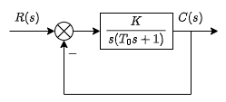
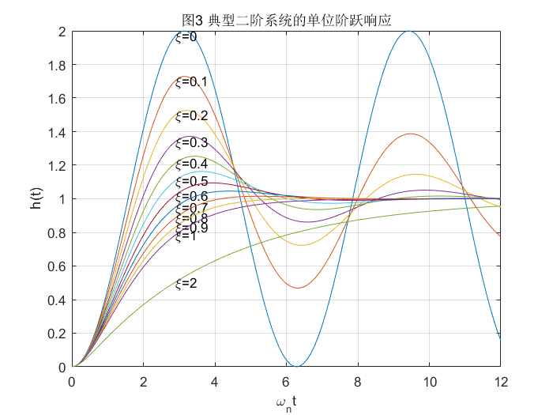
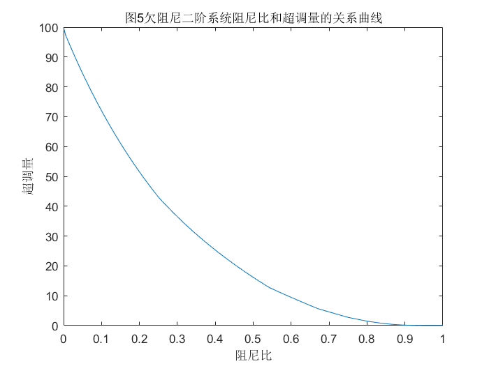
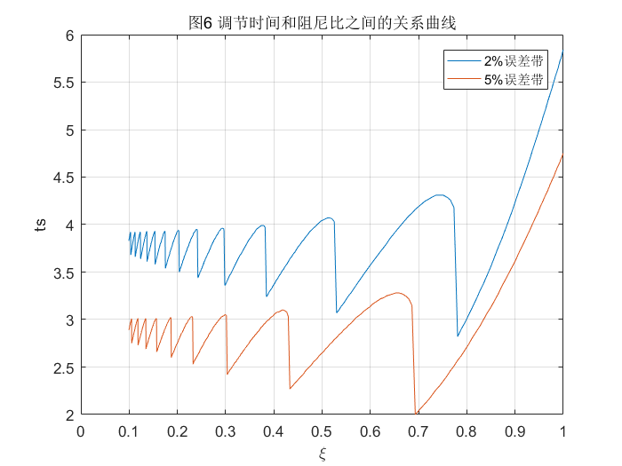
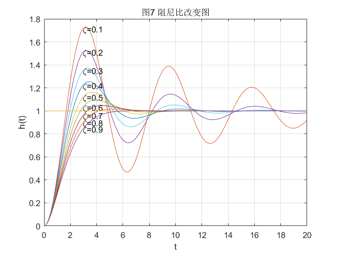
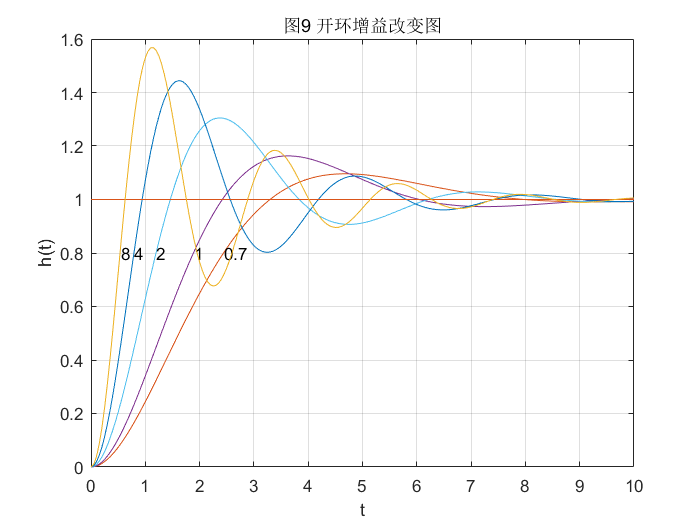
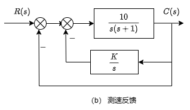
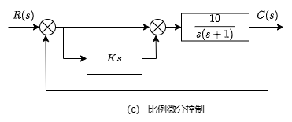

&ensp;
<!-- more -->

# 系统的时域分析
一般来说，对于控制系统的要求可归纳为稳、准、快。
稳定是控制系统正常运行的基本条件，系统稳定其响应过程才能收敛。

## 动态性能
系统的动态性能是以系统阶跃响应为基础来衡量的。一般认为阶跃输入对系统而言是比较严峻的工作状态，若系统在阶跃函数作用下的动态性能满足要求，那么系统在其他形式作用下，其动态性能也是令人满意的。
动态性能指标通常有如下几项：
1. 延迟时间$t_d$:阶跃响应第一次达到终值的50%所需的时间。
2. 上升时间$t_r$:阶跃响应从终值的10%到90%所需的时间，对震荡系统也可以定义为从0到第一次到终值的时间。
3. 峰值时间$t_p$:阶跃响应越过终值达到第一个峰值所需的时间
4. 调节时间$t_s$:阶跃响应达到并保持在峰值$\pm$5%误差带所需的时间也有2%的说法。
5. 超调量$\sigma\%$:峰值超出终值的百分比。

## 稳态特性


稳态误差是时间趋于无穷系统实际输出与理想输出之间的误差，是系统控制精度或抗干扰能力的一种度量。

# 一阶系统的时间响应及动态性能
## 一阶系统传递函数标准形式及单位阶跃响应

<center>图1 一阶系统典型结构图 </center>
如图1，K是开环增益，系统传递函数的标准形式（尾1型）为

$$
\Phi(s)={K\over s+K}={1\over Ts+1}
$$
其中，T称为一阶系统的时间常数
系统单位阶跃响应的拉普拉斯变换为
$$
C(s)=\Phi(s)\cdot R(s)={1\over Ts+1}{1\over s}={1\over s}-{1\over s+{1\over T}}
$$
单位阶跃响应为：
$$
h(t)=\mathcal{L}^{-1}[C(s)]=1-e^{-{t\over T}}
$$


## 一阶系统动态性能指标计算

依据调节时间定义有：
$$
h(t_s)=1-e^{-{t_s\over T}}=0.95
\\
得t_s=3T
$$
这表明时间常数T是一阶系统的重要特征参数。T越小系统极点越远离虚轴，过渡过程越快。

# 二阶系统的时间响应及动态性能
## 二阶系统传递函数标准形式及分类
常见的二阶系统结构图如图所示：



系统闭环函数为：
$$
\Phi(s)={K\over T_0s^2+s+K}
$$
其中$K,T_0$为环节参数。

为了分析方便起见，系统闭环传递函数一般写成如下的标准形式：
$$
\Phi(s)={\omega_n^2\over s^2+2\zeta\omega_ns+\omega_n^2 }
\quad(首一型)\\
\Phi(s)={1\over T^2s^2+2T\zeta s+1 }
\quad(尾一型)
$$
其中$\zeta,\omega_n$分别称为系统的阻尼比和无阻尼自然频率，是二阶系统的重要特征参数，首一常用于时域分析中，频域分析常用尾一型。

二阶系统闭环特征方程为：
$$
D(s)=s^2+2\zeta\omega_ns+\omega_n^2=0
$$

其特征根为：
$$
\lambda_{1,2}=-\zeta\omega_n\pm\omega_n\sqrt{\zeta^2-1}
$$

若系统阻尼比$\zeta$取值范围不同，其特征根形式不同，响应特性也不同，由此可将二阶系统分类：
$$
\begin{array}{c|c|c}
    \hline
    分类&特征根&模态\\
    \hline
    \zeta>1(过阻尼)&\lambda_{1,2}=-\zeta\omega_n\pm\omega_n\sqrt{\zeta^2-1}&e^{\lambda_1t}\quad e^{\lambda_2t}\\
    \hline
    \zeta=1(临界阻尼)&\lambda_{1,2}=-\omega_n&e^{-\omega_n t}\quad te^{-\omega_nt}\\
    \hline
    \zeta<1(欠阻尼)&\lambda_{1,2}=-\zeta\omega_n\pm j\omega_n\sqrt{1-\zeta^2}&
    e^{-\zeta w_n t}\sin\sqrt{1-\zeta^2}\omega_nt\\
    &&e^{-\zeta w_n t}\cos\sqrt{1-\zeta^2}\omega_nt\\
    \hline
    \zeta=0(零阻尼)&\lambda_{1,2}=\pm j\omega_n&\sin{\omega_nt}\quad\cos{\omega_nt}
\end{array}
$$

## 过阻尼二阶系统动态性能指标计算

设过阻尼二阶系统的极点为：
$$
\lambda_1={-{1\over T_1}}=-\zeta\omega_n+\omega_n\sqrt{\zeta^2-1}\\
\lambda_2={-{1\over T_2}}=-\zeta\omega_n-\omega_n\sqrt{\zeta^2-1}\\
其中（T_1>T_2）
$$
单位阶跃响应的拉普拉斯变换
$$
\displaystyle
C(s)=\Phi(s)R(s)={\omega^2_n\over(s+{1\over T_1})(s+{1\over T_2})}{1\over s}
$$
进行反拉普拉斯变换得单位阶跃响应
$$
\displaystyle
h(t)=1+{e^{-{t\over T_1}}\over{T_2\over T_1}-1 }+{e^{-{t\over T_2}}\over{T_1\over T_2}-1 }
$$
为了方便观察其函数曲线的增减性，可改写成如下形式：
$$
h(t)=1-{1\over T_1-T_2}(T_1e^{\lambda_1t}-T_2e^{\lambda_2t})
$$
因为$T_1>T_2且t>0$，则$T_1e^{\lambda_1t}>T_2 e^{\lambda_2t}$，由此可以粗略看成一阶系统。这也给我们提示，当特征根有多个时，靠近虚轴的占主导。

则过阻尼二阶系统单位阶跃响应是无振荡的单调上升曲线，令$T_1/T_2$取不同值，可分别求出相应的无量纲调节时间$t_s/T_1$。
$$
s^2+2\zeta\omega_ns+\omega^2_n=(s+1/T_1)(s+1/T_2)\\
\zeta={1+(T_1/T_2)\over 2\sqrt{T_1/T_2}}
$$
可通过如下代码就求出$t_s/T_1$和$T_1/T_2$的关系图：
```matlab
Tb=[];
Ts=[];
t=0:0.01:40;
T2=0.5;
for i=1:length(T2)
    T1=T2(i):0.1*T2(i):20*T2(i);
    for j=1:length(T1)
        Tb=[Tb T1(j)/T2(i)];
        num = [1/(T1(j)*T2(i))];%系统传递函数的分子
        den=[1 (1/T1(j)+1/T2(i)) (1/T1(j)/T2(i))];%系统传递函数的分母
        y = step(num,den,t);%输出阶跃响应
        for k=length(y):-1:1%倒叙求ts
            if (abs(y(k)-1))>=0.05
                Ts=[Ts k*0.01/T1(j)];
                break;
            end
        end
    end
end
plot(Tb,Ts);grid on;xlim([1 20]);
xlabel('T1/T2');ylabel('ts/T1');title('图2 过阻尼二阶系统的调节时间特性');
```


由图可知，当$T_1/T_2(或\zeta)$很大时，特征根$\lambda_1$比$\lambda_2$要远离虚轴，很快衰减为0。此时系统可以近似看作由$\lambda_1$确认的一阶系统。

## 临界阻尼
当阻尼比$\zeta=1$时，系统处于临界状态，此时闭环极点是一对相等的实根；
$$
\lambda_1=\lambda_2=-\omega_n=-{1\over T_1}
$$

其单位阶跃响应为：
$$
h(t)=1-(1+\omega_nt)e^{-\omega_nt}
$$

临界阻尼也是单调上升的曲线，其调节时间$t_s$可参照过阻尼二阶系统调节时间的方法计算,$t_s=4.75T_1$

## 欠阻尼二阶系统动态性能指标
欠阻尼二阶系统的极点有两种表达方式，分别是直角坐标和极坐标表示：
$$
\lambda_{1,2}=\sigma\pm j\omega_d=\zeta\omega_n\pm j\sqrt{1-\zeta^2}\omega_n\\
\begin{cases}
|\lambda|=\omega_n\\
\angle\lambda=\beta
\end{cases}\qquad
\begin{cases}
\cos{\beta}=\zeta\\
\sin{\beta}=\sqrt{1-\zeta^2}
\end{cases}
$$


欠阻尼二阶系统的单位阶跃响应可由系统单位阶跃响应的拉普拉斯变换的到，系统的单位阶跃响应的拉普拉斯变换为：
$$
C(s)=\Phi(s)R(s)={\omega_n^2\over s^2+2\zeta\omega_ns+\omega_n^2}{1\over s}\\
={1\over s}-{s+2\zeta\omega_n\over(s+\zeta\omega_n)^2+(1-\zeta^2)\omega_n^2}\\=
{1\over s}-{s+\zeta\omega_n\over(s+\zeta\omega_n)^2+(1-\zeta^2)\omega_n^2}
-{\zeta\over\sqrt{1-\zeta^2}} {\sqrt{1-\zeta^2}\omega_n\over(s+\zeta\omega_n)^2+(1-\zeta^2)\omega_n^2}
$$

系统的单位阶跃响应为
$$
\begin{aligned}
h(t)&=1-e^{-\zeta\omega_nt}\cos(\sqrt{1-\zeta^2}\omega_nt)-{\zeta\over\sqrt{1-\zeta^2}}e^{-\zeta\omega_nt}\sin(\sqrt{1-\zeta^2}\omega_nt)\\
&=1-{e^{-\zeta\omega_nt}\over\sqrt{1-\zeta^2}}[\sqrt{1-\zeta^2}\cos(\sqrt{1-\zeta^2}\omega_nt)+\zeta\sin(\sqrt{1-\zeta^2\omega_nt})]\\
&=1-{e^{-\zeta\omega_nt}\over\sqrt{1-\zeta^2}}\sin(\sqrt{1-\zeta^2}\omega_nt+\arctan{\sqrt{1-\zeta^2}\over\zeta})
\end{aligned}
$$
系统单位脉冲响应为
$$
\begin{aligned}
k(t)&=h'(t)=\mathcal{L}^{-1}[\Phi(s)]\\
&=\mathcal{L}^{-1}[{\sqrt{1-\zeta^2}\omega_n\over(s+\zeta\omega_n)^2+(1-\zeta^2)\omega_n^2}\cdot{\omega_n\over\sqrt{1-\zeta^2}}]\\
&={\omega_n\over\sqrt{1-\zeta^2}}e^{-\zeta\omega_nt}\sin{\sqrt{1-\zeta^2}}\omega_nt
\end{aligned}
$$
典型二阶系统的单位阶跃响应如图三所示，可以看出$\zeta$越大超调量就越小。

代码如下：
```matlab
t = [0:0.1:12];c=[];
xi=[0 0.1 0.2 0.3 0.4 0.5 0.6 0.7 0.8 0.9 1.0 2.0];
for i=1:12
    num=[1];den=[1 2*xi(i) 1];
    c=step(num,den,t);
    plot(t,c);hold on;
    s = num2str(xi(i));
    k = ['\xi=',s];
    text(t(30),c(30),k);
end
xlabel('\omega_nt'),ylabel('h(t)');
title('图3 典型二阶系统的单位阶跃响应');grid on;
```

欠阻尼系统由于其振荡，对其稳态时间的求解增加难度，但由于其阶跃响应曲线被包络线所围，可以通过包络线近似求解其稳定时间，如图4：


其代码如下：
```matlab
wn=2.5;xi=0.4;t=0:0.05:6;
t1=acos(xi)*ones(1,length(t));
al=(1/sqrt(1-xi^2));
hl = 1-al*exp(-xi*wn*t).*sin(wn*sqrt(1-xi^2)*t+t1);%.*是两个矩阵对应的元素相乘，而非矩阵相乘
bu = al*exp(-xi*wn*t)+1;bl=2-bu;
plot(t,hl,t,bu,t,bl,t,ones(size(t)));
legend('阶跃响应','上包络线','下包络线','阶跃输入');
xlabel('\omega_nt'),ylabel('h(t)');grid on;
title('图4 欠阻尼二阶系统阶跃响应及其包络线');
```
值得说明的是因为单位阶跃响应的$\sin(\sqrt{1-\zeta^2}\omega_nt+\arctan{\sqrt{1-\zeta^2}\over\zeta})\in(-1,1)$，则有$1-{e^{-\zeta\omega_nt}\over\sqrt{1-\zeta^2}}<1-{e^{-\zeta\omega_nt}\over\sqrt{1-\zeta^2}}\sin(\sqrt{1-\zeta^2}\omega_nt+\arctan{\sqrt{1-\zeta^2}\over\zeta})<1+{e^{-\zeta\omega_nt}\over\sqrt{1-\zeta^2}}$

### 欠阻尼二阶系统动态性能指标计算
峰值时间；可令$h'(t)=k(t)=0$得到$\sin(\sqrt{1-\zeta^2}\omega_nt)=0$。

则$\sqrt{1-\zeta^2}\omega_nt=0,\pi,2\pi,\cdots$
那么$t_p=\pi/\sqrt{1-\zeta^2}\omega_n$

超调量；上式的的峰值时间带入进去可得：
$$
h(t_p)=1+e^{-\zeta\pi/\sqrt{1-\zeta^2}}\\
\sigma\%={h(t_p)-h(\infty)\over h(\infty)}\times100\%=e^{-\zeta\pi/\sqrt{1-\zeta^2}}\times100\%。
$$

可见典型欠阻尼二阶系统的超调量只与阻尼比有关，关系图如下：

其代码如下：
```matlab
sigma=[];t=0:0.1:50;xi=0:0.005:1;wn=5;
for i=1:length(xi)
    num=wn*wn;
    den=[1 2*xi(i)*wn num];
    y=step(num,den,t);
    sigma=[sigma ((max(y)-1)*100)];
end
plot(xi,sigma);
xlabel('阻尼比'),ylabel('超调量')
title('图5欠阻尼二阶系统阻尼比和超调量的关系曲线')
```

调节时间$t_s$，通常按阶跃响应的包络线5%误差带的时间。令
$$
|1+{e^{-\zeta\omega_n}\over\sqrt{1-\zeta^2}} -1|
={e^{-\zeta\omega_nt}\over\sqrt{1-\zeta^2}}=0.05
$$

可解得：
$$
t_s=-{ {\ln0.05+{1\over2}\ln(1-\zeta^2)}\over\zeta\omega_n}\approx{3.5\over\zeta\omega_n}
(0.3<\zeta<0.8)
$$
可见调节时间与阻尼比和自然频率均有关。按照上式计算的调节时间偏保守。$\zeta\omega$一定时，调节时间还和$\zeta$有关。
下图给出当$T={1\over\zeta\omega_n}$时，调节时间和阻尼比之间的关系曲线，可以看出，当$\zeta =0.707(\beta=45^\circ)$时，$t_s\approx2T$，实际调节时间最短，$\sigma=4.32\%\approx5\%$，超调量又不大，所以一般称为$\zeta=0.707$为最佳阻尼比。


下面是代码：
```matlab
Ts2=[];Ts5=[];xi=[];re=1;t=0:.01:50;
for im=10:-0.02:0
    xi=[xi,cos(atan(im/re))];
    num=re*re+im*im;
    den=[1 2*re re*re+im*im];
    y=step(num,den,t);
    for k=5000:-1:0
        if(abs(y(k)-1))>=0.05,Ts5=[Ts5,k*0.01];
            break;
        end
    end
    for k=5000:-1:0
        if (abs(y(k)-1))>=0.02,Ts2=[Ts2,k*0.01];
            break;
        end
    end
end
plot(xi,Ts2,xi,Ts5);
xlabel('\xi'),ylabel('ts');
title('图6 调节时间和阻尼比之间的关系曲线');
legend('2%误差带','5%误差带');
grid on;
```


## 典型欠阻尼二阶系统动态性能、系统参数及几点分布之间的关系

当$\omega_n$固定，$\zeta$增加（$\beta减小$），系统极点在s平面沿着圆弧运动，对应系统的超调量减小，同时因为远离虚轴调节时间减小。下图给出$\zeta$变化系统阶跃响应的过程：

```matlab
t = 0:0.05:20;wn=1;r=ones(size(t));
zeta=0.1:0.1:0.9;
for i=1:9
    num=wn*wn;
    den=[1 2*zeta(i)*wn num];
    y = step(num,den,t);
    ab = plot(t,r,t,y);
    hold on,
    s = ['\zeta=' num2str(zeta(i))];
    text(t(60),y(60),s);
end
xlabel('t');
ylabel('h(t)')
title('图7 阻尼比改变图')
```
当$\zeta$固定，$\omega_n$增加时，系统极点沿某一角度直线增加。对应超调量不变，由于极点远离虚轴，$\zeta\omega$增加，调节时间减小。

```matlab
t = 0:0.05:20;r=ones(size(t));
zeta=0.5;
wn=[0.25 0.3 0.5 0.8 2];
for i=1:5
    num=wn(i)*wn(i);
    den=[1 2*zeta*wn(i) num];
    y = step(num,den,t);
    for k=1:length(y)
        if y(k)>=0.8;
            break
        end
    end
    ab = plot(t,r,t,y);
    hold on,
    s = num2str(wn(i));
    text(t(k),0.8,s);
end
xlabel('t');
ylabel('h(t)')
title('图8 自然频率改变图')
grid on;
```

一般实际系统中，$T_0$是系统的固定参数，不能随意改变，而开环增益K是各环节总的传递函数，可以调节，K增大时，系统极点会垂直向上移动，阻尼比变小，超调量会增大。下图给出K变化时系统单位阶跃响应的过程：


```matlab
t = 0:0.05:10;r=ones(size(t));
re=1;wn=1;
k=[0.7 1 2 4 8];
for i=1:5
    num=k(i);
    den=[1 1 num];
    y = step(num,den,t);
    ab = plot(t,r,t,y);
    hold on,
    for j=1:length(y)
        if y(j)>=0.8
            break
        end
    end
    s=num2str(k(i))
    text(t(j),0.8,s)
end
xlabel('t');
ylabel('h(t)')
title('图9 开环增益改变图')
grid on;
```

## 改善二阶系统动态性能的措施
采用测速反馈和比例加微分控制方式。先给出如下图所示的闭环传递函数，分别给出测速反馈和比例加微分的形式，其中K=0.216。






<center>
图10 系统结构图
</center>

$$
\begin{array}{c|c|c|c}
\hline
系统结构&原系统&测速反馈& 比例+微分\\
\hline
开环传递函数&\displaystyle G(s)={10\over s(s+1)}&\displaystyle
G(s)={10\over s(s+1+10K)}&\displaystyle
G(s)={10(Ks+1)\over s(s+1)}\\
\hline
开环增益&\displaystyle K=10&\displaystyle
K={10\over1+10K}&\displaystyle
K=10\\
\hline
闭环传递函数&\displaystyle\Phi(s)={10\over s^2+s+10}&
\displaystyle\Phi(s)={10\over s^2+(1+10K)s+10}&
\displaystyle\Phi(s)={10(Ks+1)\over s^2+(1+10K)s+10}\\
\hline
\zeta&0.158&0.5&0.5\\
\hline
\omega_n&3.16&3.16&3.16\\
\hline
闭环零点&-&-&-4.63\\
\hline
闭环极点&-0.5\pm3.12j&-1.58\pm2.74j&-1.58\pm2.74\\
\hline
t_s&1.01&1.115&1.05\\
\hline
\sigma\%&60\%&16.3\%&23\%\\
\hline
t_s&7&2.2&2.1\\
\hline
\end{array}
$$
下图是三个系统的阶跃响应图：
\\


\\
line
******
asf
asfd

afd

afd

asdfsfdasfdasf


从本质来说，系统引入测速反馈，相当与增加了系统的阻尼，是系统的振荡性得到抑制，超调量减小。
若系统采用比例微分控制，微分信号有超前性，相当于系统的调节作用提前阻止了系统的过度调节。相对与原系统而言，这两种方法都可以改善系统的动态性能。
对于稳态精度而言，在相同的阻尼比和自然频率下，采用比例微分控制不会改变系统的开环增益，因而不会影响稳态精度，而采用测速反馈会导致开环增益下降，造成稳态误差增加，然而册数反馈能削弱被包围部件中非线性特性、参数漂移等不利因素。

## 附加零极点对系统动态性能的影响
图10中的b、c两系统，它们的闭环传递函数分母相同，只是后者的分子对一个闭环零点。附加的闭环零点不会影响闭环极点，因而不会影响到而部分的模态，但是会改变各模态的权值。因此影响系统的动态性能。
从信号合成关系上可知，c系统是b系统上还叠加一个$Kh'(t)$而成的，下图显示其影响：

、、

、、


明显看出，附加闭环零点会使系统峰值时间提前，超调量增加。附加闭环零点靠虚轴越近即K越大，这种影响越强烈。
而附加闭环极点的作用与附加零点的作用刚好与之相反，下图是附加闭环极点的影响：
afddfadf
、、
、、
\\

同时附加闭环零点和极点时，距虚轴近的零点或极点对系统的影响大。下图是附加闭环零点、极点和同时附加闭环零级的影响图：
、、


、afd、
\\

# 高阶系统的阶跃响应及动态性能
## 高阶系统单位阶跃响应
高阶系统传递函数一般可以表示为：
$$
\Phi(s)={M(s)\over D(s)}={b_ms^m+b_{m-1}s^{m-1}+\cdots+b_1s+b_0\over a_ns^n+a_{n-1}s^{n-1}+\cdots+a_1s+a_0 }\\
={\displaystyle K\prod_{i=1}^m(s-z_i)\over\displaystyle\prod_{j=1}^q(s-\lambda_j)\prod_{k=1}^r(s^2+2\zeta_k\omega_ks+\omega_k^2)}(n\geq m)
$$

其中$K=b_m/a_n,q+2r=n$。系统单位阶跃响应的拉普拉斯变换可表示为：
$$
C(s)=\Phi(s){1\over s}={A_0\over s}+\sum_{j=1}^q{A_j\over s-\lambda_j}+\sum_{k=1}^r{B_ks+C_k\over s^2+2\zeta_k\omega_ks+\omega_k^2}
$$

其中$A_0=\lim\limits_{s\to0}sC(s),A_j=\lim\limits_{s\to\lambda_j}(s-\lambda_j)C(s)$是相关留数，$B_k,C_k$是闭环复数极点的留数相关系数。对上式进行反拉普拉斯变换可得：
$$
c(t)=A_0+\sum_{j=1}^qA_j\cdot e^{\lambda_jt}+
\sum_{k=1}^r D_k\cdot e^{-\sigma_kt}\sin(\omega_{dk}t+\varphi_k)
$$
式中，$D_k$是闭环复数极点的留数有关的常系数。
$$
\sigma_k=\zeta_k\omega_k\qquad w_{dk}=\omega_k\sqrt{1-\zeta^2_k}
高阶系统的单位阶跃响应是系统模态的组合。模态由闭环极点确定，而部分分式系统书与闭环零极点分布有关，所以闭环零极点对系统性能均有影响。
$$

## 闭环主导极点
对稳定闭环系统，远离虚轴极点收敛较快，只影响阶跃响应的起始段，因而系统动态性能主要取决于离虚轴较近的极点。此外，各瞬态分量的具体值还与其系数大小有关。
各瞬态分量的系数与零极点的分布有如下关系：
1. 若极点远离原点，相应系数较小
2. 若极点接近一零点，而远离其他零极点，则相应系数也很小
3. 若极点远离零点又接近原点或其他极点，则相应系数较大

因此，距离虚轴最近而且附近又没有零点的极点对系统的动态性能起主导作用，称相应极点为主导极点。

## 零点极点法
一般规定，若某极点的实部大于主导极点实部的$5\sim6$倍，则可以忽略相应分量，且若两相邻的零极点间的具体比本身模值小一个数量级，称其为“偶极子”，其作用近似抵消。

绝大多数系统的闭环零极点可以选择一个或几个极点作为主导极点，忽略远离虚轴的零极点，再忽略偶极子，下面分析相应公式估算系统的动态性能指标。

### 震荡型二阶系统
#### 闭环零极点分布图


\\\
afdafdasfdfdadf

