&ensp;
<!-- more -->

# 频率特性的基本概念
## 频率响应

线性控制系统在输入正弦信号，其稳态输出随频率变化的规律，称为该系统的频率响应。
系统的传递函数可以表示为
$$
G(s)={C(s)\over R(s)}={M(s)\over(s+p_1)(s+p_2)\cdots(s+p_n)}
$$

其中$M(s)$表示$G(s)$ 的分子多项式，当输入信号$r(t)=X\sin wt$时，有
$$
R(s)={Xw\over s^2+w^2}
$$
那么，输出信号就为
$$
C(s)={C(s)\over R(s)}={M(s)\over(s+p_1)(s+p_2)\cdots(s+p_n)}{Xw\over (s+jw)(s-jw)}\\
={C_1\over s+p_1}+{C_2\over s+p_2}+\cdots+{C_n\over s+p_n}+{C_a\over s+jw}+{C_{-a}\over s-jw}
$$


输出信号的反拉普拉斯变化得
$$
c(t)=C_1e^{-p_1t}+C_2e^{-p_2t}+\cdots+C_ne^{-p_nt}+
C_ae^{-jwt}+C_{-a}e^{-jwt}
$$

假设系统稳定，上式除了最后两项以外，其余各项都将衰减至0。所以稳态分量为
$$
c_s(t)=C_ae^{jwt}+C_{-a}e^{-jwt}
$$

其中，系数可如下计算
$$
C_a=G(s){Xw\over (s+jw)(s-jw)}(s-jw){\huge |}_{s=jw}
={XG(jw)\over 2j}\\
C_{-a}=G(s){Xw\over (s+jw)(s-jw)}(s+jw){\huge |}_{s=-jw}
=-{XG(-jw)\over 2j}
$$

其中$G(jw)$是复函数，可写为
$$
G(jw)=|G(jw)|e^{j\angle G(jw)}
$$

则有
$$
c_s(t)=X{|G(jw)|\over 2j}[e^{jwt}e^{j\angle G(jw)}-e^{-jwt}e^{j\angle G(-jw)}]\\
=X|G(jw)|\sin[wt+\angle G(jw)]
$$

上式表明线性系统在输入正弦信号时，其稳态输出是与输入同频率的正弦信号，输出正弦信号与输入正弦信号幅值比为$G(jw)$，相角差为$G(jw)$的相角。

## 频率特性
线性定常系统的频率特性定义为系统的稳态正弦响应与输入正弦信号的复数比用$G(jw)$表示
$$
\begin{aligned}
G(jw)&={X|G(jw)|e^{j\angle G(jw)}\over Xe^{j0}}\\
&=|G(jw)|e^{j\angle G(jw)}\\
&=A(w)\angle \varphi(w)
\end{aligned}
$$

频率特性描述了在不同频率下系统传递正弦信号的能力。
可以看出，将s替换jw就可以得到相应的频率特性。尽管频率特性是一种稳态响应，但系统动态过程的规律也全部在其中。
因此，频率特性也能表征系统的运动规律。

有关频率特性推导是在系统稳定得条件下给出的。若系统不稳定，输出响应最终不可能达到稳态过程。
但从理论上讲$c(t)$中的稳态分量$c_s(t)$总是可以被分解出来，所以频率特性的概念同样**适合于**不稳定系统。


## 频率特性图形表示方法

### 频率特性曲线
频率特性曲线包括幅频特性曲线和相频特性曲线。幅频特性是频率特性幅值$|G(jw)|$随$w$的变化规律；相频特性是频率特性相角$\angle G(jw)$随$w$变化规律。

下图是闭环传递函数$\Phi(s)=\displaystyle{1\over Ts+1}$的频率特性曲线图：


<center>图1 频率特性曲线</center>


### 幅相特性曲线
幅相特性曲线又称为奈奎斯特图，在平面上以极坐标的形式表示。向量的长度为$A(w_i)$，相角为$\varphi(w_i)$。
下图是闭环传递函数$\Phi(s)=\displaystyle{1\over Ts+1}$的幅相特性曲线图：


<center>图2 幅相特性曲线</center>

### 对数频率特性曲线
对数频率特性曲线又叫伯德图，由对数幅频特性和对数相频两条曲线所组成，其横坐标采用对数刻度，纵坐标采用均匀刻度。

在伯德图中，对数频率特性是$G(jw)$的对数值$20\lg|G(jw)|$与频率$w$的关系曲线。

对数频率特性曲线必须注意对数刻度特点，坐标轴两点$w_1,w_2$之间的距离是$\lg w_1-\lg w_2$，横坐标上两对频率间距离相同，则其比值相等。

频率每变化10倍称为一个十倍频程，又称“旬距”，记作dec。

对数幅频特性的纵坐标为$L(w)=20\lg A(w)$，称为对数幅值，单位是dB。$A(w)$的幅值每增大10倍，对数幅频$L(w)$就增加20dB。

下图是闭环传递函数$\Phi(s)={1\over Ts+1}$的对数频率特性曲线图：


<center>图3 对数频率特性曲线</center>


采用对数坐标图的优点较多，主要表现在下述几个方面：
1. 由于横坐标采用对数刻度，相对展宽了低频段，相对压缩了高频段。因此可以在较宽的频段范围中研究系统的频率特性。
2. 对数将乘除变为加减，可将多个环节的串联而成的系统的各个环节的对数幅频特性叠加即可得到该系统的对数幅相特性曲线。
3. 在对数坐标图上，所有典型环节的对数幅频特性乃至系统的对数幅频特性均可以用分段直线近似表示。若对分段直线进行修正，即可得到精确的特性曲线。
4. 若将实现所得的频率特性数据整理，并用分段直线画出对数频率特性，很容易写出实验对象的频率特性表达式或传递函数。

### 对数幅相特性曲线
对数幅相特性曲线又称尼科尔斯图。

对数幅相特性是由对数幅频特性和对数相频特性合并而成的曲线。对数幅相坐标的横轴为相角$\varphi(w)$单位是$(^{\circ})$，纵轴为对数幅频值$L(w)=20\lg A(w)$，单位是dB。

下图是闭环传递函数$\Phi(s)=\displaystyle{1\over Ts+1}$的对数幅频特性曲线图：


<center>图4 对数幅相特性曲线</center>


采用对数幅相特性可以用尼科尔斯图线方便地求得系统的闭环特性以及有关的特性参数。

# 幅相频率特性
## 典型环节的幅相特性曲线
### 比例环节
比例环节的传递函数为$G(s)=K$。
其频率特性为
$$
G(jw)=K+j0=Ke^{j0}\\
\begin{cases}
A(w)&=|G(jw)|=K\\
\varphi(w)&=\angle G(jw)=0^{\circ}
\end{cases}
$$
比例环节的幅相特性是G平面上实轴的一个点，如图所示，它表明比例环节稳态正弦响应的振幅是输入信号的K倍，且响应与输入同相角。


<center>图5 比例环节幅相特性曲线</center>


### 微分环节
微分环节的传递函数为$G(s)=s$。
其频率特性为
$$
G(jw)=0+jw=we^{j90^\circ}\\
\begin{cases}
A(w)&=w\\
\varphi(w)&= 90^{\circ}
\end{cases}
$$

微分环节的幅值与w成正比，相角恒为$90^\circ$。其幅相特性曲线如图所示：


<center>图6 微分环节幅相特性曲线</center>

### 积分环节
积分环节的传递函数为$G(s)=\displaystyle{1\over s}$。

其频率特性为
$$
G(jw)=0+{1\over jw}={1\over w}e^{-j90^\circ}\\
\begin{cases}
A(w)&=\displaystyle{1\over w} \\
\varphi(w)&=- 90^{\circ}
\end{cases}
$$

积分环节的幅值与w成反比，相角恒为$-90^\circ$，其幅相特性曲线如图所示：


<center>图5 积分环节幅相特性曲线</center>

### 惯性环节
积分环节的传递函数为$G(s)=\displaystyle{1\over Ts+1}$。

其频率特性为
$$
G(jw)={1\over 1+Tjw}={1\over \sqrt{1+T^2w^2}}e^{-j\arctan Tw}\\
\begin{cases}
A(w)&=\displaystyle{1\over \sqrt{1+T^2w^2}} \\
\varphi(w)&=- \arctan Tw
\end{cases}
$$

惯性环节幅相特性曲线是一个以点（1/2，j0），为圆心、半径为1/2的半圆，
证明如下：
$$
G(jw)={1\over 1+jTw}=X+jY \tag{1}
$$
其中

$$
X={1\over 1+T^2w^2}\\
Y={-Tw\over 1+T^2w^2}=TwX
$$
由此可得
$$
-Tw={Y\over X}\tag{2}
$$
将上式带回1式，可得
$$
(X-{1\over 2})^2+Y^2=({1\over 2})^2
$$

从式2可以看出，当x为正时，y只能为负，这意味着曲线在实轴的下方。其幅相特性曲线如图所示：


<center>图6 惯性环节幅相特性曲线</center>

若某环节的的传递函数为$G(s)=\displaystyle{10\over Ts+1}$，当w=1的正弦信号时，该环节稳态响应的相角滞后$30^\circ$，试确定该环节的传递函数。

由传递函数可得频率传递函数为$G(jw)=\displaystyle{10\over Tj+1}$，则有$A(1)=\displaystyle{10\sqrt{3}\over3},\varphi(1)=-\arctan T=-30^\circ$。
则有$T={\sqrt{3}\over3}$，所以
$$
G(s)={10\over\displaystyle{\sqrt{3}\over3}s+1}
$$

由此可以看出惯性环节是一种低通滤通器，低频信号容易通过，而高频信号通过后幅值衰减较大。


对于不稳定的惯性环节，其传递函数为$G(s)=\displaystyle{1\over Ts-1}$。

其频率特性为
$$
G(jw)={1\over -1+Tjw}={1\over \sqrt{1+T^2w^2}}e^{-j\arctan Tw}\\
\begin{cases}
A(w)&=\displaystyle{1\over \sqrt{1+T^2w^2}} \\
\varphi(w)&=-180^\circ + \arctan Tw
\end{cases}
$$
可以看出其幅相特性曲线与稳定的惯性环节的幅相特性曲线关于纵坐标轴对称，其幅相特性曲线如下：


<center>图7 不稳定惯性环节幅相特性曲线</center>

### 一阶复合微分环节
一阶复合微分环节的传递函数为$G(s)=1+Ts$。

其频率特性为
$$
G(jw)=1+jTw=\sqrt{1+T^2w^2}e^{j\arctan Tw}\\
\begin{cases}
A(w)&=\displaystyle{\sqrt{1+T^2w^2}} \\
\varphi(w)&=\arctan Tw
\end{cases}
$$


一阶复合微分环节幅相特性的实部为1，虚部与w成正比，其幅相特性曲线为


<center>图8 一阶复合微分环节幅相特性曲线</center>


不稳定一阶复合微分环节的传递函数为$G(s)=Ts-1$。
其频率特性为
$$
G(jw)=-1+jTw\\
\begin{cases}
A(w)&=\displaystyle{\sqrt{1+T^2w^2}} \\
\varphi(w)&=180^\circ -\arctan Tw
\end{cases}
$$

其幅相特性的实部为-1，虚部与w成正比，不稳定环节的频率特性都是非最小相角的。其幅相特性曲线为


<center>图9 不稳定一阶复合微分环节幅相特性曲线</center>

### 二阶振荡环节

二阶振荡环节的传递函数为$G(s)=\displaystyle{w_n^2\over s^2+2\zeta\omega_ns+\omega_n^2}$。

其频率特性为
$$
G(jw)={1\over(1-\displaystyle{w^2\over w_n^2})+j2\zeta{w\over w_n}} \\
\begin{cases}
A(w)&=\displaystyle{1\over\sqrt{(1-\displaystyle{w^2\over w_n^2})^2+4\zeta^2{w^2\over w^2_n}}} \\
\varphi(w)&=-\arctan \displaystyle{2\zeta\displaystyle{w\over w_n}\over 
1-\displaystyle{w_n^2\over w_n^2}}
\end{cases}
$$

当$w=0$时，$G(j0)=1\angle 0^\circ$;
当$w=w_n$时，$G(j0)=1/(2\zeta)\angle -90^\circ$;
当$w=\infty$时，$G(j\infty)=0\angle -180^\circ$;

其幅相特性曲线为


<center>图10 二阶振荡环节幅相特性曲线</center>

#### 谐振频率和谐振峰值
可以看出$\zeta$较小时，随$w=0\to\infty$变化，幅值$A(w)$先增加在逐渐衰减直至0。
$A(w)$达到极大值时，对应的幅值称为谐振峰值，记为$M_r$，对应的频率称为谐振频率，记为$w_r$。
以下推导$M_r,w_r$计算公式。
求$A(w)$极大值相当于求$[1-{w^2\over w_n^2}]^2+4\zeta^2{w^2\over w_n^2}$极小值，则令

$$
{d\over dw}\{[1-{w^2\over w_n^2}]^2+4\zeta^2{w^2\over w_n^2}\}=0
$$
解得

$$
w_r=w_n\sqrt{1-2\zeta^2}
$$

将$w_r$带入可得
$$
M_r=A(w_r)={1\over 2\zeta\sqrt{1-\zeta^2}}
$$

$M_r$与$\zeta$关系如图所示，当$\zeta\leqslant0.707$，对应的振荡环节存在$w_r,M_r$。

当$\zeta$减小时，$w_r$趋向$w_n$，$M_r$越来越大，趋向$\infty$，当$\zeta=0$时，$M_r=\infty$，这对应无阻尼系统的共振现象。


<center>图11 二阶系统阻尼比和谐振频率曲线</center>


不稳定二阶振荡环节的传递函数为$G(s)=\displaystyle{w_n^2\over s^2-2\zeta\omega_ns+\omega_n^2}$。


其频率特性为
$$
G(jw)={1\over(1-\displaystyle{w^2\over w_n^2})-j2\zeta{w\over w_n}} \\
\begin{cases}
A(w)&=\displaystyle{1\over\sqrt{(1-\displaystyle{w^2\over w_n^2})^2+4\zeta^2{w^2\over w^2_n}}} \\
\varphi(w)&=-360^\circ+\arctan \displaystyle{2\zeta\displaystyle{w\over w_n}\over 
1-\displaystyle{w_n^2\over w_n^2}}
\end{cases}
$$

不稳定二阶振荡环节是“非最小相角”环节，其相角从$-360^\circ$连续变化到$-180^\circ$。其幅相曲线如图


<center>图12 不稳定振荡环节的幅相特性曲线</center>


### 二阶复合微分环节
二阶复合微分环节的传递函数为$G(s)=T^2s^2+2\zeta Ts+1=\displaystyle{s^2\over w_n^2}+2\zeta{s\over w_n}+1$。

其频率特性为
$$
G(jw)=(1-\displaystyle{w^2\over w_n^2})+j2\zeta{w\over w_n} \\
\begin{cases}
A(w)&=\sqrt{(1-\displaystyle{w^2\over w_n^2})^2+4\zeta^2{w^2\over w^2_n}} \\
\varphi(w)&=\arctan \displaystyle{2\zeta\displaystyle{w\over w_n}\over 
1-\displaystyle{w_n^2\over w_n^2}}
\end{cases}
$$

二阶复合微分环节的幅相特性曲线


<center>图13 二阶复合微分环节的幅相特性曲线</center>


不稳定的二阶复合微分环节的传递函数为$G(s)=\displaystyle{s^2\over w_n^2}-2\zeta{s\over w_n}+1$。

其频率特性为
$$
G(jw)=(1-\displaystyle{w^2\over w_n^2})-j2\zeta{w\over w_n} \\
\begin{cases}
A(w)&=\sqrt{(1-\displaystyle{w^2\over w_n^2})^2+4\zeta^2{w^2\over w^2_n}} \\
\varphi(w)&=360^\circ - \arctan \displaystyle{2\zeta\displaystyle{w\over w_n}\over 
1-\displaystyle{w_n^2\over w_n^2}}
\end{cases}
$$

不稳定的二阶复合微分环节的幅相特性曲线


<center>图14 不稳定二阶复合微分环节的幅相特性曲线</center>

### 延迟环节

延迟环节的传递函数为$G(s)=e^{-\tau s}$。

其频率特性为
$$
G(jw)=e^{-j\tau w} \\
\begin{cases}
A(w)&=1 \\
\varphi(w)&= -\tau w
\end{cases}
$$

其幅相特性曲线是圆心在原点的单位圆，w越大其相角滞后量越大。


<center>图15 延迟环节的幅相特性曲线</center>


## 开环系统幅相特性曲线的绘制

设开环传递函数由$l$个典型环节串联组成，系统的频率特性为
$$
G(jw)=G_1(jw)G_2(jw)\cdots G_l(jw)
=A(w)e^{j\varphi(w)}
$$

其中
$$
\begin{cases}
A(w)&=A_1(w)A_2(w)\cdots A_l(w)\\
\varphi(w)&=\varphi_1(w)+\varphi_2(w)+\cdots+\varphi_l(w)
\end{cases}
$$

上式表明只要将开环传递函数的各典型环节的频率特性叠加起来，即可的出开环频率特性。

概略绘制开环幅相特性曲线反映开环频率的三个要点
1. 开环幅相特性曲线的起点和终点
2. 开环幅相特性曲线与实轴的交点
3. 开环幅相特性曲线变化范围


# 对数频率特性
## 典型环节的伯德图
### 比例环节

比例环节$G(s)=K$的频率特性与频率无关，其对数幅频特性和对数相频特性分别为
$$
\begin{cases}
L(w)&=20\lg K\\
\varphi(w)&=0^\circ
\end{cases}
$$
相应伯德图如图所示


<center>图16 比例环节的bode图</center>


### 微分环节

微分环节$G(s)=s$其对数幅频特性和对数相频特性分别为

$$
\begin{cases}
L(w)&=20\lg w\\
\varphi(w)&=90^\circ
\end{cases}
$$
对数幅频曲线在w=1处通过0dB线，斜率为20dB/dec，对数相频特性为$+90^\circ$直线。相应伯德图如图所示

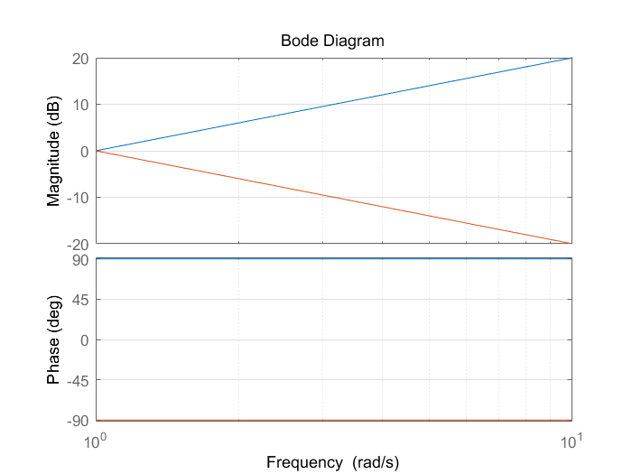
<center>图17 积分和微分环节的bode图</center>

### 积分环节

微分环节$G(s)=\displaystyle{1\over s}$，其对数幅频特性和对数相频特性分别为

$$
\begin{cases}
L(w)&=-20\lg w\\
\varphi(w)&=-90^\circ
\end{cases}
$$
积分环节对数幅频曲线在w=1处通过0dB线，斜率为$-20dB/dec$，对数相频特性为$-90^\circ$直线。
相应bode图如图17所示


### 惯性环节

惯性环节$G(s)=\displaystyle{1\over Ts+1}$，其对数幅频特性和对数相频特性分别为

$$
\begin{cases}
L(w)&=-20\lg \sqrt{1+(wT)^2}  \\
\varphi(w)&=-\arctan wT
\end{cases}
$$

当w<<1/T时，有$L(w)\approx 0dB$
当w>>1/T时，有$L(w)\approx -20\lg(wT)$

表明$l(w)$高频部分的渐近线是斜率为$-20dB/dec$的直线，两条渐近线的交点频率为1/T称为转折频率。
惯性环节的对数相频特性从$0^\circ$变化到$-90^\circ$，并且关于点$(\displaystyle{1\over T},-45^\circ)$对称。
下图是其bode图

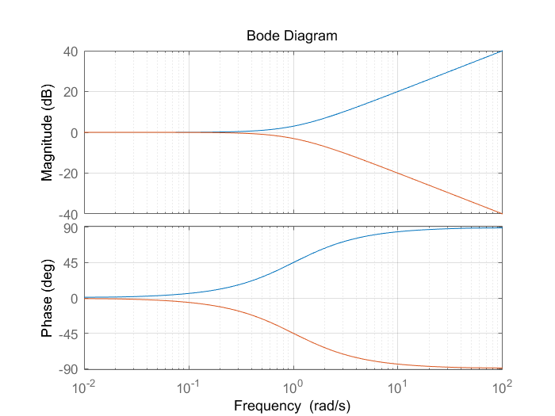
<center>图18 惯性和一阶微分环节的bode图</center>

由图可见，最大幅值误差发生在转折频率1/T处，误差值为$-3dB$，可用下图曲线进行修正。惯性环节的对数相频曲线从$0^\circ$变化到$-90^\circ$

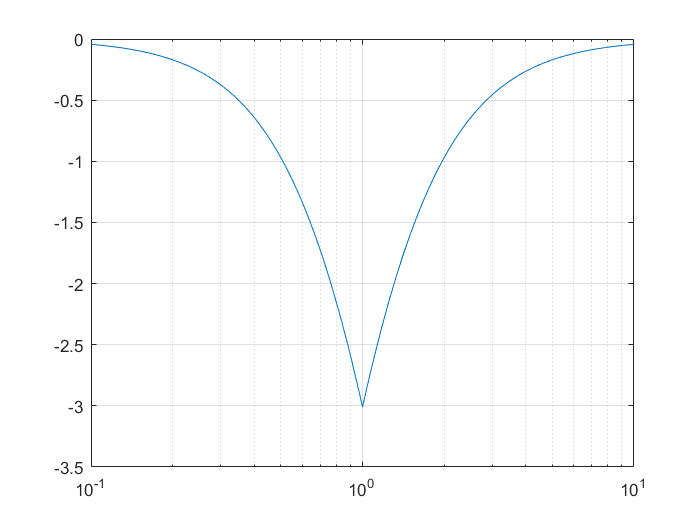
<center>图19 惯性环节的误差图</center>

代码如下
```matlab
ww1=0.1:0.01:10
for i=1:length(ww1)
    lw=-20*log10(sqrt(1+ww1(i)^2))
    if ww1(i)<=1 lw1=0
    else lw1=(-20)*log10(ww1(i))
    end
    m(i)=lw-lw1
end
semilogx(ww1,m)
grid on
```
### 一阶复合微分环节

一阶复合微分环节$G(s)= Ts+1$，其对数幅频特性和对数相频特性分别为

$$
\begin{cases}
L(w)&=20\lg \sqrt{1+(wT)^2}  \\
\varphi(w)&=\arctan wT
\end{cases}
$$

其bode图如图18


### 二阶振荡环节


二阶振荡环节$G(s)=\displaystyle{1\over\displaystyle({s\over w_n})^2+ 2\zeta{s\over w_n}+1}$，其对数幅频特性和对数相频特性分别为

$$
\begin{cases}
L(w)&=-20\lg \sqrt{[1-\displaystyle({w\over w_n})^2]^2+(2\zeta{w\over w_n})^2}  \\
\varphi(w)&=-\arctan \displaystyle{2\zeta w/w_n\over1-(w/w_n)^2}
\end{cases}
$$

当$\displaystyle{w\over w_n}<<1$时，则有$L(w)\approx 0dB$
当$\displaystyle{w\over w_n}>>1$时，则有$L(w)\approx -20\lg(\displaystyle{w\over w_n})^2=
-40\lg{w\over w_n}$

表明$L(w)$低频段是一条0dB的水平线，高频段是一条斜率为-40dB/dec的直线。
显然当$\displaystyle{w\over w_n}=1$，是两条线的相交点，所以振荡环节的自然频率就是其转折频率。

振荡环节的对数幅频特性不仅与$w_n$有关，还与阻尼比有关，因此在转折频率附近一般不能简单用渐近线近似替代。
振荡环节的相角也是$w_n,\zeta$的函数，当$w=0$时，$\varphi(w)=0$，当$w\to\infty$时，$\varphi(w)=-180^\circ$，当$w=w_n$时，$\varphi(w)=-90^\circ$，所以相频特性曲线关于$(w_n,-90^\circ)$对称。
下图给出当阻尼比去不同值对数频率特性的准确曲线。

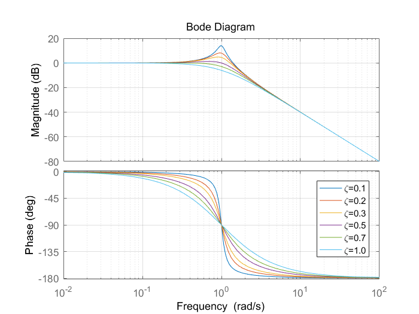
<center>图20 二阶系统bode图</center>


由图可见当$\zeta<0.707$，曲线出现谐振峰值，阻尼比越小，谐振峰值越大，必要时可用下图进行修正

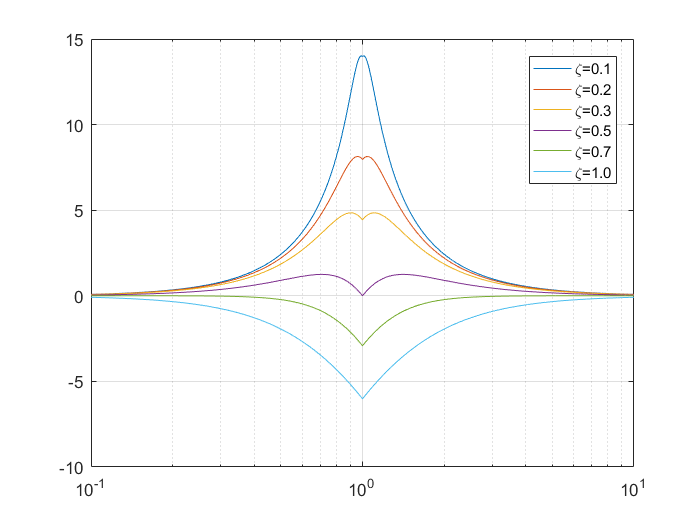
<center>图21 二阶振荡环节的误差图</center>


其代码如下
```matlab
xi=[0.1 0.2 0.3 0.5 0.7 1.0]
wn=0.1:0.01:10
for i=1:length(xi)
    for k=1:length(wn)
        lw=-20*log10(sqrt((1-wn(k)^2)^2+(2*xi(i)*wn(k))^2))
        if wn(k)<=1 lw1=0
        else lw1=-40*log10(wn(k))
        end
        m(k)=lw-lw1
    end
    semilogx(wn,m);hold on
end
legend('\zeta=0.1','\zeta=0.2','\zeta=0.3','\zeta=0.5','\zeta=0.7','\zeta=1.0')
grid on
```


### 二阶复合微分环节


二阶复合微分环节$G(s)=\displaystyle({s\over w_n})^2+ 2\zeta{s\over w_n}+1$，其对数幅频特性和对数相频特性分别为


$$
\begin{cases}
L(w)&=20\lg \sqrt{[1-\displaystyle({w\over w_n})^2]^2+(2\zeta{w\over w_n})^2}  \\
\varphi(w)&=\arctan \displaystyle{2\zeta w/w_n\over1-(w/w_n)^2}
\end{cases}
$$

二阶复合微分环节与振荡环节成倒数关系，两者bode图如图20关于频率轴对称


### 延迟环节

延迟环节$e^{-\tau s}$，其对数幅频特性和对数相频特性分别为

$$
\begin{cases}
L(w)&=20\lg |G(jw)|=0  \\
\varphi(w)&=-\tau w
\end{cases}
$$


<center>图22 延时环节的bode图</center>

这表明，延迟环节的对数幅频特性与0dB线重合，对数相频特性与w成正比，当$w\to\infty$时，相角滞后量$\to\infty$。延迟环节bode图如下图所示


## 开环系统bode图绘制

将开环传递函数表示成典型环节组合的形式有

$$
\begin{cases}
L(w)&=20\lg A(w)=20\lg\displaystyle\prod_{i=1}^l A_i(w)=
\sum_{i=1}^{l}20\lg A_i(w)=
\sum_{i=1}^lL_i(w)\\
\varphi(w)&=\displaystyle\sum_{i=1}^l\varphi(w)_i(w)
\end{cases}
$$

上式表明只要能作出$G(jw)$所包含的各典型环节的对数幅频和对数相频曲线，将其相加，就可以球的开环系统的bode图，具体步骤如下：
1. 将开环传递函数写成尾1的形式，确定系统开环增益和型别，把各典型环节的转折频率由小到大依次标在频率轴上。
2. 绘制开环对数幅频特性低频段的渐近线，由于低频段渐近线的频率特性为$K/(jw)^v$，所以他就是过点$(1,20\lg K)$、斜率为$-20vdB/dec$的直线。
3. 在低频段渐近线的基础上，沿着频率增大的方向，每遇到一个转折频率就改变一次斜率，直到所有的转折频率全部进行完毕。最右端的渐近线的斜率是$-20(n-m)dB/dec$。
4. 如果需要可按照各典型环节的误差曲线在相应转折频率附近进行修正，以得到较准确的对数幅频特性曲线。
5. 绘制对数相频特性曲线，分别绘制处各典型环节的对数相频特性曲线在沿着频率增大的方向逐点叠加，最后将相加点练成光滑曲线。

## 由对数幅频特性曲线确定开环传递函数

1. 先由低频段的斜率确认系统型别
2. 由转折频率确认系统的典型环节
3. 由图像信息确认开环增益K和振荡环节的阻尼比

## 最小相角系统和非最小相角系统
极点或零点在s的右半平面的典型环节或者包含延迟环节，则称此系统为“非最小相角”环节，否则为“非最小相角系统”。

在系统的开环频率特性中，最小相角系统相角变化量的绝对值相对最小，而且其对数幅频特性与对数相频特性之间存在唯一的对应关系，可以互相确认，而非最小相角系统不具备这种性质。

# 频域稳定判据
## nyquist判据
闭环控制系统稳定的充要条件是特征方程均具有负的实部。频域稳定判据是利用系统的开环频率特性来判断闭环系统的稳定性。

利用nyquist判据不但可以判断系统是否稳定（绝对稳定性），可以确认系统的稳定程度（相对稳定性），还可以用于分析系统的动态性能以及指出改善系统性能指标的途径。

### 辅助函数


<center>图23 系统传递函数</center>


对于上图所示的控制系统，其开环传递函数为$G(s)=G_0(s)H(s)=\displaystyle{M(s)\over N(s)}$;

相应的闭环传递函数为
$\varphi(s)=\displaystyle{G_0(s)\over1+G(s)}={N(s)G_0(s)\over N(s)+M(s)}$

令辅助函数
$$
F(s)=1+G(s)={M(s)+N(s)\over N(s)}
$$
可见辅助函数是闭环特征多项式和开环特征多项式之比。
实际系统传递函数$G(s)$的分母阶数总是大于分子结束，因此辅助函数的分子分母同阶，即$F(s)$的零点与极点数相同，则有

$$
F(s)={(s-z_1)(s-z_2)\cdots(s-z_n)\over
(s-p_1)(s-p_2)\cdots(s-p_n)}
$$

综上所述，辅助函数具有以下特点
1. 辅助函数的零点和极点分别是系统的闭环极点和开环急待你，他们的个数相同。
2. 辅助函数和开环传递函数之间只差1，同时$F(jw)=1+G(jw)$表明，将开环幅相曲线向右移动一个单位可得辅助函数的幅相曲线。

### nyquist稳定判据
从开环传递函数表达式容易看出在右半s平面中的开环极点个数，如果能确定系统在右半s平面中所有闭环极点和开环极点个数差，就能确定系统在右半s平面中闭环极点个数，有
$$
Z=P+R
$$
其中Z是闭环极点个数，P是开环极点个数，R是两者的个数差。

为了确认R，在s平面设计nyqusit路径$\Gamma$,$\Gamma$由以下三段组成
1. 正虚轴$s=jw$，频率由0到$\infty$;
2. 半径无限大的右半圆$s=re^{j\theta}$,$r\to\infty,\theta:\pi/2\to-\pi/2$;
3. 负虚轴$s=jw$，频率由$-\infty$到0;

这样，3段组成的封闭曲线$\Gamma$就包含了整个右半平面，如图所示


<center>图24 nyquist路径</center>


由于nyquist路径包围了整个右半s平面，闭环传递函数和开环传递包围在其中。
则有G平面在系统开环幅相特性曲线及其镜像顺时针包围$(-1,j0)$点的圈数，一般只需绘制开环幅相特性曲线，考虑角度的方向性，有
$$
R=-2N
$$

则可得nyquist判据
$$
Z=P-2N
$$


## nyquist稳定判据的应用

如果开环传递函数$G(s)$在虚轴上有极点，则不能直接应用nyquist路径，可以对nyquist路径进行修改，使其沿着半径无穷小的右半圆绕过极点。

这样nyquist路径就避开极点，又包围了位于坐标原点的极点，前述得nyquist判据仍然适用，只是在画nyquist图时，s取值线从j0绕半径无限小得圆弧逆时针转$90^\circ$到j$0^+$，这样需要补充$s=j0\to j0^+$小圆弧所对应得$G(jw)$特性曲线。


## 对数稳定判据
事实上，系统的频域分析设计通常是在bode图上进行的。将nyquist稳定判据引申到bode图上，以bode图的形式表现出来。

系统开环频率特性的nyquist图与bode图存在一定的对应关系

1. nyquist图上$|G(jw)=1|$的单位圆与bode图上的0dB线相对应，单位圆外部对应$L(w)>0$，单位圆内部对应$L(w)<0$。
2. nyquist图上的复实轴对应bode图上的$\varphi(w)=-180^\circ$线。如果开环幅相特性曲线在点$(-1,j0)$以作穿过负实轴，则称为穿越，曲线按相角增加增加方向（自上而下）穿过点$(-1,j0)$称为正穿越。按相角减小的方向（自下而上）穿过点$(-1,j0)$称为负穿越。若幅相特性曲线自$(-1,j0)$离开或者趋近到$(-1,j0)$，则称半次穿越。

在nyquist图上，正穿越一次，对应幅相特性曲线逆时针包围一圈，负穿越一次，对应顺时针包围一圈。因此有
$$
N=N_+-N_-
$$

# 稳定裕度
## 稳定裕度的定义

控制系统稳定与否是绝对稳定性的概念，而对于一个稳定系统而言，还有一个相对稳定的概念。
相对稳定性与系统的动态性能指标有着密切关系。
对于一个最小相角系统而言，$G(jw)$越靠近点$(-1,j0)$而言阶跃响应就越差，因此可以用$G(jw)$曲线对点$(-1,j0)$的接近程度来表示系统的相对稳定性。

### 相角裕度
相角裕度是指开环幅相特性的幅值$A(jw)=1$时，向量与负实轴的夹角，用$\gamma$表示。如图所示


<center>图25 稳定裕度的nyquist表示</center>


在G平面上画出以原点为圆心的单位圆，曲线与圆的交点处的频率为截止频率$w_c$，按相角裕度定义有$\gamma=180^\circ +\varphi(w_c)$

由于$L(w_c)=20\lg A(w_c)=0$，在bode图中，相角裕度表现为$L(w)=0dB$处的相角$\varphi(w_c)$与$180^\circ$的角度差。如下图所示。


<center>图25 稳定裕度的bode图表示</center>

### 幅值裕度
$G(jw)$曲线与负实轴交点处的频率$w_g$称为相角交接频率，此时幅相特性曲线的幅值为$A(w_g)$，幅值裕度是$G(jw)$与负实轴至虚轴的倒数常用h表示即
$$
h={1\over A(w_g)}
$$

相角裕度的物理意义在于，稳定系统在截止频率$w_c$处再滞后一个$\gamma$角度，则系统处于临界稳定。
幅值裕度的物理意义在于，稳定系统的开环增益再增大h倍，系统处于临界状态。
对于最小相角系统，要使系统稳定，要求相角裕度$\gamma>0$，幅值裕度$h>0dB$。
为保证系统具有一定仙骨笛稳定性，稳定裕度不能太小。工程设计中要求$\gamma>30^\circ$(一般为$\gamma=40^\circ\sim60^\circ$)，$h>6dB$(一般为$10\sim20dB$)

# 利用开环对数幅频特性分析系统性能
在系统分析中，频域指标不如时域指标直观准确，需要进一步探讨频域指标与时域指标之间的关系。
考虑到对数频率特性在控制工程应用的广泛性，首先讨论幅频特性L(w)的形状与性能指标之间的关系，然后根据频域指标与时域指标之间关系估算出系统的时域响应性能。

实际系统的开环对数幅频特性一般都符合下图的特征，左端高，右端低，人为将L(w)分为三个频段：低频段，中判断，高频段。

- 低频段是第一个转折频率以左的频段；
- 中频段是截止频率附近的频段；
- 高频段是远大于$w_c$的频段；


<center>图26 三频段的幅值特性曲线表示</center>


三频段的划分是相对的，各频段之间没有严格的界限。
一般来说控制系统的频段范围在$0.01\sim100 rad/s$之间。这里说的“高频段”和无线电科学里的“超高频”、“甚高频”不是一个概念。

## $L(w)$低频渐近线与系统稳态误差的关系

低频段通常值$L(w)$的渐近线在第一个转折频率左边的频段，这一频段的特性完全由积分环节和开环增益决定。设低频段对应的传递函数
$$
G_d(s)={K\over s^v}
$$
则低频段对数幅频特性为
$$
20\lg |G_d(jw)|=20\lg{K\over w^v}
$$

将低频段对数幅频特性曲线延长交与0dB线，交点频率$w_0=K^{1\over v}$。可以看出，低频段斜率越小，位置越高，对应的积分环节数目越多，开环增益越大。
在闭环系统稳定的条件下，其稳态误差越小，稳态精度越高。

## $L(w)$中频段特性与系统动态性能的关系

中频段是指$L(w)$在截至频率附近的频段，这频段特性集中反映了闭环系统动态响应的平稳性和快速性。

一般来说，$L(w)$斜率越负，则$\varphi(w)$的绝对值越大。在截止频率处，$L(w)$曲线的斜率对相角裕度的影响最大，反之则越小。

定性来讲，如果$L(w)$曲线的中段斜率为-20dB/dec，并且占据较宽的范围，则相角裕度$\gamma$就越大。系统的超调量就越小。

如果$L(w)$曲线的中段斜率为-40dB/dec，并且占据较宽的范围，则相角裕度$\gamma$就很大，系统的平稳性和快速性就会变得很差。

因此为保证系统具有满意的动态性能，希望$L(w)$以-20dB/dec的斜率穿越0dB线，并保持较宽的中频段范围。闭环系统的动态性能主要取决于开环对数频率特性中频段的形状。


### 二阶系统
典型二阶系统的开环传递函数为
$$
G(s)={w_n^2\over s(s+2\zeta w)}
$$
其相应的闭环传递函数为
$$
\varPhi(s)={w_n^2\over s^2+2\zeta w_ns +w_n^2}
$$

#### 相角裕度和超调量的关系

系统开环频率特性为
$$
G(jw)={w_n^2\over jw(jw+2\zeta w_n)}
$$

开环幅频和相频特性为
$$
\begin{cases}
A(w)&=\displaystyle{w^2_n \over w\sqrt{w^2+(2\zeta w_n)^2} }\\
\varphi(w)&=-90^\circ -\arctan \displaystyle{w\over 2\zeta w_n}
\end{cases}
$$

在$w=w_c$处有$A(w)=1$即
$$
A(w_c)={w_c^2\over w_c\sqrt{w_c^2+4\zeta^2w_n^2}}=1
$$

即
$$
w_c^4+4\zeta^2w_n^2w_c^2-w_n^4=0
$$
解得
$$
w_c=w_n\sqrt{\sqrt{4\zeta^4+1}-2\zeta^2}
$$

当$w=w_c$有
$$
\varphi(w_c)=-90^\circ-\arctan{w_c\over 2\zeta w_n}
$$

那么可得相角裕度
$$
\gamma=90^\circ-\arctan{w_c\over 2\zeta w_n}=\arctan{2\zeta w_n\over w_c}
$$

将解得的$w_c$带入进去可得
$$
\gamma=\arctan{2\zeta\over\sqrt{\sqrt{4\zeta^4+1}-2\zeta^2}}
$$

另一方面典型二阶系统的超调量为
$$
\sigma\%=e^{-\pi\zeta/\sqrt{1-\zeta^2}}
$$

于是我们可以得到$\zeta$和$\gamma$、$\sigma\%$的关系图像如下图所示


<center>图27 二阶系统超调量、谐振峰值、相角裕度与阻尼比的关系曲线$</center>

代码如下
```matlab
xi=0:0.001:1;MMr=[];kks=[]
for i=1:length(xi)
    gamma(i)=atan(2*xi(i)/sqrt(sqrt(4*xi(i)^4+1)-2*xi(i)^2))*180/pi
    sigma(i)=exp(-pi*xi(i)/sqrt(1-xi(i)^2))*100/2+10
    if xi(i)<0.707
        Mr(i)=1/(2*xi(i)*sqrt(1-xi(i)^2))
    else Mr(i)=1
    end
    if Mr(i)<=7.5
        MMr=[MMr Mr(i)*10-10]
        kks=[kks xi(i)]
    end
end
plot(xi,gamma,xi,sigma,kks,MMr)
xlabel('\zeta');grid on;
```

从图中可以看出$\gamma$越大，超调量越大，反之越小。

#### 相角裕度、截止频率和调节时间的关系
由时域法分析可得典型二阶系统的调节时间为$t_s=3.5/\zeta w_n$，将$t_s$和$w_c$相乘可得

$$
t_sw_c={3.5\over \zeta}\sqrt{\sqrt{4\zeta^4+1}-2\zeta^2}
$$

再由$\gamma$的等式可得
$$
t_sw_c={7\over \tan\gamma}
$$

将其函数关系绘制成曲线图如图所示


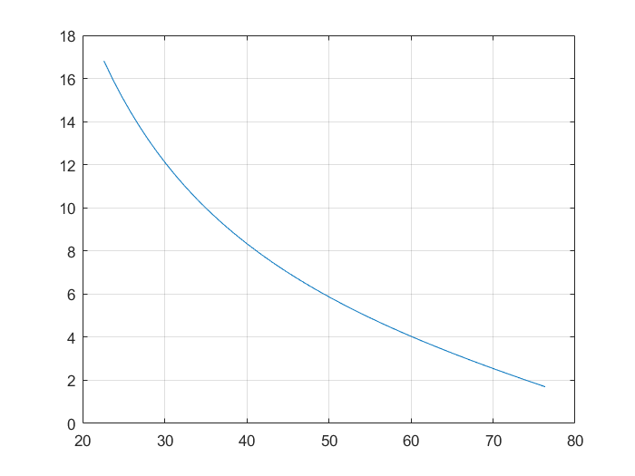

<center>图28 二阶系统调节时间、截止频率与相角裕度的关系曲线</center>


由上分析可得，调节时间、相角裕度和截止频率有关，当相角裕度确定时，截止频率和调节时间成反比。

换言之，两个典型二阶系统拥有相同的相角裕度，那么他们的超调量也相同，但截至频率较大的系统，其调节时间必然较短。

### 高阶系统

对于一般三阶或三阶以上的高阶系统，要准确推导出开环频域特征量与时域指标之间的关系是很困难的，即使推导出这样的关系式，使用也并不方便。

在控制工程分析中，通常采用下面从工程实践中总结出来的近似公式
$$
\sigma\%=[0.16+0.4({1\over \sin\gamma}-1)]\times100\%\quad(35^\circ\leqslant\gamma\leqslant90^\circ)\\
t_s={\pi\over w_c}[2+1.5({1\over\sin\gamma}-1)+2.5({1\over\sin\gamma}-1)^2]\quad(35^\circ\leqslant\gamma\leqslant90^\circ)
$$

如下图所示，是根据上图所绘制的两条曲线。

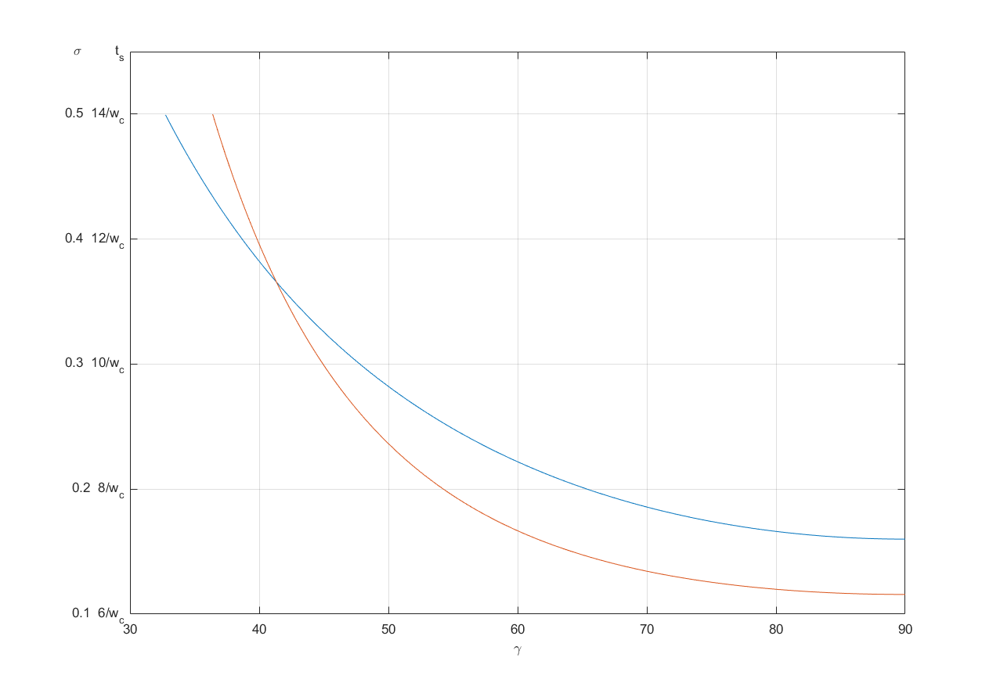

<center>图29 高阶系统超调量、调节时间与相角裕度的关系曲线</center>


代码如下
```matlab
gamma=30:0.05:90;Ts=[];Sigma=[];gamma1=[];gamma2=[]
for i=1:length(gamma)
    temp=1/sin(gamma(i)*pi/180)-1
    sigma=0.16+0.4*temp
    ts=pi*(2+1.5*temp+2.5*temp^2)*0.5/9-6*0.5/9+0.1
    if ts<=0.5
        gamma1=[gamma1 gamma(i)]
        Ts=[Ts ts]
    end
    if sigma<=0.5
        gamma2=[gamma2 gamma(i)]
        Sigma=[Sigma sigma]
    end
end
plot(gamma2,Sigma,gamma1,Ts)
axis([30 90 0.1 0.55]);grid on
```

## $L(w)高频段与系统抗高频干扰能力的关系$

$L(w)$的高频段特性是由小时间常数的环节构成的，其转折频率均远离截至频率$w_c$所以对系统的动态性能影响不大。
但是从系统抗干扰的角度出发，研究高频段的特性是具有实际意义的。
对于单位反馈系统，开环频率特性$G(jw)$和闭环频率特性$\varphi(jw)$的关系为
$$
\varPhi(jw)={G(jw)\over 1+G(jw)}
$$

在高频段一般有$20\lg|G(jw)|<<0$即$|G(jw)|<<1$

$$
|\varPhi(jw)|={|G(jw)|\over|1+G(jw)|}\approx|G(jw)|
$$

因此，$L(w)$特性高频段的幅值，直接反映出系统对输入端高频信号的抑制能力，高频段的分贝越低，说明系统对高频信号的衰减作用越大。
综上所述，希望的开环对数幅频特性应有如下特点

1. 如果要求具有一阶或二阶无差系统，则$L(w)$特性的低频段应具有$-20dB/dec$或$-40dB/dec$的斜率。
2. $L(w)$特性应以$-20dB/dec$的斜率穿越零分贝线，且具有一定的中频段宽度。这样系统就具有足够的稳定裕度。保证闭环系统具有较好的平稳性。
3. $L(w)$应具有较高的的截至频率，以提高闭环系统的快速性。
4. $L(w)$特性的高频段应尽可能低，以增强系统的抗高频干扰能力。

# 闭环频率特性曲线的绘制

## 向量法求闭环频率特性
对于单位反馈系统，如果以幅值和相角形式表示开环频率特性有
$$
G(jw)=A(w)e^{j\varphi(w)}
$$
则有闭环频率特性
$$
\varPhi(jw)={G(jw)\over 1+G(jw)}=M(w)e^{j\varphi(w)}
$$

其中闭环频率特性的幅值和相角分别可以表示为

$$
M(w)=|{G(jw)\over 1+G(jw)}|=[(1+{1\over A^2(w)}+{2\cos\varphi(w)\over A(w)})^{1\over2}]^{-1}\\
\alpha(w)=\angle{G(jw)\over 1+G(jw)}=\arctan{\sin\varphi(w)\over\cos\varphi(w)+A(w)}
$$

在G平面上，系统开环频率特性可用向量表示，当频率$w=w_1$，
如下图所示，向量$\overrightharpoon{OA}$表示$G(jw)$，向量$\overrightharpoon{PA}$表示$1+G(jw_1)$，
因此，闭环频率特性$\varPhi(jw_1)$可由两个向量之比求得，即$\varPhi(jw_1)=\displaystyle{\overrightharpoon{OA}\over\overrightharpoon{PA}}$。


<center>图30 开环频率特性与闭环频率特性关系</center>


即有
$$
M(w_1)={|\overrightharpoon{OA}|\over|\overrightharpoon{PA}|}\\
\alpha(w_1)=\angle\overrightharpoon{OA}-\angle\overrightharpoon{PA}=\varphi-\theta
$$

用这种方式求闭环频率特性，几何意义清晰，容易理解，但过程比较麻烦。

## 尼科尔斯图线
用开环频率特性求系统的闭环函数特性时，需要准确绘制出系统的开环幅相特性曲线，因此希望通过对数频率特性来求闭环频率特性。
为查对方便和互相换算将模值关系和角度关系绘制成标准图线，这就是尼柯尔斯图线。


<center>图31 尼科尔斯图线</center>

尼柯尔斯图线由两簇曲线组成，一簇是对应与闭环频率特性的幅值为定值($20\lg M$)的曲线，另一簇是对应于闭环频率特性的相角为定制($\alpha$)的曲线。

尼柯尔斯图线左右对称于$-180^\circ$线。每隔$360^\circ$，等幅值图线和等角图线就重复一次。
使用尼柯尔斯图线求闭环频率特性时，需首先沪指系统的开环对数幅相特性曲线。从对数幅相特性曲线和尼柯尔斯图线上的交点可读得各个频率下闭环频率特性的对数幅值和相角值。

# 利用闭环频率特性分析系统的性能

## 闭环频率特性的几个特征量
### 零频值
零频值是w=0时的闭环幅频特性值，当系统的输入阶跃输入的话那么有闭环稳态值
$$
\varPhi_{s}(s)=\lim\limits_{s\to0}s\varPhi(s){1\over s}=\varPhi(0)
$$
从上面的式子可以得到
$$
\varPhi(0)=M(0)e^{j\varphi(0)}=M(0)
$$


所以说零频值是系统的单位阶跃响应的稳态值。
如果零频值是1，则意味着当阶跃函数作用系统时，系统响应的稳态值和输入一致，即此时的稳态精度误差为0。

### 谐振峰值
谐振峰值是闭环频率特性的最大值与零频值之比，即$M_r=\displaystyle{M_{max}\over M(0)}$，$M_r$越大，表明系统对某个频率的正弦输入信号反映强烈，有振荡的趋向。
这意味系统的相对稳定性较差，系统的阶跃响应会有较大的超调量。


### 谐振频率

谐振频率$w_r$是指出现谐振峰值时的角频率

### 带宽频率

带宽频率$w_b$是闭环幅频特性降低到其零频值的70.7%时所对应的频率。
通常把$[0, w_b]$对应的频率范围称为通频带或频带宽度即带宽。控制系统的带宽反映系统静态噪声滤波特性，同时带宽也用于衡量瞬态响应的特性。带宽大，高频信号分量容易通过系统达到输出端，系统上升时间就短，相反闭环带宽小，系统时间响应慢，快速性就差。

## 闭环频域指标与时域指标的关系
闭环频率特性缝隙通常以谐振峰值和频带宽度或谐振频率这些特征量作为依据。
$M_r,w_b$与时域指标$\sigma\%,t_s$之间存在密切关系，这种关系在二阶系统中是准确的，在高阶系统则是近似的。


### 二阶系统
典型二阶系统的闭环传递函数为

$$
\varPhi(s)={w_n^2\over s^2+2\zeta w_ns+w_n^2}
$$

#### $M_r$和$\sigma\%$的关系
由之前二阶振荡环节幅相特性讨论可知，典型二阶系统的谐振频率$w_r$和谐振峰值$M_r$为
$$
w_r=w_n\sqrt{1-2\zeta^2}\quad(0\leqslant\zeta\leqslant0.707)\\
M_r={1\over2\zeta\sqrt{1-\zeta^2}}\quad(0\leqslant\zeta\leqslant0.707)
$$

由图34242412431243214314321432132414321324143214曲线可知$M_r$越小，系统的阻尼性越好，$M_r$越大则超调量越大。收敛慢，平稳性和快速性都比较差。

#### $M_r,w_b$与$t_s$的关系
根据通频带定义，在带宽频率$w_b$处，典型二阶系统闭环频率特性幅值为

$$
M(w_b)={w_n^2\over\sqrt{(w_n^2-w_b^2)^2+(2\zeta w_nw_b)^2}}=0.707
$$

由此可以解出带宽$w_b$与$w_n,\zeta$的关系
$$
w_b=w_n\sqrt{1-2\zeta^2+\sqrt{2-4\zeta^2+4\zeta^4}}
$$

从时域分析可知调节时间$t_s=3.5/\zeta w_n$，可得

$$
w_bt_s={3.5\over \zeta}\sqrt{1-2\zeta^2+\sqrt{2-4\zeta^2+4\zeta^4}}
$$

由此可以得到$w_bt_s$与$M_r$的函数关系，并绘制成下图曲线


<center>图32 二阶系统带宽、调节时间与谐振峰值的关系</center>

代码如下

```matlab
xi=0:0.001:0.707
Mr=[];Xi=[]
for i=1:length(xi)
    mr=1/(2*xi(i)*sqrt(1-xi(i)^2))
    if mr>=1&mr<=6
        Xi=[Xi xi(i)]
        Mr=[Mr mr]
    end
end
for i=1:length(Xi)
    wbts(i)=3.5*sqrt(1-2*Xi(i)^2+sqrt(2-4*Xi(i)^2+4*Xi(i)^4))/Xi(i)
end
plot(Mr,wbts);grid on
xlabel('M_r');ylabel('w_bt_s')
```


由图可见对于给定谐振峰值，调节时间与带宽成反比，带宽越宽，则调节时间越短。

### 高阶系统
对于高阶系统，时域指标与闭环频率特性的特征量之间没有确切关系，到但是，若高阶系统存在一对共轭复数主导极点时，则可用二阶系统所建立的关系来近似表达。至于一般的高阶系统，常用下面两个经验公式估算指标
$$
\sigma\%=[0.16+0.4(M_r-1)]\times100\%\quad (1\leqslant M_r\leqslant1.8)
$$
$$
\begin{aligned}
t_s&= {\pi\over w_c}[2+1.5(M_r-1)+2.5(M_r-1)^2]\\
&={1.6\pi\over w_b}[2+1.5(M_r-1)2.5(M_r-1)^2]\quad (1\leqslant M_r\leqslant1.8)
\end{aligned}
$$

实际上，高阶系统特征量谐振峰值、带宽频率与开环频率特性的相角裕度、截至频率之间存在以下关系
$$
\begin{cases}
w_b&=1.6w_c\\
M_r&\approx\displaystyle{1\over\sin\gamma}
\end{cases}
$$

由上式可以绘制如下关系图，蓝色为超调量，红色为调节时间

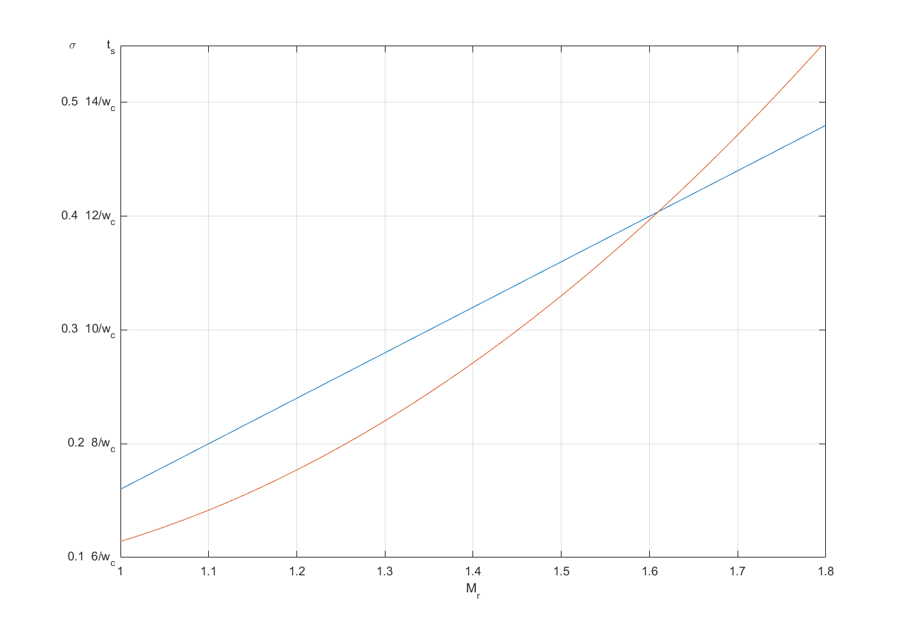
<center>图33 高阶系统超调量、调节时间与谐振峰值的关系</center>


# 频率法串联校正
串联校正根据所用的校正装置的频率特性不同分为串联超前、串联滞后和串联滞后-超前校正三种方式。
## 相角超前校正

### 超前网络特性
下图是R-C超前网络的电路图


<center>图34 超前校正网络</center>


如果输入信号源的内阻为零，负载阻抗为无穷，则其传递函数为
$$
G_{c0}={1\over a}{aTs+1\over Ts+1}\\
a={R_1+R_2\over R_2},T+{R_1R_2\over R_1+R_2}C
$$

可见如果将无源超前网络接入系统，系统的开环增益会降到原来的1/a。为补偿超前网络造成的网络增益衰减，需要另外串联一个放大倍数为a的放大器。增益补偿后的网络传递函数为
$$
G_c(s)=aG_{c0}={aTs+1\over Ts+1}
$$

画出超前网络的对数频率特性曲线，如图所示


<center>图35 无源超前网络特性</center>


可见，该校正装置的相角总是超前的，故称为相角超前网络。
相频特性为
$$
\varphi_c(w)=\arctan aTw-\arctan Tw=\arctan{(a-1)Tw\over1+a(Tw)^2}
$$

对上式w进行求导，令其等于零则有
$$
\varphi'_c(w)={aT\over1+(aTw)^2}-{T\over1+(Tw)^2}=0\\
aT^2w^2(a-1)=a-1\\
w_m={1\over T\sqrt{a}}
$$


显然，$w_m$位于$L(w)$两转折频率1/a和1/T的几何中心。将$w_c$带入$\varphi_c(w)$则有


$$
\varphi_m=\arctan{a-1\over 2\sqrt{a}}=\arcsin{a-1\over a+1}
$$

这表明最大超前角不仅与a有关，a越大角度越大，但同时高频段也抬得越高，一般a不超过20，此外可以看出$w_c$处的对数幅频值

$$
L_c(w_m)=10\lg a
$$

由图35的b可得，一级超前网络能提供的最大超前角不超过$60^\circ$，由角度公式可得
$$
a={1+\sin\varphi_m\over 1-\sin\varphi_m}
$$

超前校正装置对控制系统会产生两方面有利影响，第一是相角超前，，即选择适当的校正装置参数，使超前角频率置于校正后系统的截至频率处。
有效增加系统的相角裕度。
第二是幅值增加哦，即将校正装置的对数幅频特性叠加到原系统开环对数幅频特性上，会使系统的截止频率增大，有利于提高系统响应的快速性。

### 相角超前网络的校正

串联超前网络校正的实质是将超前网络的最大超前角补在校正后系统开环频率特性的截止频率，从而改善系统的动态性能。

设计超前校正装置的一般步骤如下：
1. 根据给定稳态误差$e_{ss}^*$要求确定系统开环增益K；
2. 根据以确定的开环增益绘制未校正系统的对数幅频特性曲线，并求出截止频率和相角裕度，如果$w_{c0}< w_c^*,\gamma_0<\gamma^*$时，首先考虑用超前校正。
3. 根据给定的相角裕度$\gamma^*$，计算校正装置所应提供的最大相角超前量$\varphi_m$，即$\varphi_m=\gamma-\gamma_0+(5^\circ\sim 15^\circ)$。
其中预加的$5^\circ\sim 15^\circ$为补偿校正后截至频率增大导致的校正前系统相角裕度的损失量。
4. 根据所确定校正装置的传递函数确定最大超前角$\varphi_m$，求出相应a值。
5. 选定校正后系统的截止频率，在$-10\lg a$处作水平线，与$L_0(w)$相交于$A'$点，交点频率为$w_A'$，取校正后系统的校正截止频率为$w_c=\max\{w_A',w_c^* \}$。
6. 确定校正装置的传递函数，在选好的$w_c$处作垂直线，与$L_0(w)$交于A点，确定A点关于0dB线的镜像点B，过点B作+20dB/dec直线与0dB线交于C点，对应频率为$w_c$，在CB延长线上定D点。使得$\displaystyle{w_D\over w_c}={w_c\over w_C}$，在D点将曲线改平，则对应超前校正装置的传递函数为

$$
G_c(s)={1+\displaystyle{s\over w_C}\over1+\displaystyle{s\over w_D}}
$$

7. 验算，写出校正后系统的开环传递函数
$$
G(s)=G_c(s)G_0(s)
$$
验算其是否满足$w_c\geqslant w_c^*,\gamma\geqslant\gamma^*,h\geqslant h^*$，若不满足，则返回步骤3适当增加相角补偿量，重新设计直到满足要求。当调整相角补偿量后仍不能达到设计指标时，要改变校正方案，可尝试滞后-超前校正。


## 相角滞后校正
### 滞后网络特性
无源滞后网络电路图如图所示


<center>图36 无源滞后网络结构图</center>

则其传递函数为
$$
G_c(s)={1+bTs\over 1+Ts}
$$

其中，$b=\displaystyle{R_2\over R_1+R_2}<1;T=(R_1+R_2)C$


滞后网络的对数频率特性如下图所示


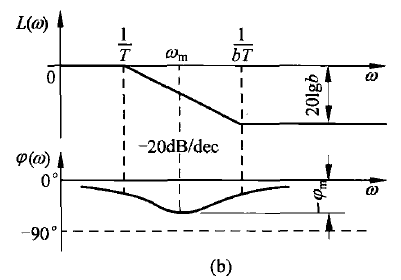
<center>图37 无源滞后网络特性图</center>


由图可见，滞后校正装置是一种低通滤波器，由于其$\varphi_c(w)$总是滞后的，故称相角滞后校正装置。


与超前校正装置类似，滞后校正装置的最大滞后角发生在1/T和1/(bT)的几何中点处，计算最大滞后角的公式是
$$
\varphi_m=\arcsin{1-b\over1+b}
$$
滞后网络对低频有用信号不产生衰减，而对高频信号有削弱作用，b值越小，削弱作用越强。

采用滞后校正装置进行串联校正时，主要是利用其高频幅值衰减特性，力求避免最大滞后角，发生在校正后系统的截止频率$w_c$附近。
因此，选择滞后校正装置参数时，通常使校正装置第二个转折频率远小于$w_c$，一般取
$$
{1\over bT}={w_c\over10}\to\quad w_c={10\over bT}
$$

此时，滞后网络在$w_c$产生相角滞后量为
$$
\varphi_c(w_c)=\arctan bTw_c-\arctan Tw_c
$$

则有


$$
\tan\varphi_c(w_c)={bTw_c-Tw_c\over1+bT^2(w_c)^2}
$$
把$w_c=10/bT$带入上式则有
$$
\tan\varphi_c(w_c)={10b-10\over b+100}
$$
由于b<1，则有
$$
\varphi_c(w_c)\approx\arctan[0.1(b-1)]
$$

$\varphi_c(w_c)$和$20\lg b$随b变化的关系曲线如下图


<center>图38 滞后网络关系曲线图</center>


代码如下
```matlab
b = 0.01:0.0001:1.0
for i=1:length(b)
    lgb(i)=20*log10(b(i))
    phiw(i)=atan(0.1*(b(i)-1))*180/pi
end
semilogx(b,phiw*10,b,lgb)
grid on
```


由图可见，只要第二个转折频率离开校正后截止频率有10倍频，则滞后网络对校正后系统相角裕度造成的影响不会超过$-6^\circ$。
滞后校正装置本身对系统的相角没有贡献，但利用其幅值衰减特性，可以挖掘原系统自身的相角储备，同时压低了高频段，相应提高校正后系统的抗高频干扰能力。

### 相角滞后网络的校正

滞后校正的实质是利用滞后网络幅值衰减特性，将中频段压低，使校正后系统的截止频率减小，挖掘系统自身相角储备来满足校正后系统的相角裕度。
设计滞后校正装置一般步骤如下：
1. 根据给定的稳态误差系数要求确定开环增益K
2. 根据K值绘制未校正系统的对数幅频特性曲线$L_0(w)$，确定其截止频率$w_{c0}$和相角裕度$\gamma_0$。
3. 判别是否合适采用滞后校正，若$w_{c0}>w_c^*,\gamma_0<\gamma$，并在$w_c^ *$满足
$$
\gamma_0(w_c^*)=180^\circ+\angle G_0(jw_c^*)\geqslant\gamma^*+6^\circ
$$

则可以采用滞后校正。否则可尝试滞后-超前校正。

4. 确定校正后系统的截止频率$w_c$，确定满足调节$\gamma_0(w_{c1})=\gamma^ * +6^\circ$的频率$w_{c1}$。根据情况选择$w_c$使之满足$w_c^ * \leqslant w_c\leqslant w_{c1}$。
5. 设计滞后校正装置的传递函数，在选定的校正后系统截止频率$w_c$作垂直线交$L(w_c)$于A点，确定A关于0dB线的镜像点B，过B作水平线，在$w_C=0.1w_c$确定C点，过该点作-20dB/dec交0dB于D点。对应频率$w_D$，则校正后系统的传递函数可写为
$$
G_c(s)={ \displaystyle{s\over w_C}+1\over\displaystyle{s\over w_D}+1}
$$

6. 验算，写出校正后系统的开环传递函数，验算相角裕度和幅值裕度是否满足$\gamma=180^\circ+\angle G(w_c)\geqslant\gamma^ * ,h\geqslant h^*$。否则返回步骤4重新设计。

## 滞后-超前校正
### 滞后-超前校正网络特性

滞后-超前网络电路图如图所示


<center>图39 无源滞后-超前电路图</center>

其传递函数为
$$
G_c{s}=({bT_2s+1\over T_2s+1})({aT_1s+1\over T_1s+1})
$$
其中
$$
aT_1=R_1C_1,bT_2=R_2C_2,ab=1\\
R_1C_1+T_1C_2+R_2C_2=T_1+T_2,\quad T_1<T_2
$$

当a>1,b<1时，其对数频率传递函数如下图


<center>图40 无源滞后-超前特性</center>


### 滞后-超前网络的校正

滞后-超前校正实质是综合利用超前网络的相角特性和滞后网络幅值衰减特性来改善系统性能，其校正步骤如下

1. 根据系统的稳态误差要求确定系统开环增益K
2. 由K绘制未校正系统的开环对数幅频特性$L_0(w)$，确定校正前系统$w_{c0},\gamma_0$。当$\gamma_0<\gamma^*$，用超前校正所需要的最大超前角所需要的最大超前角$\varphi_m>60^\circ$，而滞后校正在$w_c^ *$处系统又没有足够的相角储备，可用滞后-超前校正即
$$
\gamma_0(w_c^*)=180^\circ+\angle G_0(w_0^*)<\gamma^*+6^\circ
$$

3. 选择校正后系统的截止频率$w_c=w_c^*$，计算$w_c$处系统需要最大超前角
$$
\varphi_m(w_c)=\gamma^*-\gamma_0(w_c)+6^\circ
$$

其中$6^\circ$是为了补偿校正网络滞后部分造成的相角损失而预置的，计算超前部分参数为
$$
a={1+\sin\varphi_m\over1-\sin\varphi_m}
$$

在$w_c$处作一垂线，与$L_0(w)$交于点A，确定A关于0dB线的镜像点B。
以点B为中心作斜率20dB/dec线，分别与过$w=\sqrt{a}w_c$和$w=w_c/\sqrt{a}$的两条垂直直线交于点C和点D，从点C作向右水平线，从D点作向左水平线。
在过点D的水平线确定$w_E=0.1w_c$的点E，过E作斜率-20dB/dec的直线交0dB线于点F，相应频率为$w_F$则滞后-超前校正装置的传递函数为
$$
G_c={\displaystyle{s\over w_E}+1\over\displaystyle{s\over w_F}+1}
{\displaystyle{s\over w_D}+1\over\displaystyle{s\over w_C}+1}
$$

4. 验算，写出校正后系统的开环传递函数计算校正后系统的$\gamma，h$，若$\gamma\geqslant\gamma^ * ,h\geqslant h^ *$，则结束，否则返回步骤3调整参数重新设计。


## 串联PID校正

### 比例-微分控制
比例-微分控制器的传递函数为
$$
G_c(s)=K_p+K_Ds=K_p(1+T_Ds)
$$

其中$T_D=K_D/K_p$，其特性图如下所示


<center>图41 PD控制特性</center>


由图可得PD校正正是相角超前校正，由于微分控制反映误差信号的变化趋势，具有预测能力，因此能在误差信号变化前给出校正信号，防止出现过大的偏离和振荡，因而有效改善系统的动态性能。比例-微分还抬高了高频段，使得系统抗高频干扰能力下降。

### 比例-积分

比例-积分控制器的传递函数为
$$
G_c(s)=K_p+{K_I\over s}=K_p(1+{1\over T_1s})
$$

其中$T_I=K_p/K_I$，其特性图如下所示

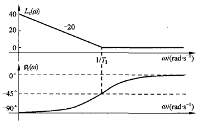
<center>图42 PI控制特性</center>

由图可得，PI控制引入积分环节，使得系统型别增加一级，因而可以有效改善系统的稳态精度。同时，PI控制是相角滞后环节，它会损失相角裕度，降低系统的相对稳定度，另外，PI控制器是低通滤波器，能提高系统抗高频干扰的能力。


### 比例-积分-微分控制

比例-积分控制器的传递函数为
$$
G_c(s)=K_p+{K_I\over s}+K_Ds=K_I{(\displaystyle{1\over w_1}s+1)({1\over w_2}s+1)\over s}
$$
其中$w_1w_2=K_I/K_D,w_1w_2=K_pK_D$，当$K^2_p-4K_IK_D>0$其特性图如下所示

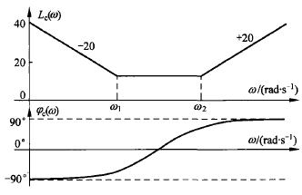
<center>图43 PID控制特性</center>

由图可得，PID控制有滞后-超前校正的功效，在低频段起到积分作用，可以改善系统稳态性能，在中高频则起到微分作用，改善系统动态性能。


