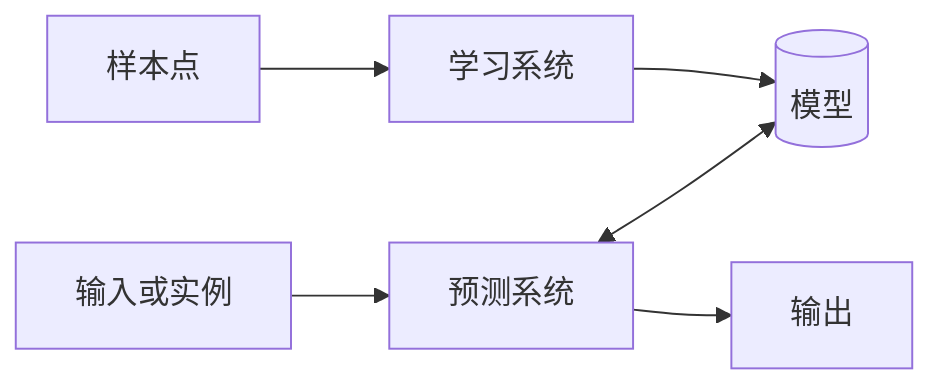

&ensp;
<!-- more -->

# 统计学习方法概论
&ensp;&ensp; 本章简要叙述学习方法的一些基本概念，首先叙述统计学习的定义、研究对象与方法，然后叙述统计学习的的定义、研究对象与方法，然后叙述监督学习，接着提出统计学习的三要素：**模型、策略和算法**，介绍模型的选择，包括正则化、交叉验证与学习的泛化能力。介绍生成模型与判别模型。最后介绍监督学习方法的应用： 分类问题标注问题与回归问题。

## 1.1统计学习
统计学习是关于计算机基于数据狗i教案概率统计模型并运用模型对数据进行预测与分析的一本学科。统计学习也称为统计机器学习。
1. 统计学习的特点：
    - 统计学习以计算机为平台
    - 统计学习以数据为研究对象
    - 统计学习的目的是对数据进行预测与分析
    - 统计学习以方法为中心
    - 统计学习是多个领域的交叉学科
> 如果一个系统能够通过执行某个过程改进他的性能，这就是学习。————Herbert A. Simon

2. 统计学习的对象
统计学习对象是数据。在统计学习的过程中，以变量组表示数据，数据分为离散和连续。

3. 统计学习的目的
统计学习的目的是对数据的预测与分析，构建概率统计模型。总目的是考虑学习什么杨的模型和如何学习模型，同时也要尽可能提高学习效率。

4. 统计学习方法
    - 监督学习
    - 非监督学习
    - 半监督学习
    - 强化学习

    实现统计学习方法的步骤如下：
    - 得到一个有限的训练合集
    - 确定包含所有可能的模型假设空间
    - 确定模型选择的准则
    - 实现求解最优模型的宣发
    - 通过学习方法选择最优模型
    - 利用学习的最优模型对新数据进行预测或分析

5. 统计学研究：
    - 统计学习方法（探究新方法）
    - 统计学习理论 （研究方法的有效性与效率）
    - 统计学习应用（解决实际问题）

## 1.2 监督学习
### 基本概念
在监督学习中，将输入与输出所有可能值的集合分别称为**输入空间**与**输出空间**。

每个具体的输入是一个实例，通常由特征向量表示，所有的特征向量存在的空间称为**特征空间**。

除特别声明外，向量均为列向量。输入变量与输出变量用大写字母表示，习惯上写作**X**和**Y**。

记作：
$x=(x^{(1)},x^{(2)},...,x^{(n)})^{(T)}
$

训练数据由输入与输出对组成，训练集通常表示为：
$T = \{(x_1,y_1),(x_2,y_1),...,(x_N,y_N), \}
$

测试数据也由相应的输入与输出对组成。输入与输出对有称为样本或样本点。

输入变量X和输出变量Y有不同的类型，可以是连续的，也可以是离散的。人们根据输入、输出变量的不同类型，对预测任务给予不同的名称：
- 输入变量与输出变量均为连续变量的预测问题称为回归问题
- 输出变量为有限个离散变量的预测问题称为分类问题
- 输入变量与输出变量为变量序列的预测问题称为标注问题

### 联合概率分布

监督学习假设输入与输出的随机变量X和Y遵循联合概率分布P(X,Y)。P(X,Y)表示分布函数或联合密度函数。

注意，在学习的过程中，假定这一联合概率分布存在，但对于学习系统来说，联合概率分布的具体定义是未知的。

训练数据与测试数据被看作是依据联合概率分布P(X,Y),独立同分布产生的。统计学习假设数据存在一定的统计规律，X和Y具有概率同分布的假设就是监督学习关于数据的基本假设。

### 假设空间
监督学习的目的在于学习一个由输入到输出的映射。模型属于由输入空间到输出空间的映射的集合，这个集合就是假设空间。假设空间确定意味着学习范围的确定。

监督学习的模型可以是概率模型或非概率模型，由条件概率分布P(Y|X)或决策函数Y=f(X)表示。

### 问题的形式化
监督学习利用训练数据集学习一个模型，由于在这个过程中需要训练数据集，而数据集往往是人工给出的，所以称为监督学习。

监督学习分为学习和预测两个过程，有学习系统和预测系统完成。

<!-- htmlmin:ignore -->

<!-- htmlmin:ignore -->
首先给定一个训练集:
$T=\{ (x_1,y_1),(x_2,y_2),\cdots,(x_N,y_N), \}
$
其中$(x_i,y_i)$称为样本或者样本点。

监督学习中，假设训练数据与测试数据是依联合概率密度分布P(X,Y)独立同分布产生。

## 1.3 统计学习三要素
统计学习方法都是由模型、策略和算法构成的，即统计学习方法由三要素构成。
### 模型
统计学习首要考虑的问题是学习什么样的模型
监督学习中，模型就是所要学习的条件概率分布或决策函数。

### 策略
统计学习的目标在于从假设空间中选取最优模型。
首先引入损失函数与风险函数的概念。损失函数度量模型一次预测的好坏，风险函数度量平均意义下模型预测的好坏。
1. 损失函数和风险函数
统计学习常用的的损失函数有以下几种：
   - 0-1损失函数
    $$
    L(Y,f(X))=
    \begin{cases}
    1,\ \ \ Y\not=f(X) \\
    0,\ \ \ Y=f(X)
    \end{cases} 
    $$

   - 平方损失函数
$L(Y,f(X))=(Y-f(X))^2
$

   - 绝对损失函数
$L(Y,f(X))=|Y-f(X)|
$
   - 对数损失函数
$L(Y,P(Y|X))=-\log P(Y|X)
$

损失函数值越小，模型就越好。所以损失函数的期望是：
$
R_{exp}(f)=E_p[L(Y,f(X))]=\int_{x\times y} L(y,f(x))p(x,y)dxdy 
$

这是理论上模型f(X)关于联合分布P(X,Y)的平均意义下的损失，称为风险函数或期望损失。或者期望损失。
如果知道联合分布P(X,Y),可以从联合分布直接求出条件概率分布P(Y|X)，也就不需要学习，一方面根据期望风险最小学习模型要用到联合分布，另一方面联合分布又是未知的，所以监督学习就成为一个病态问题。

给定一个训练数据集
$T = \{(x_1,y_1),(x_2,y_1),...,(x_N,y_N), \}
$

模型关于训练数据集的平均损失称为经验风险：
$
R_{emp}(f)={1\over N} \Sigma_{i=1}^NL(y_i,f(x_i))
$

根据大数定律，当样本容量N趋于无穷时，经验风险趋于期望风险，但是现实中，训练样本有限，结果往往不理想，所以要对经验风险进行一定的矫正，这就关系到监督学习的两个基本策略：
经验风险最小化和结构风险最小化。

1. 经验风险最小化与结构风险最小化
经验风险最小的策略认为经验风险最小的模型是最优的模型，根据这一策略就是求解最优化问题：

$$
\min_{f\in \mathcal{F}  } {1 \over N}\sum_{i=1}^N L(y_i,f(x_i))
$$

其中$\cal F$是假设空间，样本容量足够大时间，经验风险最小化能保证有很好的效果，在现实中被广泛采用，比如极大似然估计就是一个例子。
但是当样本容量很小时，会产生过拟合的现象。
结构风险最小化是为了防止过拟合而提出来的策略，结构风险最小化等价与正则化。
结构风险在经验风险上加上表示模型复杂度的*正则化项*或*罚项*。
在假设空间、损失函数以及训练数据集确定的情况下，结构风险的定义是：
$$
R_{srm}(f)={1\over N}\sum_{i=1}^NL(y_i,f(x_i))+\lambda J(f)
$$
其中J(f)为模型的复杂度，是定义在假设空间$\cal F$上的泛函。模型越复杂J(f)就越大，反之越小。复杂度表示了对模型的惩罚。$\lambda \geq 0$是系数，比如贝叶斯估计中的最大后验概率估计就是结构风险化最小的一个例子。

结构风险最小化的策略认为结构风险最小的模型是最优的模型，所以求最优模型就是求解最优化问题：
$$
\min_{f \in \mathcal{F} } {1 \over N}\sum_{i=1}^{N}L(y_i,f(x_i))+\lambda J(f)
$$

### 算法
算法是指学习模型的具体计算方法，统计学习基于训练集根据学习策略从假设空间中选择最优模型，最后需要考虑如何求解最优解。

如何保证找到全局最优解，并使得求解的过程高效，就成为一个重要问题，统计学习利用现有算法，有时也需要独自开发算法。

## 1.4 模型评估与模型选择
### 训练误差与测试误差
当损失函数给定时，基于损失函数的模型的训练误差和模型的测试误差就成为学习方法评估的标准。
注意，统计学习方法的损失函数和评估使用的损失函数未必是一致的。当然让两者一致是比较理想的。

假设学习模型是$Y=\hat{f}(X)$，训练误差是$Y=\hat{f}(X)$的平均损失：
$$
R_{emp}(\hat{f}) = {1 \over N} \sum_{i=1}^N L(y_i,\hat{f}(x_i))
$$
其中N是训练样本容量。

测试误差是关于测试集的平均损失：
$$
e_{test}(\hat{f}) = {1 \over N^\prime} \sum_{i=1}^{N^\prime} L(y_i,\hat{f}(x_i))
$$
其中$N^\prime $是测试样本容量。

例如当损失函数是0-1损失时，测试误差就变成了：
$$
e_{test}(\hat{f}) = {1 \over N^\prime} \sum_{i=1}^{N^\prime} I(y_i \neq \hat{f}(x_i))
$$
相应地，测试集的准确率为：
$$
r_{test} = {1 \over N^\prime} \sum_{i=1}^{N^\prime} I(y_i = \hat{f}(x_i))
$$
显然$r_{test}+e_{test}=1$

训练误差大小对判断给定问题是不是一个容易学习的问题是有意义的，但本质上不重要。
测试误差反映了学习方法中对未知测试数据集的预测能力，是学习中的重要概念。通常将**学习方法对未知数据的预测能力称为泛化能力**。

### 过拟合与模型选择
当假设空间含有不同复杂度的模型时，就要面临模型选择的问题，如果假设空间中存在真模型，那么所选择的模型就应该逼近真模型，意味着所选的模型要与真模型的参数个数相同。
如果一味最求提高对训练集的预测能力，所选的复杂度往往比真模型更高，这种现象称为“过拟合”。
过拟合是指学习时选择的模型参数过多，以至于对已知的数据预测很好但是对未知数据预测很差的现象。
一般来讲，训练误差和测试误差与模型复杂度之间的关系是：当模型的复杂度增大时，训练误差会减小并趋向0，而测试误差会先减小后增大，过拟合的现象会发生。
在学习的过程，防止防止过拟合，下面介绍两种常用的模型选择方法：正则化与交叉验证。

## 1.5 正则化与交叉验证
### 正则化
模型选择的进度方法是正则化。正则化是结构风险最小化策略的实现，是在经验风险上加一个正则化项或罚项。
正则化一般具有如下形式：
$$
\min_{f \in \mathcal{F} } {1 \over N}\sum_{i=1}^{N}L(y_i,f(x_i))+\lambda J(f)
$$
其中第一项是经验风险，第二项是正则化项，$\lambda \geq 0$为调整两者之间的关系系数。
正则化项可以取不同形式，回归问题中损失函数是平方损失，正则化项可以是参数向量$L_2$的范数：
$$
L(w)= {1 \over N}\sum_{i=1}^{N}(f(x_i;w)-y_i)^2+{\lambda \over 2} || w||^2
$$

第一项的经验风险比较小的模型可能比较复杂，这时第二项的模型复杂度会比较大。正则化的作用是选择经验风险与模型同时比较效果的模型。
从贝叶斯估计的角度来看，正则化对应于模型的先验概率。可以假设复杂模型有比较小的先验概率。

### 交叉验证
如果样本数据充足，进行模型选择一种简单方法是随机将数据集切成三部分，为训练集、验证集、测试集。
但是许多实际应用中数据是不充足的。为了选择好的模型，可以采用交叉验证的方法，把给定的数据进行切分，将切分的数据集组合为训练集与测试集。

1. 简单交叉验证
简单交叉验证是指：将数据随机分成两部分，例如70%为训练集，30%为测试集。然后在各种条件下训练，例如不同的参数个数。
2. S折交叉验证
应用最多的交叉验证，随机将已给数据切分为S个互不相交的大小相同的子集。然后利用S-1个子集的数据训练模型，利用余下的子集为测试集，将这一过程对可能S中选择重复进行。
3. 留一交叉验证
S折交叉验证的特殊情况，即S=N，N为数据集容量，即最后只留一个数据作为测试集，往往在缺乏数据的情况下使用。

## 1.6 泛化能力
### 泛化误差
现实中通常使用测试集来评价学习方法的泛化能力，但这种评价依赖数据集。因为数据集是有限的，很有可能得到的评价是不可靠的。统计学习理论试图从理论上对学习方法的泛化能力进行分析。

首先给出泛化误差的定义，如果学到的模型是$\hat{f}$，那么泛化误差即为：
$$
R_{exp}(\hat{f})=E_p[L(Y,\hat{f}(X))]=
\int_{x \times y} L(y,\hat{f}(x))P(x,y)dxdy
$$
事实上泛化误差是所学习模型的期望风险。

### 泛化误差上界
学习方法的泛化能力分析往往是通过研究泛化误差的概率上界进行的，简称泛化误差上界。
泛化误差上界通常具有以下性质：
他是样本容量函数，当样本容量增加时，泛化上界趋于0。
他是假设空间容量函数，假设空间容量越大模型越难学，泛化误差上界越大。
下面给出一个简单的泛化误差上界的例子：二类分类问题的泛化误差上界。

考虑二类分类问题，已知的数据集
$T=\{(x_1,y_1),(x_2,y_2),\cdots,(x_n,y_n)\}$，从联合分布概率P(X,Y)独立分布产生。
$X\in R^n, Y\in \{-1,+1\}$，假设空间是函数的有限集合
$\mathcal{F}=\{f_1,f_2,\cdots,f_d\}
$
d是函数的个数，f是从$\mathcal{F}$选取的函数，损失函数是0-1损失，关于f的期望风险和经验风险分别是
$$
R(f)=E[L(Y,f(X))] \\
\hat{R}(f)={1 \over N}\sum_{i=1}^N L(y_i,f(x_i))
$$
经验风险最小化函数是
$$
f_N = \argmin_{f \in \mathcal{F}}\hat{R}(f)
$$
泛化能力
$$
R(f_N)=E[L(Y,f_N(X))]
$$

**定理1.1（泛化误差上界）**
对于二类分类问题，当假设空间是有限个函数的集合$\mathcal{F}=\{f_1,\cdots,f_d\}$，对任意一个$f\in \mathcal{F}$，至少以概率$1-\delta$以下等式不成立：
$$
R(f)\leq \hat{R(f)}+\varepsilon(d,N,\delta)
$$
其中：
$$
\varepsilon(d,N,\delta)=\sqrt{ {1 \over 2N}(\log d +\log {1 \over \delta})}
$$

不等式左端是泛化误差，右端即为泛化误差上界，第一项是训练误差，第二项是N的单调递减函数，当N趋于无穷时，函数趋于0；
同时他也是logd阶的函数，假设空间$\mathcal{F}$包含的函数越多，其值越大。

**证明**：
在证明中要用到heoffding不等式，（详情见）叙述如下。
设$S_n=\sum_{i=1}^{n} X_i$是独立随机变量$X_1,X_2,\cdots,X_n$之和，$X_i\in[a_i,b_i]$，则对于任意的t>0,有：
$$
P(S_n-ES_n \geq t)\leq \exp(\frac{-2t^2}{\sum_{i=1}^n (b_i-a_i)^2})\\
P(ES_n-S_n \geq t)\leq \exp(\frac{-2t^2}{\sum_{i=1}^n (b_i-a_i)^2})
$$
对于任意函数$f\in\mathcal{F}$，如果损失函数，**对于所有i，有**$\bold{b_i-a_i=\pm1}$那么不难得出：
$$
P(R(f)-\hat{R}(f)\geq \varepsilon)\leq \exp(-2N\varepsilon ^2)
$$

由上式得：
$$
\global\def\vep{\varepsilon}
\global\def\cl {\mathcal}\\
\begin{aligned}
P(R(f)-\hat{R}(f)\geq \varepsilon) &\leq 
P(\bigcup_{f\in\cl{F}}\geq \{R(f)-\hat{R}(f)\geq \varepsilon\})\\
&\leq \sum_{f\in\cl{F}}P(R(f)-\hat{R}(f)\geq \varepsilon)\\
&\leq d \exp(-2N\vep^2)
\end{aligned}
$$

若令$\delta=d\exp(-2N\varepsilon^2)$，则$P(R(f)<\hat{R}(f_N)+\varepsilon)\geq 1-\delta$

由此至少以概率$1-\delta$有不等式$R(f)\leq\hat{R}(f)+\varepsilon(d,N,\delta)$成立。

## 1.7 生成模型与判别模型
监督学习的任务是学习一个模型，这个模型的一般形式为决策函数：
$
Y=f(X)
$
或者条件概率分布：
$
P(Y|X)
$
由此，监督学习方法可以分为**生成方法**和**判别方法**；
所学到的模型分别称为**生成模型**和**判别模型**。
生成方法学习联合概率密度分布$P(X,Y)$，然后求出条件概率分布$P(Y|X)$即生成模型：
$$
P(Y|X)={P(X,Y)\over{P(X)}}
$$
之所以叫生成方法是因为模型表示了输入和输出的生成关系。
典型的生成模型有朴素贝叶斯和隐马尔可夫模型。

判别方法由数据直接学习决策函数或者条件概率分布，即判别模型。判别方法关心输入X应该预测什么样的输出Y；
典型的判别模型有：K邻近法，感知机，等。

生成方法特点：生成方法能还原联合概率分布，学习收敛速度更快，当存在隐变量时，仍可以用生成方法学习，此时，判别方法不能用。
判别方法特点：判别方法学习直接学习条件概率或决策函数，直接预测往往学习准确率搞，可以对数据进行各种抽象，定义特征，因此可以简化学习问题。

## 1.8 分类问题

