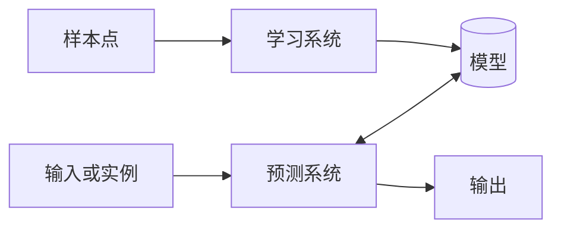

&ensp;
<!-- more -->

# 统计学习方法概论
&ensp;&ensp; 本章简要叙述学习方法的一些基本概念，首先叙述统计学习的定义、研究对象与方法，然后叙述统计学习的的定义、研究对象与方法，然后叙述监督学习，接着提出统计学习的三要素：**模型、策略和算法**，介绍模型的选择，包括正则化、交叉验证与学习的泛化能力。介绍生成模型与判别模型。最后介绍监督学习方法的应用： 分类问题标注问题与回归问题。

## 1.1统计学习
统计学习是关于计算机基于数据狗i教案概率统计模型并运用模型对数据进行预测与分析的一本学科。统计学习也称为统计机器学习。
1. 统计学习的特点：
    - 统计学习以计算机为平台
    - 统计学习以数据为研究对象
    - 统计学习的目的是对数据进行预测与分析
    - 统计学习以方法为中心
    - 统计学习是多个领域的交叉学科
> 如果一个系统能够通过执行某个过程改进他的性能，这就是学习。————Herbert A. Simon

2. 统计学习的对象
统计学习对象是数据。在统计学习的过程中，以变量组表示数据，数据分为离散和连续。

3. 统计学习的目的
统计学习的目的是对数据的预测与分析，构建概率统计模型。总目的是考虑学习什么杨的模型和如何学习模型，同时也要尽可能提高学习效率。

4. 统计学习方法
    - 监督学习
    - 非监督学习
    - 半监督学习
    - 强化学习

    实现统计学习方法的步骤如下：
    - 得到一个有限的训练合集
    - 确定包含所有可能的模型假设空间
    - 确定模型选择的准则
    - 实现求解最优模型的宣发
    - 通过学习方法选择最优模型
    - 利用学习的最优模型对新数据进行预测或分析

5. 统计学研究：
    - 统计学习方法（探究新方法）
    - 统计学习理论 （研究方法的有效性与效率）
    - 统计学习应用（解决实际问题）

## 1.2 监督学习
### 基本概念
在监督学习中，将输入与输出所有可能值的集合分别称为**输入空间**与**输出空间**。

每个具体的输入是一个实例，通常由特征向量表示，所有的特征向量存在的空间称为**特征空间**。

除特别声明外，向量均为列向量。输入变量与输出变量用大写字母表示，习惯上写作**X**和**Y**。

记作：
$x=(x^{(1)},x^{(2)},...,x^{(n)})^{(T)}
$

训练数据由输入与输出对组成，训练集通常表示为：
$T = \{(x_1,y_1),(x_2,y_1),...,(x_N,y_N), \}
$

测试数据也由相应的输入与输出对组成。输入与输出对有称为样本或样本点。

输入变量X和输出变量Y有不同的类型，可以是连续的，也可以是离散的。人们根据输入、输出变量的不同类型，对预测任务给予不同的名称：
- 输入变量与输出变量均为连续变量的预测问题称为回归问题
- 输出变量为有限个离散变量的预测问题称为分类问题
- 输入变量与输出变量为变量序列的预测问题称为标注问题

### 联合概率分布

监督学习假设输入与输出的随机变量X和Y遵循联合概率分布P(X,Y)。P(X,Y)表示分布函数或联合密度函数。

注意，在学习的过程中，假定这一联合概率分布存在，但对于学习系统来说，联合概率分布的具体定义是未知的。

训练数据与测试数据被看作是依据联合概率分布P(X,Y),独立同分布产生的。统计学习假设数据存在一定的统计规律，X和Y具有概率同分布的假设就是监督学习关于数据的基本假设。

### 假设空间
监督学习的目的在于学习一个由输入到输出的映射。模型属于由输入空间到输出空间的映射的集合，这个集合就是假设空间。假设空间确定意味着学习范围的确定。

监督学习的模型可以是概率模型或非概率模型，由条件概率分布P(Y|X)或决策函数Y=f(X)表示。

### 问题的形式化
监督学习利用训练数据集学习一个模型，由于在这个过程中需要训练数据集，而数据集往往是人工给出的，所以称为监督学习。

监督学习分为学习和预测两个过程，有学习系统和预测系统完成。

首先给定一个训练集:
$T=\{ (x_1,y_1),(x_2,y_2),\cdots,(x_N,y_N), \}
$
其中$(x_i,y_i)$称为样本或者样本点。

监督学习中，假设训练数据与测试数据是依联合概率密度分布P(X,Y)独立同分布产生。

### 统计学习三要素
统计学习方法都是由模型、策略和算法构成的，即统计学习方法由三要素构成。
#### 模型
统计学习首要考虑的问题是学习什么样的模型
监督学习中，模型就是所要学习的条件概率分布或决策函数。

#### 策略
统计学习的目标在于从假设空间中选取最优模型。
首先引入损失函数与风险函数的概念。损失函数度量模型一次预测的好坏，风险函数度量平均意义下模型预测的好坏。
1. 损失函数和风险函数
统计学习常用的的损失函数有以下几种：
    - 0-1损失函数
$$
L(Y,f(X))=
\begin{cases}
1,\ \ \ Y\not=f(X) \\
0,\ \ \ Y=f(X)
\end{cases} 
$$
    - 平方损失函数
$L(Y,f(X))=(Y-f(X))^2
$

    - 绝对损失函数
$L(Y,f(X))=|Y-f(X)|
$
    - 对数损失函数
$L(Y,P(Y|X))=-\log P(Y|X)
$

损失函数值越小，模型就越好。所以损失函数的期望是：
$
R_{exp}(f)=E_p[L(Y,f(X))]=\int_{x\times y} L(y,f(x))p(x,y)dxdy 
$

这是理论上模型f(X)关于联合分布P(X,Y)的平均意义下的损失，称为风险函数或期望损失。或者期望损失。
如果知道联合分布P(X,Y),可以从联合分布直接求出条件概率分布P(Y|X)，也就不需要学习，一方面根据期望风险最小学习模型要用到联合分布，另一方面联合分布又是未知的，所以监督学习就成为一个病态问题。

给定一个训练数据集
$T = \{(x_1,y_1),(x_2,y_1),...,(x_N,y_N), \}
$

模型关于训练数据集的平均损失称为经验风险：
$
R_{emp}(f)={1\over N} \Sigma_{i=1}^NL(y_i,f(x_i))
$

根据大数定律，当样本容量N趋于无穷时，经验风险趋于期望风险，但是现实中，训练样本有限，结果往往不理想，所以要对经验风险进行一定的矫正，这就关系到监督学习的两个基本策略：
经验风险最小化和结构风险最小化。

2. 经验风险最小化与结构风险最小化
经验风险最小的策略认为经验风险最小的模型是最优的模型，根据这一策略就是求解最优化问题：
$$
\displaystyle
\min_{f\in \cal F }{1 \over N}\sum_{i=1}^N L(y_i,f(x_i))
$$
其中$\cal F$是假设空间，样本容量足够大时间，经验风险最小化能保证有很好的效果，在现实中被广泛采用，比如极大似然估计就是一个例子。
但是当样本容量很小时，会产生过拟合的现象。
结构风险最小化是为了防止过拟合而提出来的策略，结构风险最小化等价与正则化。
结构风险在经验风险上加上表示模型复杂度的*正则化项*或*罚项*。
在假设空间、损失函数以及训练数据集确定的情况下，结构风险的定义是：
$$
R_{srm}(f)={1\over N}\sum_{i=1}^NL(y_i,f(x_i))+\lambda J(f)
$$
其中J(f)为模型的复杂度，是定义在假设空间$\cal F$上的泛函。模型越复杂J(f)就越大，反之越小。复杂度表示了对模型的惩罚。$\lambda \geq 0$是系数，比如贝叶斯估计中的最大后验概率估计就是结构风险化最小的一个例子。
