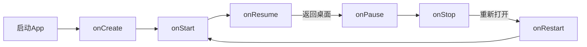

# Android开发实战课程 - 第三周：Activity与组件通信

## 课程大纲：第三周 Activity与组件通信

### 课时1：Activity生命周期深度解析 (90分钟)
#### 理论部分：
1. **生命周期图谱讲解**
   - 图解七大核心方法：`onCreate()` → `onStart()` → `onResume()` → `onPause()` → `onStop()` → `onRestart()` → `onDestroy()`
   - 状态转换关系：创建 → 启动 → 恢复 → 暂停 → 停止 → 销毁
   - 可视生命周期 vs 前台生命周期

2. **各阶段关键作用**
   | 方法 | 触发场景 | 典型操作 |
   |------|----------|----------|
   | `onCreate()` | Activity初次创建 | 初始化UI和数据绑定 |
   | `onResume()` | Activity进入前台 | 恢复动画/刷新数据 |
   | `onPause()` | 失去部分焦点 | 保存临时数据 |
   | `onDestroy()` | 完全销毁 | 释放资源/取消监听 |

#### 实战演练：


**操作练习：**
1. 重写生命周期方法，添加Log输出
2. 观察不同操作（旋转屏幕、返回键、Home键）的生命周期变化
3. 使用Android Profiler监控内存变化

---

### 课时2：Intent机制与Activity跳转 (90分钟)
#### 核心概念：
1. **Intent的作用**
   - 组件通信的信使
   - 显式 vs 隐式Intent
   - 四大组件：Activity、Service、Broadcast、ContentProvider

2. **显式启动**
   - 指定目标Activity类名
   - 基本跳转实现：
   ```java
   Intent intent = new Intent(this, TargetActivity.class);
   startActivity(intent);
   ```

3. **隐式启动**
   - Intent Filter匹配机制
   - 常见Action类型：
     - ACTION_VIEW
     - ACTION_SEND
     - ACTION_DIAL

#### 实战演练：
1. 应用内跳转（显式）
2. 调用系统功能（隐式）：
   - 打开网页
   - 拨打电话
   - 分享内容
3. Intent Filter配置练习：
   ```xml
   <intent-filter>
       <action android:name="android.intent.action.VIEW"/>
       <category android:name="android.intent.category.DEFAULT"/>
       <data android:scheme="http"/>
   </intent-filter>
   ```

---

### 课时3：Activity间数据传递 (90分钟)
#### 数据传输方法：
1. **Bundle基础传递**
   - 基本类型传递：
   ```java
   Intent intent = new Intent(this, DetailActivity.class);
   intent.putExtra("USER_ID", 123);
   intent.putExtra("USER_NAME", "Android");
   startActivity(intent);
   ```
   
   - 接收端处理：
   ```java
   int userId = getIntent().getIntExtra("USER_ID", 0);
   String name = getIntent().getStringExtra("USER_NAME");
   ```

2. **复杂对象传递**
   - Parcelable接口实现：
   ```java
   public class User implements Parcelable {
       // 实现Parcelable接口方法
       // writeToParcel() 和 createFromParcel()
   }
   ```
   - 传递Parcelable对象：
   ```java
   intent.putExtra("USER", new User());
   ```

#### 任务挑战：
实现电商应用商品列表 → 商品详情页跳转
1. 列表页：展示商品ID、名称、价格
2. 点击商品：跳转到详情页
3. 详情页：显示完整商品信息

---

### 课时4：Activity返回数据与启动模式 (90分钟)
#### 返回数据机制：
1. **startActivityForResult()**
   - 传统方案（已废弃）：
   ```java
   startActivityForResult(intent, REQUEST_CODE);
   
   protected void onActivityResult(int requestCode, int resultCode, Intent data) {
       // 处理返回结果
   }
   ```

2. **现代方案：Activity Result API**
   ```java
   ActivityResultLauncher<Intent> launcher = registerForActivityResult(
       new ActivityResultContracts.StartActivityForResult(),
       result -> {
           if (result.getResultCode() == RESULT_OK) {
               Intent data = result.getData();
               // 处理返回数据
           }
       });
   
   // 启动Activity
   launcher.launch(intent);
   ```

#### 启动模式详解：
| 启动模式 | 描述 | 适用场景 |
|---------|------|----------|
| standard | 默认模式，每次创建新实例 | 通用场景 |
| singleTop | 栈顶复用（同Activity不新建） | 通知跳转 |
| singleTask | 任务栈内单例 | 主界面 |
| singleInstance | 独立任务栈单例 | 拨号界面 |

实战配置：
```xml
<activity android:name=".MainActivity"
          android:launchMode="singleTask">
</activity>
```

---

### 课时5：综合实践 - 电商应用导航系统 (120分钟)
#### 项目任务：实现完整的电商应用导航
1. **应用结构设计**
   - 主页面：HomeActivity (singleTask)
   - 商品列表：ProductListActivity
   - 商品详情：ProductDetailActivity
   - 购物车：CartActivity
   - 订单确认：CheckoutActivity

2. **关键交互流程**
   ```mermaid
   sequenceDiagram
       用户->>HomeActivity: 启动应用
       HomeActivity->>ProductListActivity: 浏览商品
       ProductListActivity->>ProductDetailActivity: 查看详情
       ProductDetailActivity->>CartActivity: 加入购物车
       CartActivity->>CheckoutActivity: 结算订单
       CheckoutActivity-->>HomeActivity: 返回首页
   ```

3. **技术要求**
   - 使用Intent传递商品数据
   - 实现Activity返回结果处理（加入购物车结果）
   - 配置合理的启动模式
   - 处理返回栈逻辑

---

### 本周作业
1. **基础任务**
   - 完成电商应用导航系统原型
   - 实现至少3个Activity间的数据传递
   
2. **挑战任务**
   - 实现深链接跳转：`myapp://product/123`
   - 处理配置变更（屏幕旋转）时的数据保存

3. **思考题**
   - 如何避免Activity内存泄漏？
   - startActivityForResult为什么被废弃？
   - singleTask和singleInstance有何本质区别？

---

### 学习资源
1. **官方文档**
   - [Activity生命周期](https://developer.android.com/guide/components/activities/activity-lifecycle)
   - [Intent和Intent过滤器](https://developer.android.com/guide/components/intents-filters)
   
2. **实用工具**
   - [Parcelable实现生成器](https://parcelablegenerator.ashishb.net/)
   - [ADB调试命令](https://developer.android.com/studio/command-line/adb)

3. **扩展阅读**
   - 《Android编程权威指南》第5章：Activity生命周期
   - 官方示例：[Android ActivityResult API](https://github.com/android/activity-result)

掌握Activity通信是Android开发的基石，本周内容将为你后续学习Fragment、ViewModel等高级组件奠定坚实基础。